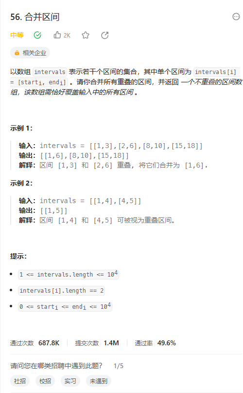
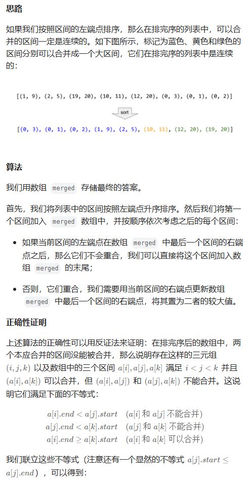
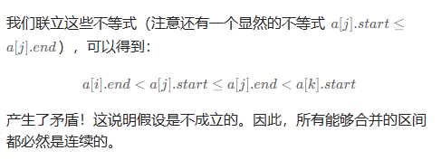

# 题目



# 我的题解

## 思路：双指针

提交了好多次，都是错的

```
class Solution {
public:
    vector<vector<int>> merge(vector<vector<int>>& intervals) {
        //之前写过一题，汇总区间，只要是下一个不连续，就可以将前面汇总成一个区间，使用的是双指针
        //来记录区间两端
        //本题也可以，但是我们首先需要将区间进行排序
        //sort函数本身就是可以按照首元素进行排序
        sort(intervals.begin(), intervals.end());
        int m = intervals.size();
        vector<vector<int>> res;
        for (int i = 0; i < m; i++){
            int low = intervals[i][0];
            int high = intervals[i][1];
            int j = i + 1;
            while (j < m && high > intervals[j][1]){
                j++;
            }
            if (j >= m){
                vector<int> vec({low,high});
                res.emplace_back(vec);
                return res;
            }
            else if (j < m && high >= intervals[j][0] && high <= intervals[j][1]){
                high = intervals[j][1];
                i = j;
            }
            vector<int> vec({low,high});
            res.emplace_back(vec);
        }
        return res;
    }
};
```

最后发现，我考虑的情况太多了，其实只要考虑和下一个区间的开头，如果比下一个区间的开头大，那么就可以继续比较下下一个开头，如果没有下下一个开头大，那么就可以放置区间了，

```C++
class Solution {
public:
    vector<vector<int>> merge(vector<vector<int>>& intervals) {
        //排序的默认方式，就可以实现二维数组的排序
        sort(intervals.begin(),intervals.end());
        vector<vector<int>>res;
        //vector<int>temp;
        //双指针
        for(int i=0;i<intervals.size();){
            //temp.push_back(intervals[i][0]);
            int t=intervals[i][1];//记录区间的结束值
            int j=i+1;
            //使用这个区间的结束值去比较下一个区间的开头，并且更新这个结束之
            while(j<intervals.size()&&intervals[j][0]<=t){
                t=max(t,intervals[j][1]);
                j++;//满足继续向后遍历
            }
            res.push_back({intervals[i][0],t});
            //更新左指针
            i=j;//因为j就是指向下一个不满足的
        }
        return res;
    }
};


//排序+双指针
//之前我排序后一直比较的是相邻的，其实可以分使用一个指针指向开头，另一个指针遍历返回,
//然后遍历的指针会跳转
```


# 其他题解

## 其他1





```C++
class Solution {
public:
    vector<vector<int>> merge(vector<vector<int>>& intervals) {
        if (intervals.size() == 0) {
            return {};
        }
        sort(intervals.begin(), intervals.end());
        vector<vector<int>> merged;
        for (int i = 0; i < intervals.size(); ++i) {
            int L = intervals[i][0], R = intervals[i][1];
            //先放入第一个，再放入其他的
            if (!merged.size() || merged.back()[1] < L) {
                merged.push_back({L, R});
            }
            //更新放入的
            else {
                merged.back()[1] = max(merged.back()[1], R);
            }
        }
        return merged;
    }
};

作者：力扣官方题解
链接：https://leetcode.cn/problems/merge-intervals/solutions/203562/he-bing-qu-jian-by-leetcode-solution/
来源：力扣（LeetCode）
著作权归作者所有。商业转载请联系作者获得授权，非商业转载请注明出处。
```

