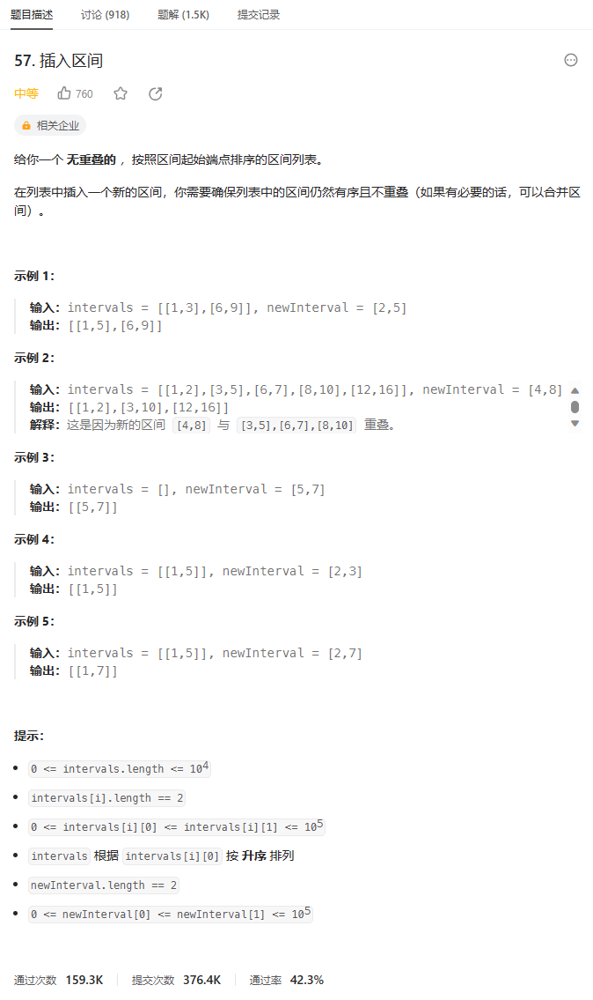
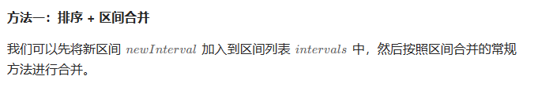
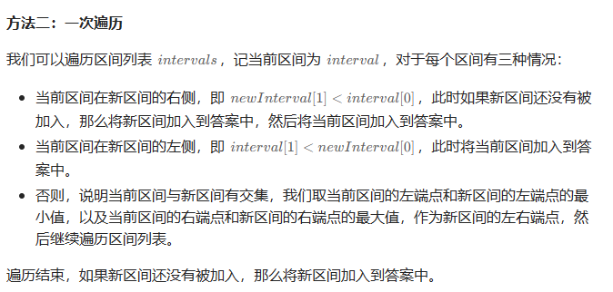

# 题目



# 我的题解

## 思路1：将新的区间添加，然后转化为合并区间问题

```C++
class Solution {
public:
    vector<vector<int>> insert(vector<vector<int>>& intervals, vector<int>& newInterval) {
        //感觉和合并区间类似，我们只需要先把新区间添加到旧区间，然后合并区间
        //并且题意是排序好的，但是我们添加后，需要再排序一下
        //就不申请额外空间了，直接在原来基础上
        intervals.emplace_back(newInterval);
        //合并区间
        vector<vector<int>> res;
        sort(intervals.begin(), intervals.end());
        for (int i = 0; i < intervals.size();){
            int low = intervals[i][0];
            int high = intervals[i][1];
            int j = i + 1;
            while(j < intervals.size() && high >= intervals[j][0]){
                high = max(intervals[j][1], high);
                j++;
            }
            //第一个不满足的j，那下一次i就从这里开始，把前面的区间放入vec
            res.emplace_back(vector<int>({low,high}));
            i = j;
        }
        return res;
    }
};
```


```C++
class Solution {
public:
    vector<vector<int>> insert(vector<vector<int>>& intervals, vector<int>& newInterval) {
        vector<vector<int>> ans;
        //记录新区间的low,high
        int st = newInterval[0], ed = newInterval[1];
        //分三种情况来讨论
        //遍历当前区间数组，要么当前区间在新区间的右侧，则将新区间加入答案，然后再将当前区间加入到答案中
        //如果当前区间在新区间左侧，即将当前区间加入到答案中
        //否则，说明当前区间与新区间有交集，我们取当前区间的左端点和新区间的左端点的最小值，以及当前区间的右端点和新区间的右端点的最大值，作为新区间的左右端点，然后继续遍历区间列表
        //关键是交集情况，并且将旧区间转化为新区间
        bool insert = false;
        //遍历区间
        for (auto& interval : intervals) {
            //记录当前区间的左右端点
            int s = interval[0], e = interval[1];
            //如果新区间在当前区间的左侧，将新区间加入答案。再将新区间加入答案
            if (ed < s) {
                if (!insert) {
                    ans.push_back({st, ed});
                    insert = true;
                }
                ans.push_back(interval);
            //如果新区间在当前区间的右侧，将当前区间加入答案
            } else if (e < st) {
                ans.push_back(interval);
                //交集情况
            } else {
                st = min(st, s);
                ed = max(ed, e);
            }
        }
        if (!insert) {
            ans.push_back({st, ed});
        }
        return ans;
    }
};


```


# 其他题解

## 其他1



```C++
class Solution {
public:
    vector<vector<int>> insert(vector<vector<int>>& intervals, vector<int>& newInterval) {
        intervals.emplace_back(newInterval);
        return merge(intervals);
    }

    vector<vector<int>> merge(vector<vector<int>>& intervals) {
        sort(intervals.begin(), intervals.end());
        vector<vector<int>> ans;
        ans.emplace_back(intervals[0]);
        for (int i = 1; i < intervals.size(); ++i) {
            if (ans.back()[1] < intervals[i][0]) {
                ans.emplace_back(intervals[i]);
            } else {
                ans.back()[1] = max(ans.back()[1], intervals[i][1]);
            }
        }
        return ans;
    }
};

作者：ylb
链接：https://leetcode.cn/problems/insert-interval/solutions/2414501/python3javacgotypescript-yi-ti-shuang-ji-2fsw/
来源：力扣（LeetCode）
著作权归作者所有。商业转载请联系作者获得授权，非商业转载请注明出处。
```


## 其他2



```C++
class Solution {
public:
    vector<vector<int>> insert(vector<vector<int>>& intervals, vector<int>& newInterval) {
        vector<vector<int>> ans;
        int st = newInterval[0], ed = newInterval[1];
        bool insert = false;
        for (auto& interval : intervals) {
            int s = interval[0], e = interval[1];
            if (ed < s) {
                if (!insert) {
                    ans.push_back({st, ed});
                    insert = true;
                }
                ans.push_back(interval);
            } else if (e < st) {
                ans.push_back(interval);
            } else {
                st = min(st, s);
                ed = max(ed, e);
            }
        }
        if (!insert) {
            ans.push_back({st, ed});
        }
        return ans;
    }
};

作者：ylb
链接：https://leetcode.cn/problems/insert-interval/solutions/2414501/python3javacgotypescript-yi-ti-shuang-ji-2fsw/
来源：力扣（LeetCode）
著作权归作者所有。商业转载请联系作者获得授权，非商业转载请注明出处。
```

