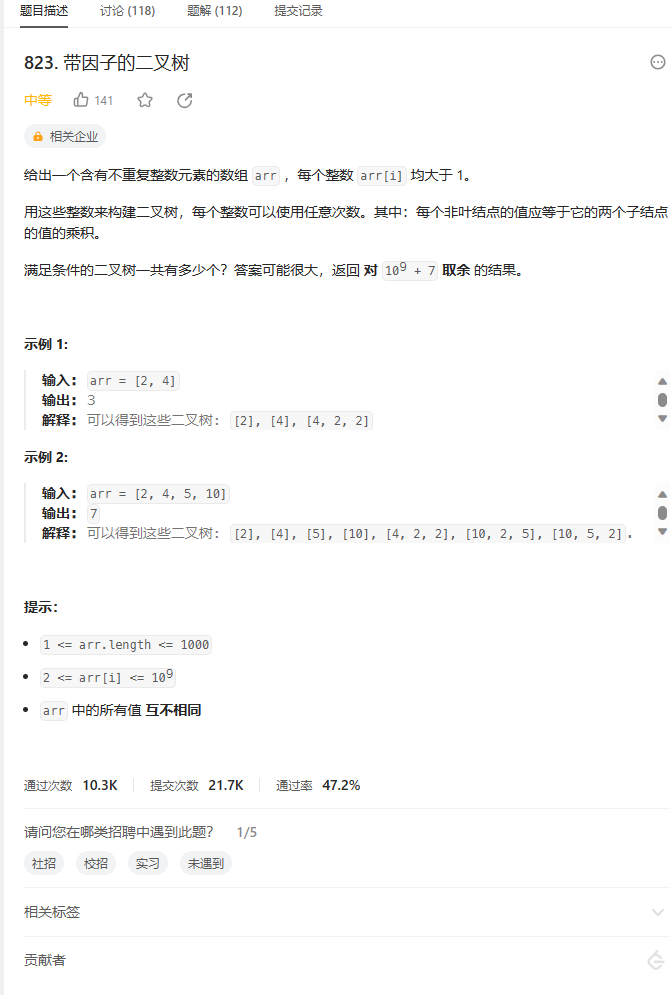
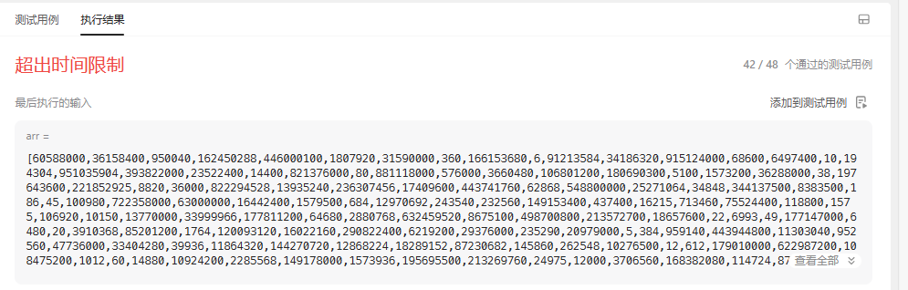
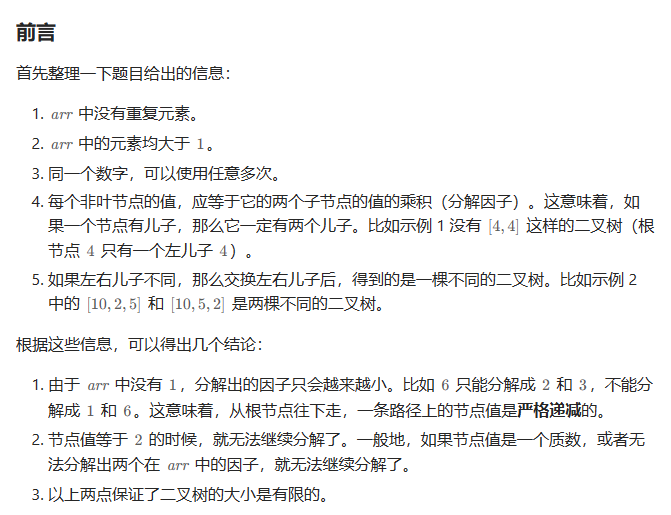
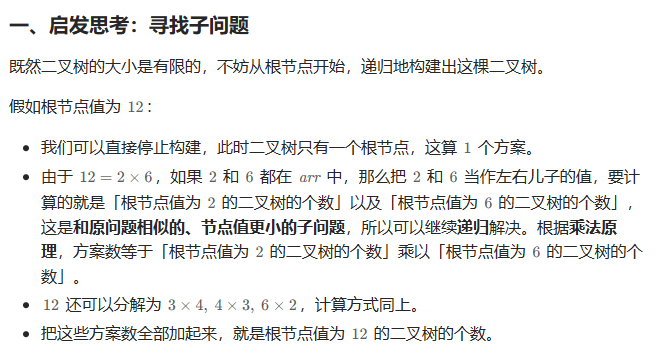
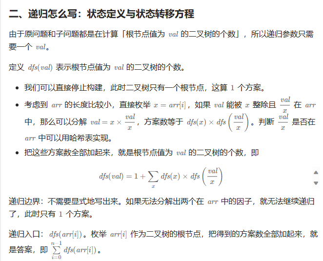
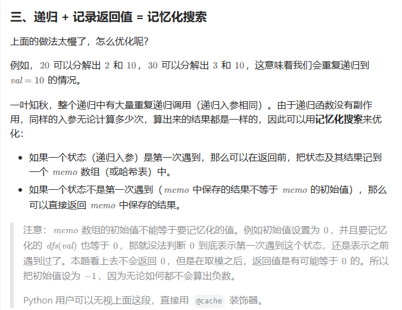
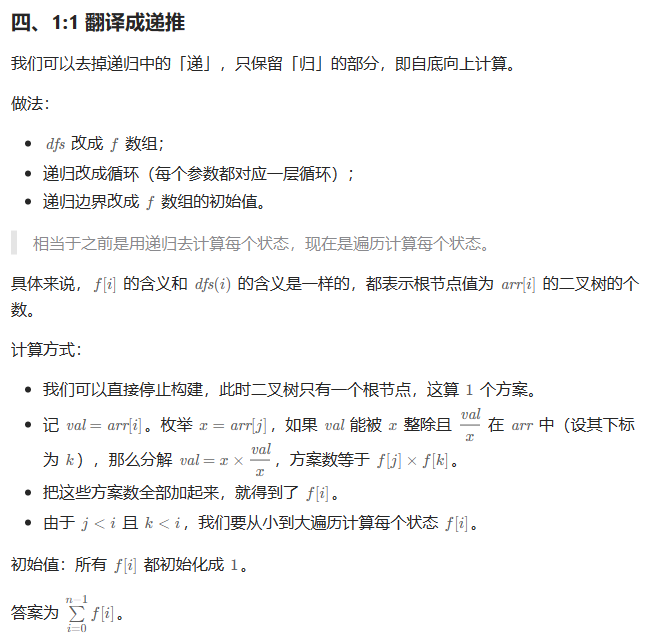
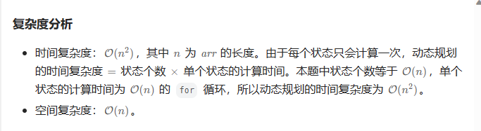
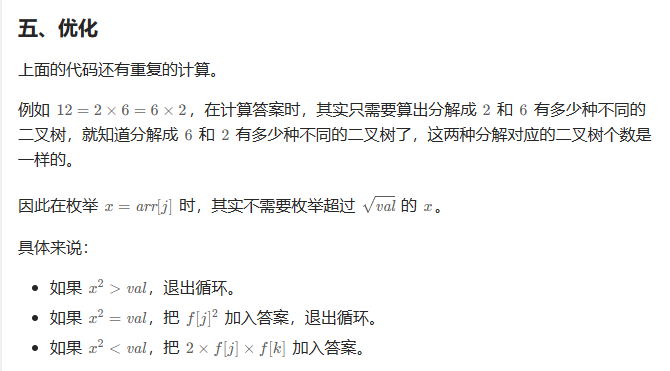
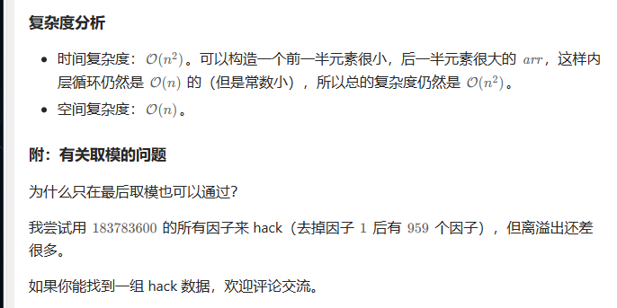

# 题目



# 我的题解

## 思路

思路暂无，感觉情况太过多了，有点无法下手，决定去看下答案


看了下题解思路：利用动态规划，来自己写

```C++
class Solution {
public:
    int numFactoredBinaryTrees(vector<int>& arr) {
        //动态规划，哈希表
        //利用哈希表暂时记录所有值,arr不会重复
        unordered_set<int> hash;
        for (int &i : arr){
            hash.insert(i);
        }
        const int MOD = 1e9 + 7;
        //动态规划 dfs(val) = 1 + dfs(x)*dfs(val/x),x为arr[i]
        //没有明确的初始化，最多就算一开始初始为1，但是任意的dfs(i)都是和乘积相关的，但是是根据所有的因子来写的
        //定义dfs
        function<long long(int)> dfs = [&](int val)->long long{
            //递归的边界 如果val无法分界因子，相当于return 1
            long long res = 1;
            for (int x : arr){
                if (val % x == 0 && hash.count(val / x)){
                    //另一个因子val/x必须存在arr中
                    res += dfs(x) * dfs(val/x); 
                }
            }
            return res;
        };
        //main函数
        long long ans = 0;
        //每一个arr[i]遍历
        for (int &i : arr){
            ans += dfs(i);
        }
        return ans % MOD;
    }
};
```



超时


### 排序+记忆化搜索+动态规划

```C++
class Solution {
public:
    int numFactoredBinaryTrees(vector<int> &arr) {
        //记忆化搜索 + 动态规划
        const int MOD = 1e9 + 7;
        sort(arr.begin(), arr.end());
        int n = arr.size();
        unordered_map<int, int> idx;
        //记录因子和下标
        for (int i = 0; i < n; i++) {
            idx[arr[i]] = i;
        }
        //记忆化搜索
        //并且memo中记录的是下标，所以后面动态规划也用下标
        vector<long long> memo(n, -1); // -1 表示没有计算过
        function<long long(int)> dfs = [&](int i) -> long long {
            long long &res = memo[i]; // 注意这里是引用
            if (res != -1) return res; // 之前计算过，就用之前记录的次数
            //没记录过，就进行递归
            res = 1;
            int val = arr[i];
            for (int j = 0; j < i; j++) { // val 的因子一定比 val 小
                int x = arr[j];
                if (val % x == 0 && idx.count(val / x)) { // 另一个因子 val/x 必须在 arr 中
                    //这里dfs(j)使用下标j来统计arr[j]的次数，因为不一定非要用数arr[j]，当然也可以用，因为arr[i]都是不重复的
                    res += dfs(j) * dfs(idx[val / x]);
                }
            }
            return res;
        };

        long long ans = 0;
        for (int i = 0; i < n; i++) {
            ans += dfs(i);
        }
        return ans % MOD;
    }
};

```


# 其他题解

## 其他1

### 思路：记忆化搜索，动态规划



从以上得知，

1.从根节点往下走，一条路径上的节点值是严格递减的

2.一个节点值为质数时，也无法分解了

3.二叉树大小是有限的




从以上得知：二叉树的个数等于左子树的二叉树个数*右子树二叉树的个数，当然具体是等于他们值的二叉树个数，意思就是左子树值作为根节点的二叉树个数




从以上分析得：

1.需要构建哈希表，来得到分解的因子是否在数组中

2.递推公式：就是左子树（因子arr[i]作为根节点）,右子树（因子val/arr[i]作为根节点）他们个数的乘积再加上1

```C++
// 会超时的递归代码
class Solution {
public:
    int numFactoredBinaryTrees(vector<int> &arr) {
        const int MOD = 1e9 + 7;
        unordered_set<int> s(arr.begin(), arr.end());

        function<long long(int)> dfs = [&](int val) -> long long {
            // 递归边界：如果 val 无法分解因子，相当于 return 1
            long long res = 1;
            for (int x: arr) {
                if (val % x == 0 && s.count(val / x)) { // 另一个因子 val/x 必须在 arr 中
                    res += dfs(x) * dfs(val / x);
                }
            }
            return res;
        };

        long long ans = 0;
        for (int x: arr) { // 枚举根节点的值
            ans += dfs(x);
        }
        return ans % MOD;
    }
};

作者：灵茶山艾府
链接：https://leetcode.cn/problems/binary-trees-with-factors/solutions/2416115/cong-ji-yi-hua-sou-suo-dao-di-tui-jiao-n-nbk6/
来源：力扣（LeetCode）
著作权归作者所有。商业转载请联系作者获得授权，非商业转载请注明出处。
```

会出现超时


### 2.可以进行排序


```C++
// 会超时的递归代码
class Solution {
public:
    int numFactoredBinaryTrees(vector<int> &arr) {
        const int MOD = 1e9 + 7;
        sort(arr.begin(), arr.end());
        int n = arr.size();
        unordered_map<int, int> idx;
        for (int i = 0; i < n; i++) {
            idx[arr[i]] = i;
        }

        function<long long(int)> dfs = [&](int i) -> long long {
            long long res = 1;
            int val = arr[i];
            for (int j = 0; j < i; j++) { // val 的因子一定比 val 小
                int x = arr[j];
                if (val % x == 0 && idx.count(val / x)) { // 另一个因子 val/x 必须在 arr 中
                    res += dfs(j) * dfs(idx[val / x]);
                }
            }
            return res;
        };

        long long ans = 0;
        for (int i = 0; i < n; i++) {
            ans += dfs(i);
        }
        return ans % MOD;
    }
};

作者：灵茶山艾府
链接：https://leetcode.cn/problems/binary-trees-with-factors/solutions/2416115/cong-ji-yi-hua-sou-suo-dao-di-tui-jiao-n-nbk6/
来源：力扣（LeetCode）
著作权归作者所有。商业转载请联系作者获得授权，非商业转载请注明出处。
```

还是会超时


### 3.递归 + 记录返回值 = 记忆化搜索

可以采用记忆化搜索来优化



```C++
class Solution {
public:
    int numFactoredBinaryTrees(vector<int> &arr) {
        const int MOD = 1e9 + 7;
        sort(arr.begin(), arr.end());
        int n = arr.size();
        unordered_map<int, int> idx;
        for (int i = 0; i < n; i++) {
            idx[arr[i]] = i;
        }

        vector<long long> memo(n, -1); // -1 表示没有计算过
        function<long long(int)> dfs = [&](int i) -> long long {
            long long &res = memo[i]; // 注意这里是引用
            if (res != -1) return res; // 之前计算过
            res = 1;
            int val = arr[i];
            for (int j = 0; j < i; j++) { // val 的因子一定比 val 小
                int x = arr[j];
                if (val % x == 0 && idx.count(val / x)) { // 另一个因子 val/x 必须在 arr 中
                    res += dfs(j) * dfs(idx[val / x]);
                }
            }
            return res;
        };

        long long ans = 0;
        for (int i = 0; i < n; i++) {
            ans += dfs(i);
        }
        return ans % MOD;
    }
};

作者：灵茶山艾府
链接：https://leetcode.cn/problems/binary-trees-with-factors/solutions/2416115/cong-ji-yi-hua-sou-suo-dao-di-tui-jiao-n-nbk6/
来源：力扣（LeetCode）
著作权归作者所有。商业转载请联系作者获得授权，非商业转载请注明出处。
```

### 4.



```C++
class Solution {
public:
    int numFactoredBinaryTrees(vector<int> &arr) {
        const int MOD = 1e9 + 7;
        sort(arr.begin(), arr.end());
        int n = arr.size();
        unordered_map<int, int> idx;
        for (int i = 0; i < n; i++) {
            idx[arr[i]] = i;
        }
        vector<long long> f(n, 1);
        for (int i = 0; i < n; i++) {
            int val = arr[i];
            for (int j = 0; j < i; j++) { // val 的因子一定比 val 小
                int x = arr[j];
                if (val % x == 0 && idx.count(val / x)) { // 另一个因子 val/x 必须在 arr 中
                    f[i] += f[j] * f[idx[val / x]];
                }
            }
        }
        return accumulate(f.begin(), f.end(), 0LL) % MOD;
    }
};

作者：灵茶山艾府
链接：https://leetcode.cn/problems/binary-trees-with-factors/solutions/2416115/cong-ji-yi-hua-sou-suo-dao-di-tui-jiao-n-nbk6/
来源：力扣（LeetCode）
著作权归作者所有。商业转载请联系作者获得授权，非商业转载请注明出处。
```




### 5.



```C++
class Solution {
public:
    int numFactoredBinaryTrees(vector<int> &arr) {
        const int MOD = 1e9 + 7;
        sort(arr.begin(), arr.end());
        int n = arr.size();
        unordered_map<int, int> idx;
        for (int i = 0; i < n; i++) {
            idx[arr[i]] = i;
        }
        vector<long long> f(n, 1);
        for (int i = 0; i < n; i++) {
            int val = arr[i];
            for (int j = 0; j < i; j++) {
                int x = arr[j];
                if (1LL * x * x > val) { // 防止乘法溢出
                    break;
                }
                if (x * x == val) {
                    f[i] += f[j] * f[j];
                    break;
                }
                if (val % x == 0 && idx.count(val / x)) {
                    f[i] += f[j] * f[idx[val / x]] * 2;
                }
            }
        }
        return accumulate(f.begin(), f.end(), 0LL) % MOD;
    }
};

作者：灵茶山艾府
链接：https://leetcode.cn/problems/binary-trees-with-factors/solutions/2416115/cong-ji-yi-hua-sou-suo-dao-di-tui-jiao-n-nbk6/
来源：力扣（LeetCode）
著作权归作者所有。商业转载请联系作者获得授权，非商业转载请注明出处。
```

