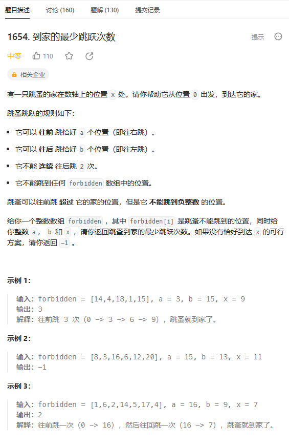
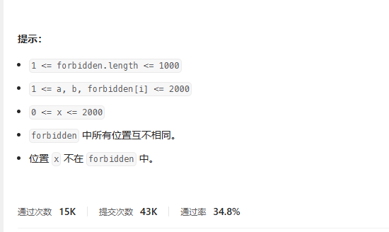
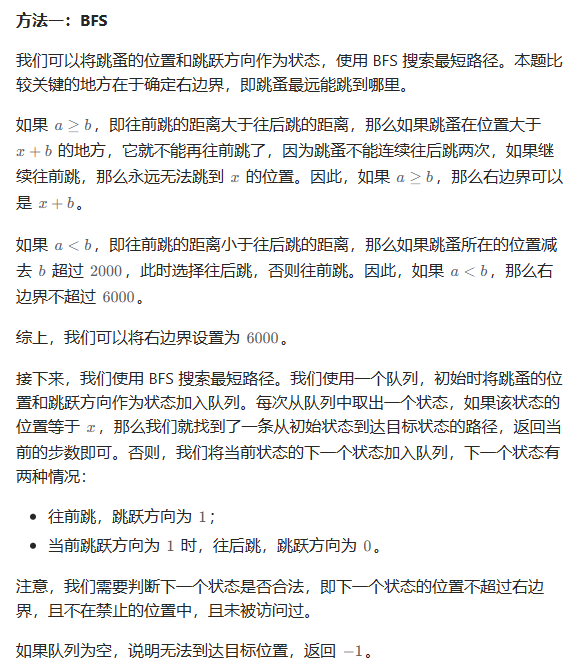

# 题目





# 我的题解

## 思路

不太会，BFS解法需要学习


# 其他题解

## 其他1



第一种就是向前跳的距离a 大于 向后跳的距离b 

如果向前跳的距离大于x+b，那么就不可能再回到家了

所以，如果a大于等于b，右边界就是x+b


第二种，a<b,即往前跳的距离小于往后跳的距离，那么又因为a和b的差距最多2000,所以如果跳蚤位置减去b超过2000，此时选择往后跳，否则往前跳。因此，右边界为x+2a 可以为6000


接下来，使用BFS来搜索最短路径。我们使用一个队列，初始时将跳蚤的位置和跳跃方向作为状态加入队列。每次从队列中取一个状态，如果该状态的位置等于x，那么我们找到一条从初始状态到达目标位置的路径，返回当前的步数即可。否则，我们将当前状态的下一个状态加入队列，下一个状态有两种情况：

1.往前跳，跳跃方向为1；

2。往前跳跃方向为1，往后跳，跳跃方向为0

要判断下一个状态是否合法，即下一个位置不超过右边界，且不在禁止的位置，且未被访问过。

如果队列为空，就说明无法达到目标。‘


```C++
class Solution {
public:
    int minimumJumps(vector<int>& forbidden, int a, int b, int x) {
        //这一行代码创建了一个无序集合（哈希集合）s，用于存储禁止经过的点。forbidden 是一个输入参数，它是一个包含禁止经过点的向量。
        unordered_set<int> s(forbidden.begin(), forbidden.end());
        //`queue<pair<int, int>> q; q.emplace(0, 1);`: 这里定义了一个队列 `q`，用于存储待处理的状态。代码开始时，将起点状态 `(0, 1)` 加入队列。这里状态用一对整数表示，第一个整数是当前位置，第二个整数表示上一步是通过正向步长 `a`（值为1）还是反向步长 `b`（值为0）到达的。
        queue<pair<int, int>> q;
        q.emplace(0, 1);
        //这里定义了一个布尔类型的二维数组 `vis`，用于记录状态是否已经访问过。`n` 是一个上限值，这里设为 6000。`vis[i][j]` 表示在位置 `i` 处，并且上一步是通过正向或反向到达的情况下，状态是否已经访问过。初始时，将状态 `(0, 1)` 标记为已访问。
        const int n = 6000;
        bool vis[n][2];
        memset(vis, false, sizeof(vis));
        vis[0][1] = true;
        //这个循环是整个算法的核心部分，它会在队列不为空的情况下不断进行迭代。`ans` 表示步数，每次循环步数加一。
        for (int ans = 0; q.size(); ++ans) {
            //内部循环对当前队列中的所有状态进行处理，这是为了确保每一步只处理一层状态。在每一步中，将队列中的状态出队，然后根据当前位置和步长进行移动。
            for (int t = q.size(); t; --t) {
                //这里取出队头状态 (i, k)，其中 i 是当前位置，k 表示上一步的步长情况（正向或反向）。
                auto [i, k] = q.front();
                q.pop();
                //如果当前位置已经达到目标位置 x，则返回步数 ans，表示找到了从起点到目标的最小步数。
                if (i == x) {
                    return ans;
                }
                // 这里生成了一个可能的下一步状态的向量 nxts，包含了通过正向步长 a 到达的状态。
                vector<pair<int, int>> nxts = {{i + a, 1}};
                //如果上一步是通过正向步长到达的，则可以通过反向步长 b 到达下一步。这里使用了位运算来判断 k 的奇偶性。
                if (k & 1) {
                    nxts.emplace_back(i - b, 0);
                }
                //遍历可能的下一步状态。j 表示下一步的位置，l 表示下一步的步长情况。
                for (auto [j, l] : nxts) {
                    //这里检查下一步状态是否合法。条件包括：不超过上限 n、不是禁止经过的点、并且之前没有访问过这个状态。
                    if (j >= 0 && j < n && !s.count(j) && !vis[j][l]) {
                        vis[j][l] = true;
                        q.emplace(j, l);
                    }
                }
            }
        }
        //如果队列为空但仍未找到目标位置，返回 -1，表示无法到达目标位置。
        return -1;
    }
};

```

