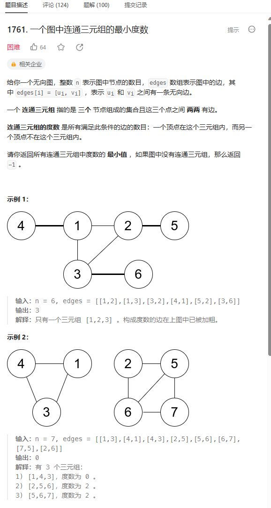

# 题目



# 我的题解

## 思路：建立邻接矩阵和度数矩阵

非独立完成，学习到了图的作法，使用bool邻接数组来建立图节点之间相邻关系，然后deg数组作为每个节点的度数。最关键的是要去掉自身三元组的度数6.


# 其他题解

## 其他1


==首先是创建邻接矩阵==，再将每个节点的度数存入数组deg中

枚举所有的三元组，如果g[i] [j] = g[j] [k] = g[i] [k] = 1, 则说明三个节点构成了一个连通三元组，

此时答案更新为ans = min(ans, deg[i] + deg[j] + deg[k] - 6)。

枚举完所有的三元组后，如果答案仍然为无穷， 说明图中不存在连通三元组


```C++
class Solution {
public:
    int minTrioDegree(int n, vector<vector<int>>& edges) {
        //判断图中节点之间是否有边相连
        bool g[n][n];
        memset(g, 0, sizeof g);
        //用来储存每个节点的度数，即与之相邻的边的数量
        int deg[n];
        memset(deg, 0, sizeof deg);
        //遍历输入的边的数组，用来建立邻接矩阵
        for (auto& e : edges) {
            //对于每条边，从输入的数组中获取两个节点的编号，并将它们分别减1，以便在代码中使用0-based索引。
            int u = e[0] - 1, v = e[1] - 1;
              //将g数组中u和v之间的元素设为true，表示节点u和节点v之间存在一条边。由于是无向图，所以需要同时设置g[v][u]为true。
            g[u][v] = g[v][u] = true;
            //增加节点u和节点v的度数，表示它们各自相邻的边的数量增加了。
            deg[u]++, deg[v]++;
        }
      
        int ans = INT_MAX;
        //接下来的部分使用三重循环嵌套，遍历所有可能的节点三元组，以查找满足条件的"trio"。
        for (int i = 0; i < n; ++i) {
            for (int j = i + 1; j < n; ++j) {
                //i,j相连吗，组成一条边
                if (g[i][j]) {
                    for (int k = j + 1; k < n; ++k) {
                        if (g[j][k] && g[i][k]) {
                            //如果节点i、j和k两两之间都有边相连（即g[i][j]、g[j][k]和g[i][k]均为true），则计算这个三元组的度数之和，并将其与当前的最小值ans进行比较，选择较小者作为新的最小值。
                            //deg[i] + deg[j] + deg[k] - 6是因为度数要排除自己的三元组，而之前我们相邻的边度数是2，是因为每个节点都会+1(即使他们是相邻的)
                            ans = min(ans, deg[i] + deg[j] + deg[k] - 6);
                        }
                    }
                }
            }
        }
        //返回结果，没有找到返回-1
        return ans == INT_MAX ? -1 : ans;
    }
};
```


## 其他2


### vector写法

```C++
class Solution {
public:
    int minTrioDegree(int n, vector<vector<int>>& edges) {
        vector<vector<int>> g(n, vector<int>(n));
        vector<int> degree(n);

        for (auto&& edge: edges) {
            int x = edge[0] - 1, y = edge[1] - 1;
            g[x][y] = g[y][x] = 1;
            ++degree[x];
            ++degree[y];
        }

        int ans = INT_MAX;
        for (int i = 0; i < n; ++i) {
            for (int j = i + 1; j < n; ++j) {
                if (g[i][j] == 1) {
                    for (int k = j + 1; k < n; ++k) {
                        if (g[i][k] == 1 && g[j][k] == 1) {
                            ans = min(ans, degree[i] + degree[j] + degree[k] - 6);
                        }
                    }
                }
            }
        }

        return ans == INT_MAX ? -1 : ans;
    }
};

作者：力扣官方题解
链接：https://leetcode.cn/problems/minimum-degree-of-a-connected-trio-in-a-graph/solutions/2417898/yi-ge-tu-zhong-lian-tong-san-yuan-zu-de-wuv8o/
来源：力扣（LeetCode）
著作权归作者所有。商业转载请联系作者获得授权，非商业转载请注明出处。
```

