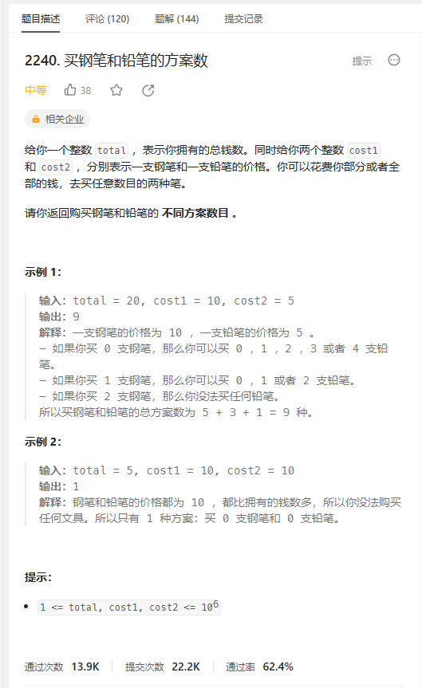
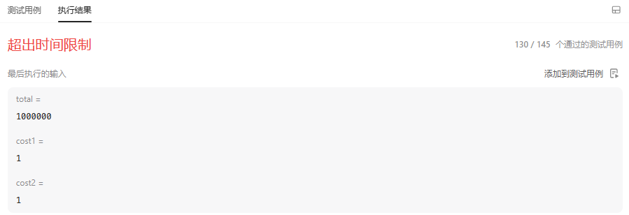
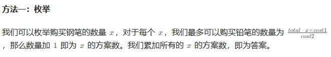
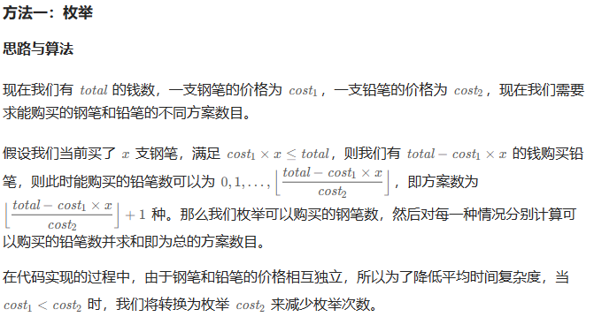

# 题目



# 我的题解

## 思路：暴力解法

看到购买方案数，很多人第一思想会是背包问题，所以我们要多回顾


我可以假设买0到n只钢笔，n只钢笔的价格是不大于total总钱数的

再遍历买铅笔的个数，价格不大于total减去买钢笔的钱

```C++
class Solution {
public:
    long long waysToBuyPensPencils(int total, int cost1, int cost2) {
        //暴力解法
        int res = 0;
        //遍历买钢笔的总数
        for (int i = 0; i * cost1 <= total; ++i){
            int left = total - i * cost1;
            //遍历买铅笔的个数
            for (int j = 0; j * cost2 <= left; ++j){
                res++;
            }
        }
        return res;
    }
};
```

会超时



## 枚举

如果我们不用内层循环，直接计算可以买的最大值，然后就可以直接算

==最终我需要注意数据可能会非常大，所以定义long long==

```C++
class Solution {
public:
    long long waysToBuyPensPencils(int total, int cost1, int cost2) {
        //暴力解法
        long long res = 0;
        //遍历买钢笔的总数
        for (int i = 0; i * cost1 <= total; ++i){
            long long left = total - i * cost1;
            //计算可以买铅笔的最大个数，向下取整
            long long count = left / cost2;
            //结果加一，是要包括买0只铅笔
            res += count + 1;
        }
        return res;
    }
};
```


# 其他解法

## 其他1

思路与我的一致，也是枚举



```C++
class Solution {
public:
    long long waysToBuyPensPencils(int total, int cost1, int cost2) {
        long long ans = 0;
        for (int x = 0; x <= total / cost1; ++x) {
            int y = (total - x * cost1) / cost2 + 1;
            ans += y;
        }
        return ans;
    }
};

作者：ylb
链接：https://leetcode.cn/problems/number-of-ways-to-buy-pens-and-pencils/solutions/2420833/python3javacgotypescript-yi-ti-yi-jie-me-r2h5/
来源：力扣（LeetCode）
著作权归作者所有。商业转载请联系作者获得授权，非商业转载请注明出处。
```

## 其它2




### 一种递归的写法

```C++
class Solution {
public:
    long long waysToBuyPensPencils(int total, int cost1, int cost2) {
        if (cost1 < cost2) {
            return waysToBuyPensPencils(total, cost2, cost1);
        }
        long res = 0, cnt = 0;
        while (cnt * cost1 <= total) {
            res += (total - cnt * cost1) / cost2 + 1;
            cnt++;
        }
        return res;
    }
};

作者：力扣官方题解
链接：https://leetcode.cn/problems/number-of-ways-to-buy-pens-and-pencils/solutions/2359649/mai-gang-bi-he-qian-bi-de-fang-an-shu-by-83nk/
来源：力扣（LeetCode）
著作权归作者所有。商业转载请联系作者获得授权，非商业转载请注明出处。
```

