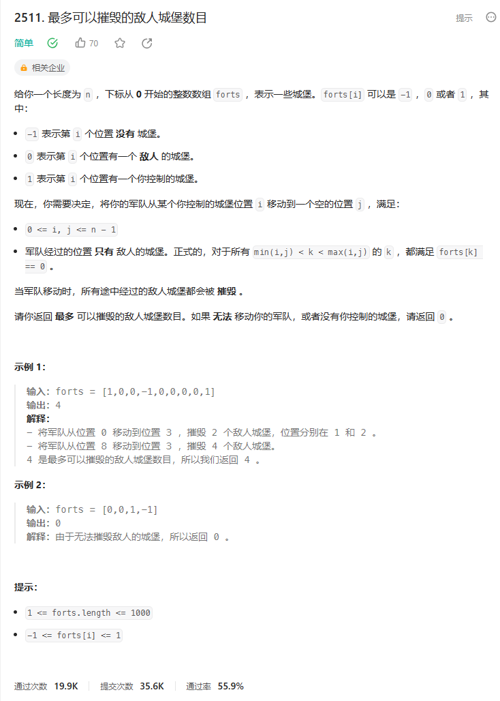
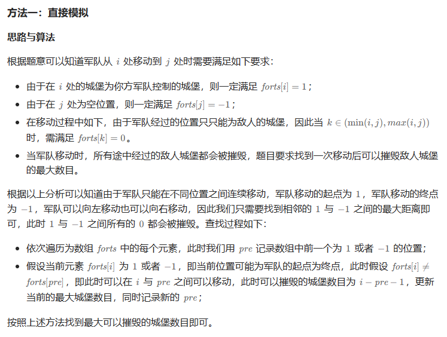
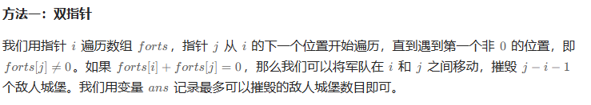

# 题目



# 我的题解

## 思路：双指针,枚举

主要是要找到1和-1之间最多的0

我们先找到1然后往左和往右去遍历寻找0，直到碰到-1


直到碰到-1这个条件还是很重要的否则我们写成这样是不对的

```C++
class Solution {
public:
    int captureForts(vector<int>& forts) {
        //枚举每个1
        int res = 0;
        for (int i = 0; i < forts.size(); i++){
            if (forts[i] == 1){
                int j = i + 1;//往右寻找-1
                while (j < forts.size() && forts[j] == 0){
                    j++;
                    res = max(res, j - i - 1);
                }
                j = i - 1;//往左找
                while (j >= 0 && forts[j] == 0){
                    j--;
                    res = max(res,i - j - 1);
                }
            }
        }
        return res;
    }
};
```


增加判断结尾是-1的条件就行

```C++
class Solution {
public:
    int captureForts(vector<int>& forts) {
        //枚举每个1，向左和向右找到最多0，当然需要的是1和-1之间的
        int res = 0;
        for (int i = 0; i < forts.size(); i++){
            if (forts[i] == 1){
                int j = i + 1;//往右寻找-1
                while (j < forts.size() && forts[j] == 0){
                    j++;
                }
                //增加判断结尾是-1的条件，要不然无法更新结果
                if (j >= forts.size() || forts[j] != -1) ;
                else res = max(res, j - i - 1);
                j = i - 1;//往左找
                while (j >= 0 && forts[j] == 0){
                    j--;    
                }
                //增加判断结尾是-1的条件，要不然无法更新结果
                if (j < 0 || forts[j] != -1) ;
                else res = max(res,i - j - 1);
            }
        }
        return res;
    }
};
```

# 其他题解

## 其他1




```C++
class Solution {
public:
    int captureForts(vector<int>& forts) {
        int ans = 0, pre = -1;
        for (int i = 0; i < forts.size(); i++) {
            if (forts[i] == 1 || forts[i] == -1) {
                if (pre >= 0 && forts[i] != forts[pre]) {
                    ans = max(ans, i - pre - 1);
                }
                pre = i;
            }
        }
        return ans;
    }
};

作者：力扣官方题解
链接：https://leetcode.cn/problems/maximum-enemy-forts-that-can-be-captured/solutions/2393779/zui-duo-ke-yi-cui-hui-de-di-ren-cheng-ba-5qmc/
来源：力扣（LeetCode）
著作权归作者所有。商业转载请联系作者获得授权，非商业转载请注明出处。
```


## 其他2



```C++
class Solution {
public:
    int captureForts(vector<int>& forts) {
        int n = forts.size();
        int ans = 0, i = 0;
        while (i < n) {
            int j = i + 1;
            if (forts[i] != 0) {
                while (j < n && forts[j] == 0) {
                    ++j;
                }
                if (j < n && forts[i] + forts[j] == 0) {
                    ans = max(ans, j - i - 1);
                }
            }
            i = j;
        }
        return ans;
    }
};

作者：ylb
链接：https://leetcode.cn/problems/maximum-enemy-forts-that-can-be-captured/solutions/2422340/python3javacgorust-yi-ti-yi-jie-shuang-z-xws6/
来源：力扣（LeetCode）
著作权归作者所有。商业转载请联系作者获得授权，非商业转载请注明出处。
```

