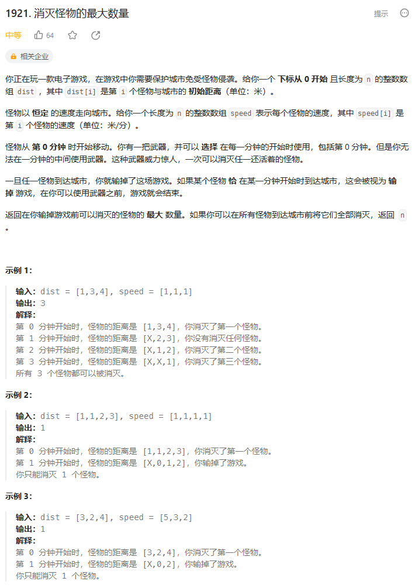
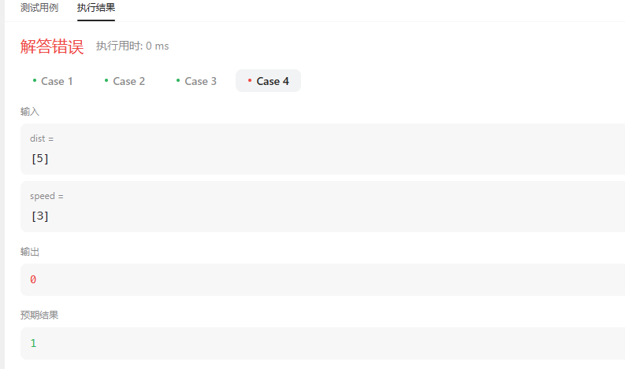
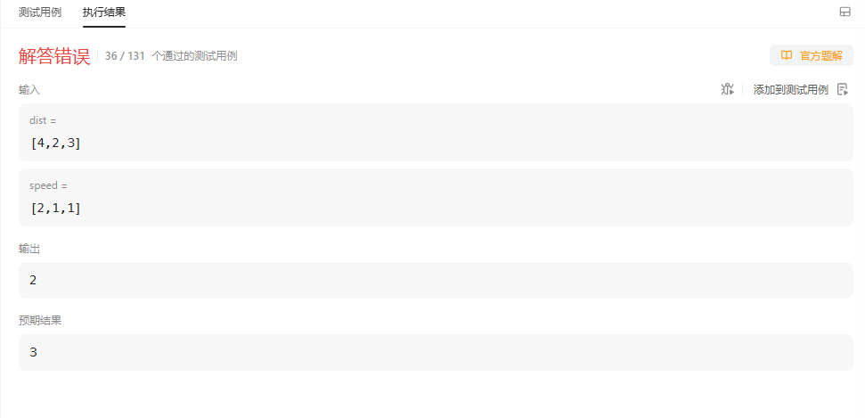
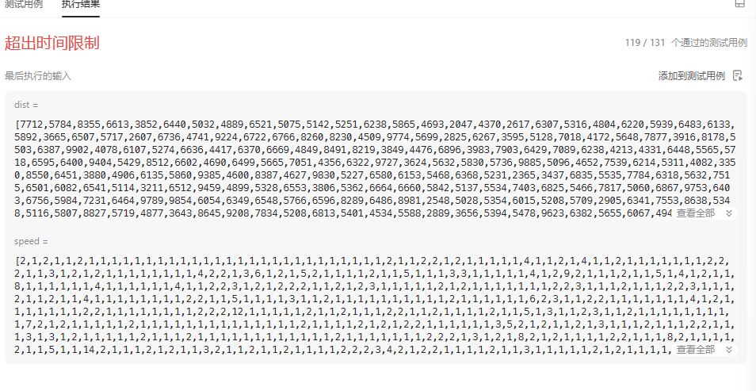
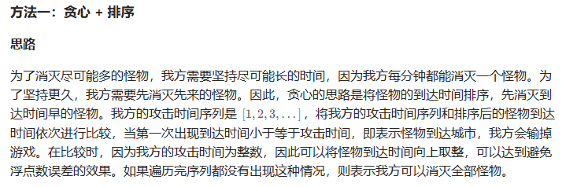
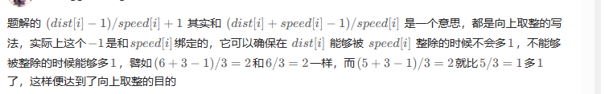

# 题目



# 我的题解

## 思路：贪心

### 我的思路是贪心，就是优先击杀距离城市最近的

```
class Solution {
public:
    int eliminateMaximum(vector<int>& dist, vector<int>& speed) {
        //贪心思路，优先击杀距离最近的，当然这个最近是指 下一跳就能到达城市的
        //暴力解法，寻找下一跳就能到达城市的
        int res = 0;
        int n = dist.size();
        while(n--){
            bool flag = false;
            for (int i = 0; i < dist.size(); i++){
            if (dist[i] - speed[i] <= 0){
                //需要消灭，但是最多只能消灭一个,碰到第二次就是没了
                if (flag) return res;
                //被消灭，一次只能消灭一个
                dist[i] = 0;
                res++;
                flag = true;
                //如果有多个下一跳就能到达城市的，那么也没法了
            }
        }
        }
        return res;
    }
};
```

==但是这样就会造成我只消灭了有危险的下一跳就会失败的，不会在消灭一些本来没有威胁的===

### ==本来这个距离5的怪物不会造成危险，但是我们应该只能把它消灭==




### 所以我们增加一个，就是都不会产生威胁的话，就删除一个最近的

### 记录一下最近的dist下标temp

```C++
class Solution {
public:
    int eliminateMaximum(vector<int>& dist, vector<int>& speed) {
        //贪心思路，优先击杀距离最近的，当然这个最近是指 下一跳就能到达城市的
        //暴力解法，寻找下一跳就能到达城市的
        int res = 0;
        int n = dist.size();
        while(n--){
            bool flag = false;
            int temp = 0;
            int mindist = INT_MAX;
            for (int i = 0; i < dist.size(); i++){
                dist[i] = dist[i] - speed[i];
                //记录距离最近的本轮下标
                if (dist[i] < mindist) temp = i;
                if (dist[i] <= 0){
                    //需要消灭，但是最多只能消灭一个,碰到第二次就是没了
                    if (flag) return res;
                    //被消灭，一次只能消灭一个
                    dist[i] = 0;
                    res++;
                    flag = true;
                }
            }
            //本轮没有造成危险的怪物，那么就杀死一个距离最近的
            if (flag == false) {
                dist[temp] = 0;
                res++;
            }
        }
        return res;
    }
};
```



### 应该考虑的不是距离最近的，而是最快就会碰到城市的怪物，杀死

将之前下标的记录方法换一种，记录最快会到达城市的

记录还有多少次到达城市


==并且需要忽略判断之前变成0的==

```C++
class Solution {
public:
    int eliminateMaximum(vector<int>& dist, vector<int>& speed) {
        //贪心思路，优先击杀距离最近的，当然这个最近是指 下一跳就能到达城市的
        //暴力解法，寻找下一跳就能到达城市的
        int res = 0;
        int n = dist.size();
        while(n--){
            bool flag = false;
            int temp = 0;
            int count = 0;
            int mincount = INT_MAX;
            for (int i = 0; i < dist.size(); i++){
                if (dist[i] == 0) continue;
                dist[i] = dist[i] - speed[i];
                //记录还有多少次到达城市,向上取整
                if (dist[i] % speed[i] == 0) count = dist[i] / speed[i];
                else count = dist[i] / speed[i] + 1;
                //记录最快到达城市的下标
                if (count < mincount) { 
                    temp = i;
                    mincount = count;
                }
                if (dist[i] <= 0){
                    //需要消灭，但是最多只能消灭一个,碰到第二次就是没了
                    if (flag) return res;
                    //被消灭，一次只能消灭一个
                    dist[i] = 0;
                    res++;
                    flag = true;
                }
            }
            //本轮没有造成危险的怪物，那么就杀死一个距离最近的
            if (flag == false) {
                dist[temp] = 0;
                res++;
            }
            //for (int &i : dist) cout << i << " ";
        }
        return res;
    }
};
```



果然这种偏暴力的做法，无法通过


# 其他解法

## 其他1

### 思路：贪心+排序




我没有想到，就是比较怪物到达的轮数，看能够消灭，我有点太暴力，模拟了

先排序，后比较

```C++
class Solution {
public:
    int eliminateMaximum(vector<int>& dist, vector<int>& speed) {
        int n = dist.size();
        vector<int> arrivalTimes(n);
        for (int i = 0; i < n; i++) {
            arrivalTimes[i] = (dist[i] - 1) / speed[i] + 1;
        }
        sort(arrivalTimes.begin(), arrivalTimes.end());
        for (int i = 0; i < n; i++) {
            if (arrivalTimes[i] <= i) {
                return i;
            }
        }
        return n;
    }
};

作者：力扣官方题解
链接：https://leetcode.cn/problems/eliminate-maximum-number-of-monsters/solutions/857961/xiao-mie-guai-wu-de-zui-da-shu-liang-by-0ou2p/
来源：力扣（LeetCode）
著作权归作者所有。商业转载请联系作者获得授权，非商业转载请注明出处。
```

### 向上取整的写法



```C++
class Solution {
public:
    int eliminateMaximum(vector<int>& dist, vector<int>& speed) {
        int n = dist.size();
        //到达的轮数，向上取整
        vector<int> arrivalTimes(n);
        for (int i = 0; i < n; i++) {
            //这种向上取整的方式值的我学习
            arrivalTimes[i] = (dist[i] - 1) / speed[i] + 1;
        }
        //排序，按从小到大
        sort(arrivalTimes.begin(), arrivalTimes.end());
        //一轮只能消灭一个，如果到达的轮数小于我们的轮数，代表我们没法消灭
        //n为轮数，最大就是dist的大小
        //这个从第0轮开始，还是比较精髓的，因为我们可以在失败前就杀死一个
        for (int i = 0; i < n; i++) {
            if (arrivalTimes[i] <= i) {
                return i;
            }
        }
        return n;
    }
};
```

