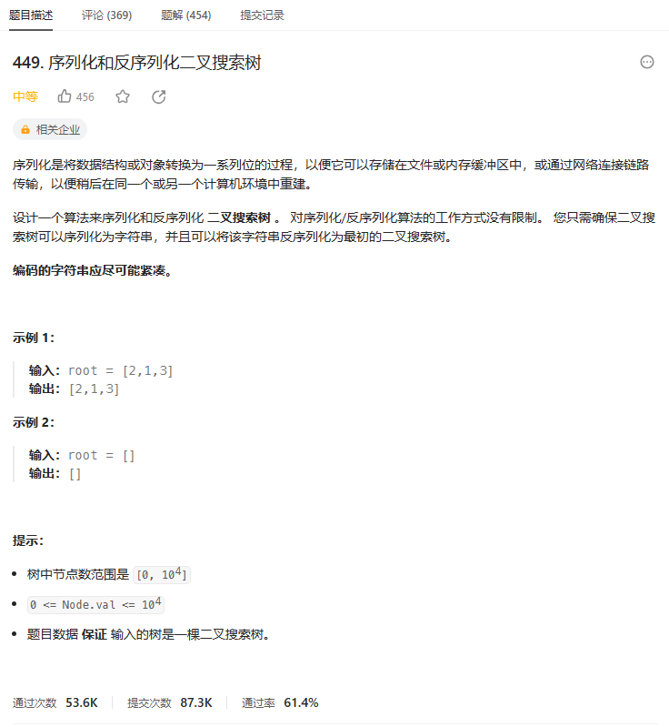
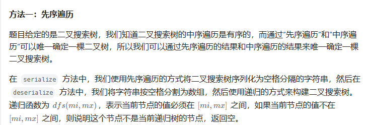

# 题目




# 我的题解

## 思路：

自己创建序列化和反序列化

都是转化成为字符串


但是需要序列化的是二叉搜索树


二叉搜索树的中序遍历是递增序列，那么这就涉及到序列化成一个递增的字符串

然后从字符串中解析处二叉搜索树


```C++
/**
 * Definition for a binary tree node.
 * struct TreeNode {
 *     int val;
 *     TreeNode *left;
 *     TreeNode *right;
 *     TreeNode(int x) : val(x), left(NULL), right(NULL) {}
 * };
 */
class Codec {
public:
string path = "";
    void dfs(TreeNode* node){
        if (!node) return;
        //中序遍历
        if (node->left) dfs(node->left);
        path += to_string(node->val);
        if (node->right) dfs(node->right);
    }
    // Encodes a tree to a single string.
    string serialize(TreeNode* root) {
        //中序遍历二叉搜索树是递增序列
        //中序遍历
        dfs(root);
        //但是仅仅依靠中序遍历，无法确定根节点，所以我们得做一个标记吧
        return path;
    }

    // Decodes your encoded data to tree.
    TreeNode* deserialize(string data) {
        //解析中序遍历

    }
};

// Your Codec object will be instantiated and called as such:
// Codec* ser = new Codec();
// Codec* deser = new Codec();
// string tree = ser->serialize(root);
// TreeNode* ans = deser->deserialize(tree);
// return ans;
```

思路，错了


应该先用先序遍历或后0序遍历，然后加上中序遍历的性质就能唯一确定二叉搜索树

用了二叉搜索树的性质来确认根节点，左子树就是比当前节点小，右子树比当前节点大

```

```


# 其他题解

巩固一些概念：

-   给定一颗二叉树的先序遍历和中序遍历可以恢复这颗二叉树
-   给定一颗二叉树的后序遍历和中序遍历可以恢复这棵二叉树
-   由于二叉搜索树的中序遍历是有序的，因此给定一颗二叉树的先序遍历（或后续遍历），相当于有了中序遍历和先序遍历（或后续遍历），因此只要有先序遍历（或后序遍历）就可以恢复二叉搜索树

题解的方法感觉很巧妙，我能想到的做法是先序遍历，第一个数字就是当前节点的值，然后找到大于这个节点的值是右子树的起始元素，然后利用这个把整个序列分成左子树和右子树两部分，然后再进行递归处理。但是有可能出现只有左子树，或者只有右子树的情况，需要特判。

而题解的做法在构造时使用与序列化时相同的遍历方式构造即可，利用当前子树最小和最大值判断节点是否是当前子树的

## 其他1




```C++
/**
 * Definition for a binary tree node.
 * struct TreeNode {
 *     int val;
 *     TreeNode *left;
 *     TreeNode *right;
 *     TreeNode(int x) : val(x), left(NULL), right(NULL) {}
 * };
 */
class Codec {
public:

    // Encodes a tree to a single string.
    string serialize(TreeNode* root) {
        if (!root) {
            return "";
        }
        string data = "";
        function<void(TreeNode*)> dfs = [&](TreeNode* root) {
            if (!root) {
                return;
            }
            data += to_string(root->val) + " ";
            dfs(root->left);
            dfs(root->right);
        };
        dfs(root);
        data.pop_back();
        return data;
    }

    // Decodes your encoded data to tree.
    TreeNode* deserialize(string data) {
        if (data.empty()) {
            return nullptr;
        }
        vector<int> nums = split(data, ' ');
        int i = 0;
        function<TreeNode*(int, int)> dfs = [&](int mi, int mx) -> TreeNode* {
            if (i == nums.size() || nums[i] < mi || nums[i] > mx) {
                return nullptr;
            }
            int x = nums[i++];
            TreeNode* root = new TreeNode(x);
            root->left = dfs(mi, x);
            root->right = dfs(x, mx);
            return root;
        };
        return dfs(INT_MIN, INT_MAX);
    }

    vector<int> split(const string& s, char delim) {
        vector<int> tokens;
        stringstream ss(s);
        string token;
        while (getline(ss, token, delim)) {
            tokens.push_back(stoi(token));
        }
        return tokens;
    }
};

// Your Codec object will be instantiated and called as such:
// Codec* ser = new Codec();
// Codec* deser = new Codec();
// string tree = ser->serialize(root);
// TreeNode* ans = deser->deserialize(tree);
// return ans;

作者：ylb
链接：https://leetcode.cn/problems/serialize-and-deserialize-bst/solutions/2425348/python3javacgo-yi-ti-yi-jie-xian-xu-bian-7ktz/
来源：力扣（LeetCode）
著作权归作者所有。商业转载请联系作者获得授权，非商业转载请注明出处。
```


## 其它2

利用前序遍历+中序遍历（排序得到）

```C++
class Codec {
    // 保存前序序列,前序排序可以得到中序序列
    // 由前、中序列构造出对应的二叉搜索树
    void rse(TreeNode* root, string& data) {
        if (!root)return;
        data += to_string(root->val) + ',';
        rse(root->left, data);
        rse(root->right, data);
    }

    vector<int> split(const string& s) {
        vector<int> ret;
        for (int beg = 0, end; beg < s.size(); beg = end + 1) {
            end = s.find(',', beg);
            ret.push_back(stoi(s.substr(beg, end - beg)));
        }
        return ret;
    }

public:
    // Encodes a tree to a single string.
    string serialize(TreeNode* root) {
        string ret;
        rse(root, ret);
        return ret;
    }


    // Decodes your encoded data to tree.
    TreeNode* deserialize(string data) {
        vector<int> preorder = split(data);
        vector<int> inorder = preorder;
        //排序得到中序遍历
        sort(inorder.begin(), inorder.end());
        
        int pi = 0;// 遍历前序序列
        int n = preorder.size();
        unordered_map<int, int> pos;// 每个元素在中序序列中的位置
        for (int i = 0; i < n; ++i) {
            pos[inorder[i]] = i;
        }
        //可以去看下，前序遍历+中序遍历构建二叉树题目，主要是边界条件
		std::function<TreeNode* (int, int)> rdse = [&](int lower, int upper)->TreeNode* {
            if (lower > upper)return nullptr;
            int val = preorder[pi++];
            TreeNode* root = new TreeNode(val);
            root->left = rdse(lower, pos[val] - 1);
            root->right = rdse(pos[val] + 1, upper);
            return root;
        };

		return rdse(0, n - 1);
    }

};
```

