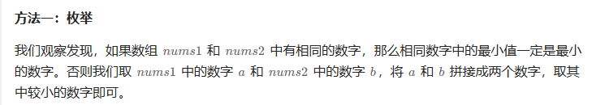

# 题目


# 我的题解

## 思路：

关键是两个数组都 **至少** 包含这个数字的某个数位。

并且给出的数组中元素大小不大于9


分情况：

1.两个数组中有相同的数字，那么就返回这个数

2.如果没有没有相同的，那么选出一个最小的数（在一个数组中）作为十进制，然后在另外的数组中，选择一个最小的数，反正都是寻找最小数

可以先合起来，然后比较最终结果来决定结果

```C++
class Solution {
public:
    int minNumber(vector<int>& nums1, vector<int>& nums2) {
        //1.两个数组中有相同的数字，那么就返回这个数

        //2.如果没有没有相同的，那么选出一个最小的数（在一个数组中）作为十进制，然后在另外的数组中，选择一个最小的数，反正都是寻找最小数
        //可以先合起来，然后比较最终结果来决定结果
        unordered_map<int, int> hash;
        int min1 = INT_MAX, min2 = INT_MAX;
        for (int i = 0; i < nums1.size(); ++i){
            //元素不重复
            hash[nums1[i]] = i;
            min1 = min(min1, nums1[i]);
        }
        for (int i = 0; i < nums2.size(); ++i){
            if (hash.count(nums2[i])) return nums2[i];
            min2 = min(min2, nums2[i]);
        }
        return min1*10 + min2 < min1 + min2 * 10 ? min1*10 + min2 : min1 + min2 * 10;
    }
};
```

错误，没有注意可能相同的数字也要比较谁最小


添加相同的数比较

```C++
class Solution {
public:
    int minNumber(vector<int>& nums1, vector<int>& nums2) {
        //1.两个数组中有相同的数字，那么就返回这个数

        //2.如果没有没有相同的，那么选出一个最小的数（在一个数组中）作为十进制，然后在另外的数组中，选择一个最小的数，反正都是寻找最小数
        //可以先合起来，然后比较最终结果来决定结果
        unordered_map<int, int> hash;
        int min1 = INT_MAX, min2 = INT_MAX;
        for (int i = 0; i < nums1.size(); ++i){
            //元素不重复
            hash[nums1[i]] = i;
            min1 = min(min1, nums1[i]);
        }
        //确定是否有重复
        bool flag = false;
        int min3 = INT_MAX;
        for (int i = 0; i < nums2.size(); ++i){
            if (hash.count(nums2[i])) 
            {
                flag = true;
                min3 = min(nums2[i], min3);
            }
            min2 = min(min2, nums2[i]);
        }
        if (flag) return min3;
        //比合起来的数大小
        return min1*10 + min2 < min1 + min2 * 10 ? min1*10 + min2 : min1 + min2 * 10;
    }
};
```

空间复杂度O(n)还是有点高

时间复杂度O(n)


# 其他题解

## 其它1

做法和思路和我的差不多一致


```C++
class Solution {
public:
    int minNumber(vector<int>& nums1, vector<int>& nums2) {
        auto same = [&]() -> int { ... };：这一行定义了一个lambda函数same，它没有参数，返回一个整数。这个lambda函数的目的是找出两个向量中是否有相同的数字，并返回最小的相同数字。它使用了一个无序集合（unordered_set）s来存储nums1中的元素，然后遍历nums2中的元素，如果找到一个元素在s中也存在，就将其与当前最小值x比较，然后更新x为更小的值。如果没有找到相同的数字，函数返回-1。
        auto same = [&]() -> int {
            unordered_set<int> s(nums1.begin(), nums1.end());
            int x = 10;
            for (int num: nums2) {
                if (s.count(num)) {
                    x = min(x, num);
                }
            }
            return x == 10 ? -1 : x;
        };
//这个条件语句首先调用上面定义的same lambda函数，将返回的结果赋值给变量x。如果x不等于-1，表示找到了相同的数字，函数返回x，这是最小的相同数字。
        if (int x = same(); x != -1) {
            return x;
        }
        //最后，函数返回x * 10 + y和y * 10 + x中的较小值，这是通过将最小的元素组合在一起形成的最小整数。这是因为在两个整数组合成一个整数时，较小的整数应该放在前面以获得最小的结果。
        int x = *min_element(nums1.begin(), nums1.end());
        int y = *min_element(nums2.begin(), nums2.end());
        return min(x * 10 + y, y * 10 + x);
    }
};

作者：力扣官方题解
链接：https://leetcode.cn/problems/form-smallest-number-from-two-digit-arrays/solutions/2425419/cong-liang-ge-shu-zi-shu-zu-li-sheng-che-zaie/
来源：力扣（LeetCode）
著作权归作者所有。商业转载请联系作者获得授权，非商业转载请注明出处。
```


## 其他2

使用了双层for循环，时间复杂度O(m*n),空间复杂度O(1)



```C++

class Solution {
public:
    int minNumber(vector<int>& nums1, vector<int>& nums2) {
        int ans = 100;
        for (int a : nums1) {
            for (int b : nums2) {
                if (a == b) {
                    ans = min(ans, a);
                } else {
                    ans = min({ans, a * 10 + b, b * 10 + a});
                }
            }
        }
        return ans;
    }
};

作者：ylb
链接：https://leetcode.cn/problems/form-smallest-number-from-two-digit-arrays/solutions/2426909/python3javacgotypescript-yi-ti-san-jie-m-e115/
来源：力扣（LeetCode）
著作权归作者所有。商业转载请联系作者获得授权，非商业转载请注明出处。
```

空间复杂度O(1)，没有使用额外空间


## 其他3

bitset做法，一种比较高效的哈希表

主要是判断是否存在相同的数字


```C++
class Solution {
public:
    int minNumber(vector<int>& nums1, vector<int>& nums2) {
        bitset<10> s1;
        bitset<10> s2;
        for (int x : nums1) {
            s1[x] = 1;
        }
        for (int x : nums2) {
            s2[x] = 1;
        }
        int a = 0, b = 0;
        for (int i = 1; i < 10; ++i) {
            if (s1[i] && s2[i]) {
                return i;
            }
            if (!a && s1[i]) {
                a = i;
            }
            if (!b && s2[i]) {
                b = i;
            }
        }
        return min(a * 10 + b, b * 10 + a);
    }
};

作者：ylb
链接：https://leetcode.cn/problems/form-smallest-number-from-two-digit-arrays/solutions/2426909/python3javacgotypescript-yi-ti-san-jie-m-e115/
来源：力扣（LeetCode）
著作权归作者所有。商业转载请联系作者获得授权，非商业转载请注明出处。
```

## 其他4

位运算来判断是否存在相同的

只用int大小来判断


```C++
class Solution {
public:
    int minNumber(vector<int>& nums1, vector<int>& nums2) {
        //定义了两个整数mask1和mask2，用于表示两个向量中包含的数字的位掩码（bit mask）。这些位掩码将用于检测两个向量中是否存在相同的数字。
        int mask1 = 0, mask2 = 0;
        //通过以下循环遍历nums1和nums2中的数字，并使用位运算|操作将每个数字对应的位设置为1，以构建位掩码：
        //这里使用了位移运算<<，将1左移x位，然后使用|操作将该位设置为1，表示数字x存在。
        //因为不存在重复
        for (int x : nums1) {
            mask1 |= 1 << x;
        }
        for (int x : nums2) {
            mask2 |= 1 << x;
        }
        //通过使用位运算&操作，将mask1和mask2合并成一个位掩码mask，表示两个向量中都存在的数字。
        int mask = mask1 & mask2;
        //检查是否存在相同的数字，如果mask不为0，表示存在相同的数字。使用内置函数__builtin_ctz(mask)来获取mask中最低位的1所在的位置，这个位置就是最小相同数字的值。
        if (mask) {
            return __builtin_ctz(mask);
        }
        //如果没有相同的数字，则计算mask1和mask2中最低位的1所在的位置，分别赋值给变量a和b。
        int a = __builtin_ctz(mask1);
        int b = __builtin_ctz(mask2);
        //最后，函数返回a * 10 + b和b * 10 + a中的较小值，这是通过将最小的元素组合在一起形成的最小整数。同样，这是因为在两个整数组合成一个整数时，较小的整数应该放在前面以获得最小的结果。
        return min(a * 10 + b, b * 10 + a);
    }
};
```


## 二进制位运算知识补充

