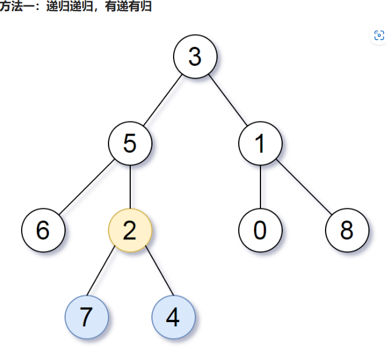

# 题目


# 我的题解

## 思路：深度搜索

注意返回的是TreeNode*,不是值，所以会会出现[2，7，4]三个值


其实思路很简单，判断两颗子树的高度是否相等即可，如果相等当前节点就是答案，不相等就往大的那边递归


==非独立完成，思路和官方题解一样，但是求深度和求最后解，分开了。所以我们要会学习边求深度，边求最后解的方法==

```C++
/**
 * Definition for a binary tree node.
 * struct TreeNode {
 *     int val;
 *     TreeNode *left;
 *     TreeNode *right;
 *     TreeNode() : val(0), left(nullptr), right(nullptr) {}
 *     TreeNode(int x) : val(x), left(nullptr), right(nullptr) {}
 *     TreeNode(int x, TreeNode *left, TreeNode *right) : val(x), left(left), right(right) {}
 * };        
 */
    TreeNode* lcaDeepestLeaves(TreeNode* root) {
        //这是函数的初始检查，如果树的根节点为空，直接返回空指针。
        if (root == nullptr) return root;
        // 求节点的最大深度
        function<int(TreeNode*)> getHeight = [&getHeight](TreeNode* r) {
        //这里是递归，所以使用了[&getHeight]
            //这里定义了一个lambda函数 getHeight，用于计算给定节点的最大深度。这是一个递归函数，它接受一个指向树节点的指针 r 作为参数。在函数内部，它递归地计算左子树和右子树的最大深度，并返回较大值加1，表示当前节点的最大深度。
            if (r == nullptr) return 0;
            return max(getHeight(r->left), getHeight(r->right)) + 1;
        };
        // 判断节点两个子树高度相等即为结果
        //这里定义了另一个lambda函数 dfs，用于执行深度优先搜索，寻找最深叶子节点的最近公共祖先。这个函数也接受一个树节点 r 作为参数。在函数内部，它首先使用 getHeight 函数计算当前节点的左子树和右子树的高度（深度）。
        function<TreeNode* (TreeNode*)> dfs = [&dfs, &getHeight](TreeNode* r) {
            if (r == nullptr) return r;
            auto lHeight = getHeight(r->left);
            auto rHeight = getHeight(r->right);
            //如果 lHeight 等于 rHeight，表示左子树和右子树的深度相等，那么当前节点 r 就是最近公共祖先，因为最深叶子节点必然位于当前节点的子树中。
            if (lHeight == rHeight) return r;
            //如果 lHeight 大于 rHeight，那么最深叶子节点位于左子树中，所以递归调用 dfs 函数处理左子树，返回其结果。
            else if (lHeight > rHeight) return dfs(r->left);
            //果 lHeight 小于 rHeight，那么最深叶子节点位于右子树中，所以递归调用 dfs 函数处理右子树，返回其结果。
            else return dfs(r->right);
        };
        return dfs(root);
    }
```


# 其他题解

## 其他1


```C++
/**
 * Definition for a binary tree node.
 * struct TreeNode {
 *     int val;
 *     TreeNode *left;
 *     TreeNode *right;
 *     TreeNode() : val(0), left(nullptr), right(nullptr) {}
 *     TreeNode(int x) : val(x), left(nullptr), right(nullptr) {}
 *     TreeNode(int x, TreeNode *left, TreeNode *right) : val(x), left(left), right(right) {}
 * };        
 */
class Solution {
public:
//这是一个递归函数，接收一个指向二叉树根节点的指针 root 作为参数，并返回一个 pair 对，其中第一个元素是指向最深叶子节点的指针，第二个元素是该节点的深度。
    pair<TreeNode*, int> f(TreeNode* root) {
        //这是递归的终止条件。如果当前节点 root 为空（表示空子树），则返回一个 {nullptr, 0} 的 pair 对，表示深度为0的空节点。
        if (!root) {
            return {root, 0};
        }
//在递归中，首先分别递归处理左子树和右子树，得到它们的深度和最深叶子节点。
        auto left = f(root->left);
        auto right = f(root->right);
//如果左子树的深度大于右子树，那么返回 {left.first, left.second + 1}，表示最深叶子节点在左子树中，深度加1。

        if (left.second > right.second) {
            return {left.first, left.second + 1};
        }
        //如果右子树的深度大于左子树，那么返回 {right.first, right.second + 1}，表示最深叶子节点在右子树中，深度加1。
        if (left.second < right.second) {
            return {right.first, right.second + 1};
        }        
//如果左子树和右子树的深度相等，那么表示最深叶子节点同时存在于左子树和右子树中，此时返回 {root, left.second + 1}，表示最深叶子节点就是当前节点 root，深度加1。
        return {root, left.second + 1};

    }

    TreeNode* lcaDeepestLeaves(TreeNode* root) {
        return f(root).first;
    }
};
//这段代码通过递归遍历二叉树，找到最深叶子节点，并返回其最近公共祖先。递归的思路是比较左子树和右子树的深度，然后根据深度的大小来决定最深叶子节点的位置，最终返回最深叶子节点的最近公共祖先。

```

代码的逻辑是在递归的每个节点处，将递归的结果作为一个`pair<TreeNode*, int>`返回。具体来说，对于每个节点 `root`：

1. 如果 `root` 为空，表示空子树，递归终止条件会返回 `{nullptr, 0}`。
2. 如果 `root` 不为空，递归会继续处理其左子树和右子树，并将它们的结果存储在 `left` 和 `right` 中。

这样，在每次递归调用中，都会返回一个 `pair`，其中包含了两部分信息：

- 第一个元素是指向最深叶子节点的指针。
- 第二个元素是最深叶子节点的深度。

递归会从叶子节点开始往上返回，每次返回的 `pair` 中都包含了当前子树中的最深叶子节点和其深度信息。最终，通过比较左子树和右子树的深度，找到了整棵树中最深叶子节点的最近公共祖先，并将其返回给调用者。

所以，递归的每个节点都返回了一个 `pair`，这些返回值一直往上传递，直到找到最深叶子节点的最近公共祖先为止。


## 其他2

简单版考虑




```C++
class Solution {
public:
    TreeNode *lcaDeepestLeaves(TreeNode *root) {
        TreeNode *ans = nullptr;
        int max_depth = -1; // 全局最大深度
        function<int(TreeNode*, int)> dfs = [&](TreeNode *node, int depth) {
            if (node == nullptr) {
                max_depth = max(max_depth, depth); // 维护全局最大深度
                return depth;
            }
            int left_max_depth = dfs(node->left, depth + 1); // 获取左子树最深叶节点的深度
            int right_max_depth = dfs(node->right, depth + 1); // 获取右子树最深叶节点的深度
            if (left_max_depth == right_max_depth && left_max_depth == max_depth)
                ans = node;
            return max(left_max_depth, right_max_depth); // 当前子树最深叶节点的深度
        };
        dfs(root, 0);
        return ans;
    }
};

作者：灵茶山艾府
链接：https://leetcode.cn/problems/lowest-common-ancestor-of-deepest-leaves/solutions/2428724/liang-chong-di-gui-si-lu-pythonjavacgojs-xxnk/
来源：力扣（LeetCode）
著作权归作者所有。商业转载请联系作者获得授权，非商业转载请注明出处。
```

