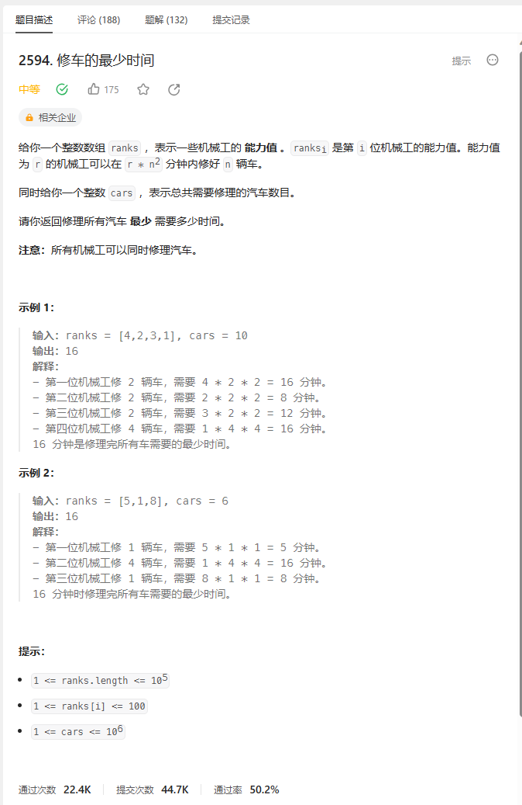
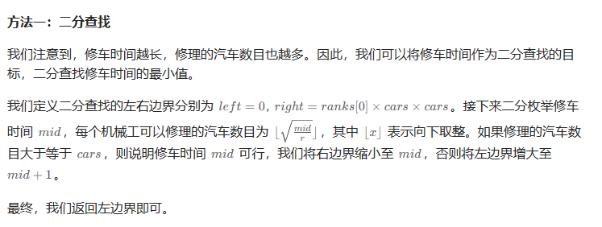

# 题目



# 我的题解

## 思路：二分查找


# 其他题解

## 其他1



```C++
class Solution {
public:
    long long repairCars(vector<int>& ranks, int cars) {
        long long left = 0, right = 1LL * ranks[0] * cars * cars;
        while (left < right) {
            long long mid = (left + right) >> 1;
            long long cnt = 0;
            for (int r : ranks) {
                cnt += sqrt(mid / r);
            }
            if (cnt >= cars) {
                right = mid;
            } else {
                left = mid + 1;
            }
        }
        return left;
    }
};

作者：ylb
链接：https://leetcode.cn/problems/minimum-time-to-repair-cars/solutions/2430475/python3javacgotypescript-yi-ti-yi-jie-er-f96a/
来源：力扣（LeetCode）
著作权归作者所有。商业转载请联系作者获得授权，非商业转载请注明出处。
```

