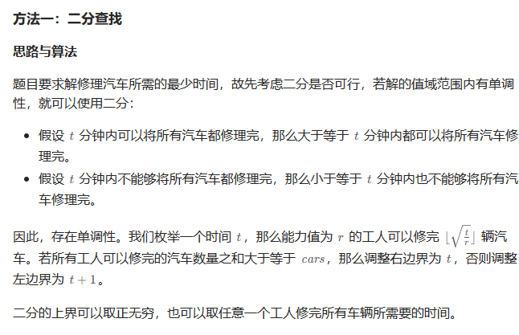
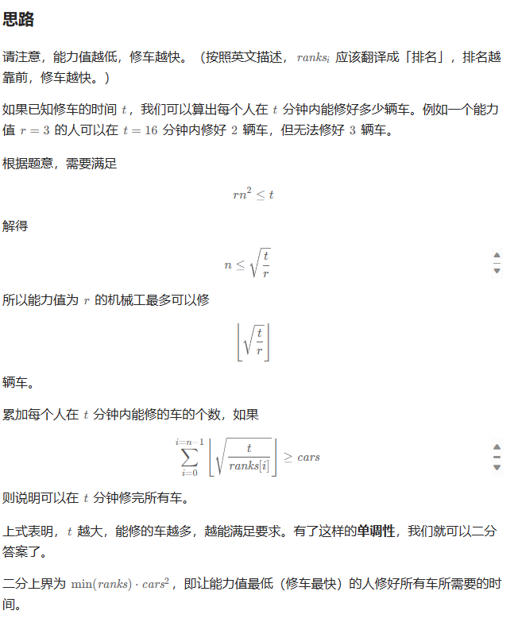

# 题目


# 我的题解

## 思路：二分查找

主要先是计算t时间内，能同时修多少辆车，==记住车的数量的单位是long long==

确定时间的最大值和最小值，最小值可以假设为0，时间的上界可以设为最小能力值修所有车的时间

使用二分法来确定最终时间。

```C++
class Solution {
public:
    long long repairCars(vector<int> &ranks, int cars) {
        using LL = long long;
        //能力值越低，修车越快，找到最低能力值
        int min_r = *min_element(ranks.begin(), ranks.end());
        //二分上界为让能力值最低（修车最快）的人修好所有车所需要的时间。都让他一个人修
        //二分法上界不一定是最大的时间，而是符合题意得最大 最少修车时间
        //一般整数都是int，可以加后缀变成其他类型
        long long left = 0, right = 1LL * min_r * cars * cars;
        //定义计算t时间内，能同时修多少辆车
        function<LL(LL)> solve = [&](LL t)->LL{
            long long cnt = 0;
            for (int &i : ranks){
                //r能力值，t时间内能修的车数量为根号下t/r
                cnt += sqrt(t / i);
            }
            return cnt;
        };
        //二分法
        while (left < right){
            LL mid = left + ((right - left) >> 1);
            //修车的数量大于cars，需要降低时间
            if (solve(mid) >= cars){
                right = mid;
            }
            else{
                left = mid + 1;
            }
        }
        return left;
    }
};

```


# 其他题解

## 其他1


```C++
class Solution {
public:
    long long repairCars(vector<int>& ranks, int cars) {
        long long left = 0, right = 1LL * ranks[0] * cars * cars;
        while (left < right) {
            long long mid = (left + right) >> 1;
            long long cnt = 0;
            for (int r : ranks) {
                cnt += sqrt(mid / r);
            }
            if (cnt >= cars) {
                right = mid;
            } else {
                left = mid + 1;
            }
        }
        return left;
    }
};

作者：ylb
链接：https://leetcode.cn/problems/minimum-time-to-repair-cars/solutions/2430475/python3javacgotypescript-yi-ti-yi-jie-er-f96a/
来源：力扣（LeetCode）
著作权归作者所有。商业转载请联系作者获得授权，非商业转载请注明出处。
```

## 其他2



```C++
class Solution {
public:
    using ll = long long;
    long long repairCars(vector<int>& ranks, int cars) {
        //l表示可能的最小修理成本，初始值为1。r表示可能的最大修理成本，初始值为1ll * ranks[0] * cars * cars，这是根据最大排名来计算的一个估计值。
        ll l = 1, r = 1ll * ranks[0] * cars * cars;
        //定义了一个用于检查给定修理成本m是否满足要求的函数。在这个函数中，首先初始化cnt为0，用于计算修理成本满足要求的汽车数量。然后，通过循环遍历排名向量ranks中的每个排名，计算m除以排名的平方根，并将结果累加到cnt中。
        auto check = [&](ll m) {
            //汽车数量
            ll cnt = 0;
            //m是时间，x是能力值
            for (auto x : ranks) {
                cnt += sqrt(m / x);
            }
            return cnt >= cars;
        };
        //二分法
        while (l < r) {
            ll m = l + r >> 1;
            if (check(m)) {
                r = m;
            } else {
                l = m + 1;
            }
        }
        return l;
    }
};

作者：力扣官方题解
链接：https://leetcode.cn/problems/minimum-time-to-repair-cars/solutions/2425409/xiu-che-de-zui-shao-shi-jian-by-leetcode-if20/
来源：力扣（LeetCode）
著作权归作者所有。商业转载请联系作者获得授权，非商业转载请注明出处。
```


## 其他3



```C++
class Solution {
public:
    long long repairCars(vector<int> &ranks, int cars) {
        //能力值越低，修车越快，找到最低能力值
        int min_r = *min_element(ranks.begin(), ranks.end());
        //二分上界为让能力值最低（修车最快）的人修好所有车所需要的时间。都让他一个人修
        //二分法上界不一定是最大的时间，而是符合题意得最大 最少修车时间
        long long left = 0, right = 1LL * min_r * cars * cars;
        //二分法，枚举每个时间t内能修改的车的数量，是可以同时修的
        while (left + 1 < right) { // 开区间
            long long mid = (left + right) / 2, s = 0;
            //遍历数组来计算可以修多少车
            for (int r : ranks)
                s += sqrt(mid / r);
            //判断是否成立
            (s >= cars ? right : left) = mid;
        }
        return right;
    }
};


```

