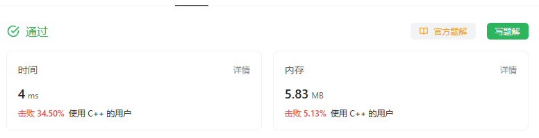

# 题目


# 我的题解

## 思路：枚举

主要是24小时制，最终我们只要返回数据对24取模

```C++
class Solution {
public:
    int findDelayedArrivalTime(int arrivalTime, int delayedTime) {
        return (arrivalTime + delayedTime) % 24;
    }
};
```



