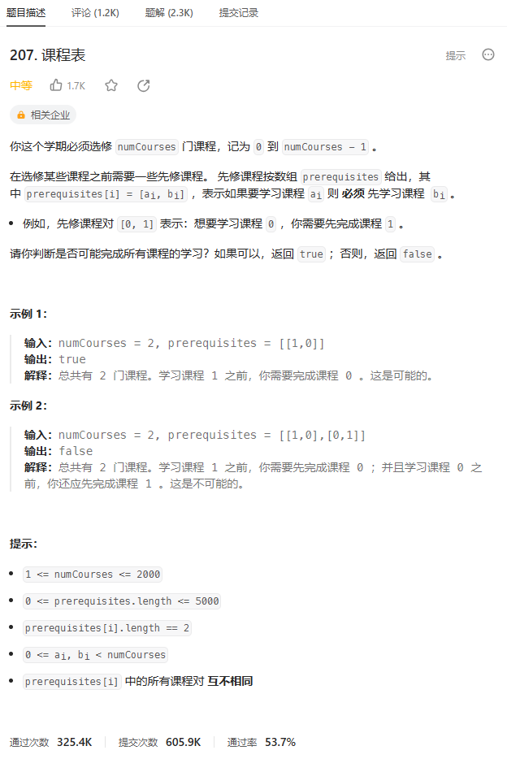
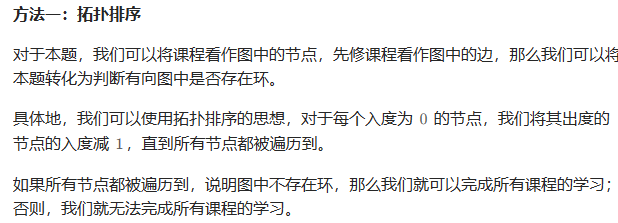
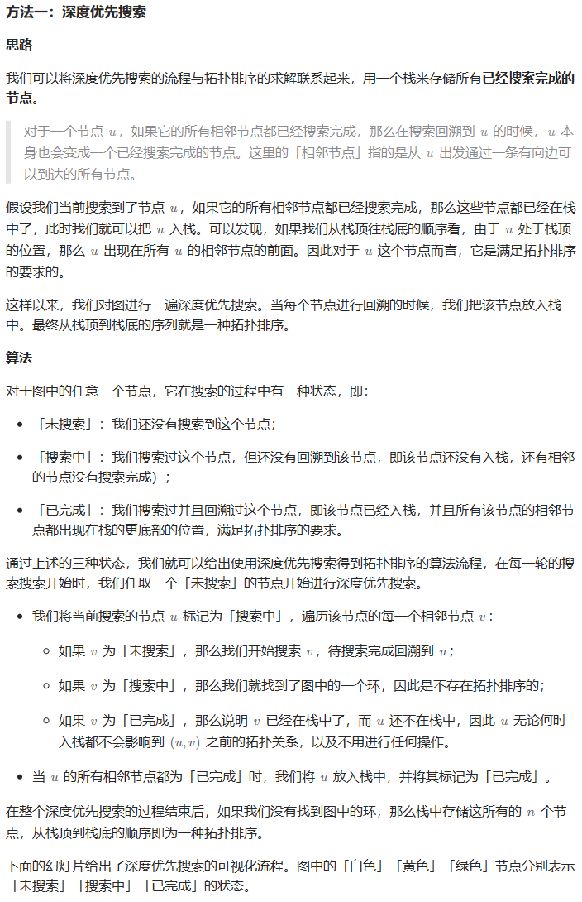

# 题目




# 我的题解

## 思路：拓扑排序

拓扑排序的思想，根据入度。除了这题的例子，还有类加载，存在递推关系。大白话就是，要想搞定A，必须先搞定B、C。你可以设A的入度是2，B、C是0。先搞定最底端入度为0的，它们不需要依赖谁，假设搞定了B，A的入度就变成1，再搞定C，A的入度0，现在就能搞定A了。可以借助队列。


首先要能想到将题目转化为求图中是否有环路问题

1.创建有向图g，节点为课程，并且建立indeg表示每个课程节点的入度

2.遍历遍历 prerequisites 中的每一对先修课程关系，将g[b].push_back(a)代表课程b指向a，代表要先学b才能学a，且a的入度增加

3.使用队列 q 存储入度为零的课程，表示没有任何先修课程的课程可以直接学习。遍历所有课程，将入度为零的课程加入队列中。

4.广度优先搜索（BFS），遍历所有依赖于课程 i 的课程 j，将课程 j 的入度减一。如果减到零，说明课程 j 的所有先修课程都已经学完，将课程 j 加入队列，等待学习


这个过程就是我们考虑拓扑排序中最前面的节点，该节点一定不会有任何入边，也就是它没有任何的先修课程要求。当我们将一个节点加入答案中后，我们就可以移除它的所有出边，代表着它的相邻节点少了一门先修课程的要求。如果某个相邻节点变成了「没有任何入边的节点」，那么就代表着这门课可以开始学习了。按照这样的流程，我们不断地将没有入边的节点加入答案，直到答案中包含所有的节点（得到了一种拓扑排序）或者不存在没有入边的节点（图中包含环）

```C++
class Solution {
public:
    bool canFinish(int numCourses, vector<vector<int>>& prerequisites) {
        //首先，创建一个有向图 g，其大小为 numCourses，用于表示课程之间的依赖关系。同时，创建一个数组 indeg，用于记录每个课程的入度（即有多少先修课程）。
        vector<vector<int>> g(numCourses);
        vector<int> indeg(numCourses);
        //接下来，遍历 prerequisites 中的每一对先修课程关系，其中 p[0] 表示先修课程，p[1] 表示要学习的课程。将先修课程指向要学习的课程，同时增加要学习的课程的入度。
        for (auto& p : prerequisites) {
            int a = p[0], b = p[1];
            g[b].push_back(a);
            ++indeg[a];
        }
        //使用队列 q 存储入度为零的课程，表示没有任何先修课程的课程可以直接学习。遍历所有课程，将入度为零的课程加入队列中。
        queue<int> q;
        for (int i = 0; i < numCourses; ++i) {
            if (indeg[i] == 0) {
                q.push(i);
            }
        }
//使用一个计数器 cnt 来记录已经学习过的课程数量。接下来，进行广度优先搜索（BFS）：
//从队列中取出一个课程 i，表示可以学习的课程。
//增加计数器 cnt。
//遍历所有依赖于课程 i 的课程 j，将课程 j 的入度减一。如果减到零，说明课程 j 的所有先修课程都已经学完，将课程 j 加入队列，等待学习。
        int cnt = 0;
        while (!q.empty()) {
            int i = q.front();
            q.pop();
            ++cnt;
            for (int j : g[i]) {
                if (--indeg[j] == 0) {
                    q.push(j);
                }
            }
        }
        //最后，如果计数器 cnt 等于总课程数 numCourses，则表示可以成功完成所有课程，返回 true；否则，返回 false，表示无法完成所有课程。
        return cnt == numCourses;
    }
};

```


# 其他题解

## 其他1



```C++
class Solution {
public:
    bool canFinish(int numCourses, vector<vector<int>>& prerequisites) {
        vector<vector<int>> g(numCourses);
        vector<int> indeg(numCourses);
        for (auto& p : prerequisites) {
            int a = p[0], b = p[1];
            g[b].push_back(a);
            ++indeg[a];
        }
        queue<int> q;
        for (int i = 0; i < numCourses; ++i) {
            if (indeg[i] == 0) {
                q.push(i);
            }
        }
        int cnt = 0;
        while (!q.empty()) {
            int i = q.front();
            q.pop();
            ++cnt;
            for (int j : g[i]) {
                if (--indeg[j] == 0) {
                    q.push(j);
                }
            }
        }
        return cnt == numCourses;
    }
};

作者：ylb
链接：https://leetcode.cn/problems/course-schedule/solutions/2433584/python3javacgotypescript-yi-ti-yi-jie-tu-w7i6/
来源：力扣（LeetCode）
著作权归作者所有。商业转载请联系作者获得授权，非商业转载请注明出处。
```


## 其它2



```C++
class Solution {
private:
    vector<vector<int>> edges;
    vector<int> visited;
    bool valid = true;

public:
    void dfs(int u) {
        visited[u] = 1;
        for (int v: edges[u]) {
            if (visited[v] == 0) {
                dfs(v);
                if (!valid) {
                    return;
                }
            }
            else if (visited[v] == 1) {
                valid = false;
                return;
            }
        }
        visited[u] = 2;
    }

    bool canFinish(int numCourses, vector<vector<int>>& prerequisites) {
        edges.resize(numCourses);
        visited.resize(numCourses);
        for (const auto& info: prerequisites) {
            edges[info[1]].push_back(info[0]);
        }
        for (int i = 0; i < numCourses && valid; ++i) {
            if (!visited[i]) {
                dfs(i);
            }
        }
        return valid;
    }
};

作者：力扣官方题解
链接：https://leetcode.cn/problems/course-schedule/solutions/359392/ke-cheng-biao-by-leetcode-solution/
来源：力扣（LeetCode）
著作权归作者所有。商业转载请联系作者获得授权，非商业转载请注明出处。
```

