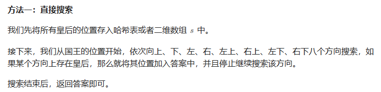

# 题目


# 我的题解

## 思路：暴力，枚举

模拟：枚举可以攻击国王的 8 个方向，每个方向遍历到边界外或第一个皇后为止。

```C++
class Solution {
public:
    vector<vector<int>> queensAttacktheKing(vector<vector<int>> &queens, vector<int> &king) {
        int dr[8] = {-1, -1, -1, 0, 0, 1, 1, 1};
        int dc[8] = {-1, 0, 1, -1, 1, -1, 0, 1};
        int isq[8][8];//记录坐标是否有皇后
        memset(isq, 0, sizeof(isq));
        for (auto &qi: queens)
            isq[qi[0]][qi[1]] = 1;
        vector<vector<int>> res;
        for (int k = 0; k < 8; k++) {//枚举8个方向
            for (int nr = king[0] + dr[k], nc = king[1] + dc[k];; nr += dr[k], nc += dc[k]) {
                if (nr < 0 || nr >= 8 || nc < 0 || nc >= 8)//已出界
                    break;
                if (isq[nr][nc]) {//该方向的第一个皇后
                    res.push_back({nr, nc});
                    break;
                }
            }
        }
        return res;
    }
};
```


# 其他题解

## 其他1



```C++
class Solution {
public:
    vector<vector<int>> queensAttacktheKing(vector<vector<int>>& queens, vector<int>& king) {
        int n = 8;
        //创建一个布尔数组 s，并初始化为全0。数组的维度是8x8，表示国际象棋的8x8棋盘。
        bool s[8][8]{};
        //遍历输入的皇后的位置，将对应的 s 数组元素标记为 true，表示这个位置有皇后。
        for (auto& q : queens) {
            s[q[0]][q[1]] = true;
        }
        //创建一个二维向量 ans 用于存储可以攻击到国王的皇后的位置。
        vector<vector<int>> ans;
        //使用两个嵌套的循环遍历所有可能的方向，这些方向分别是横向、纵向和斜向（共8个方向）：
        //这两个嵌套的循环遍历8个可能的方向，包括水平、垂直和对角线方向。
        for (int a = -1; a <= 1; ++a) {
            for (int b = -1; b <= 1; ++b) {
                //这个条件确保不考虑原地（a和b同时为0）的情况，因为皇后不会攻击自己。
                if (a || b) {
                    //初始化一个位置 (x, y)，从国王的位置开始朝当前方向 (a, b) 移动。
                    int x = king[0] + a, y = king[1] + b;
                    //进入一个 while 循环，该循环会一直移动位置 (x, y) 直到它超出了棋盘的边界：
//if (s[x][y])：如果在 (x, y) 位置有皇后，表示这个方向上可以攻击到国王，将 (x, y) 添加到答案 ans 中。
                    while (x >= 0 && x < n && y >= 0 && y < n) {
                        //这个循环的目的是检查每个可能的方向，看看是否有皇后可以攻击到国王。
                        if (s[x][y]) {
                            ans.push_back({x, y});
                            break;
                        }
                        //分别更新 (x, y) 的值，朝当前方向移动一个单位。
                        x += a;
                        y += b;
                    }
                }
            }
        }
        //最后，返回存储了可以攻击到国王的皇后位置的 ans 二维向量。
        return ans;
    }
};

作者：ylb
链接：https://leetcode.cn/problems/queens-that-can-attack-the-king/
来源：力扣（LeetCode）
著作权归作者所有。商业转载请联系作者获得授权，非商业转载请注明出处。
```

## 其他2


```C++
class Solution {
public:
    vector<vector<int>> queensAttacktheKing(vector<vector<int>>& queens, vector<int>& king) {
        auto sgn = [](int x) -> int{
            return x > 0 ? 1 : (x == 0 ? 0 : -1);
        };

        unordered_map<int, pair<vector<int>, int>> candidates;
        int kx = king[0], ky = king[1];
        for (const auto& queen: queens) {
            int qx = queen[0], qy = queen[1];
            int x = qx - kx, y = qy - ky;
            if (x == 0 || y == 0 || abs(x) == abs(y)) {
                int dx = sgn(x), dy = sgn(y);
                int key = dx * 10 + dy;
                if (!candidates.count(key) || candidates[key].second > abs(x) + abs(y)) {
                    candidates[key] = {queen, abs(x) + abs(y)};
                }
            }
        }

        vector<vector<int>> ans;
        for (const auto& [_, value]: candidates) {
            ans.push_back(value.first);
        }
        return ans;
    }
};

作者：力扣官方题解
链接：https://leetcode.cn/problems/queens-that-can-attack-the-king/
来源：力扣（LeetCode）
著作权归作者所有。商业转载请联系作者获得授权，非商业转载请注明出处。
```

