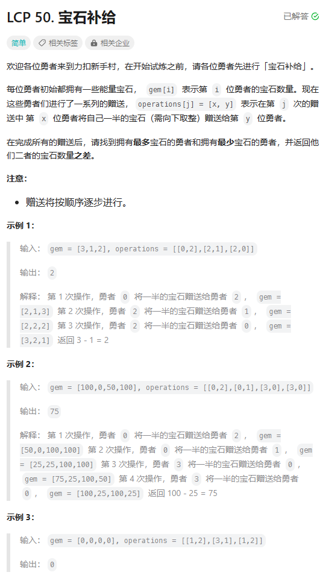
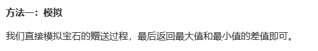

# 题目



# 我的题解

## 思路：模拟

```C++
class Solution {
public:
    int giveGem(vector<int>& gem, vector<vector<int>>& operations) {
        //模拟
        for (int i = 0; i < operations.size(); i++){
            int temp = gem[operations[i][0]] / 2;
            gem[operations[i][1]] += temp;
            gem[operations[i][0]] -= temp;
        }
        return *max_element(gem.begin(), gem.end()) - *min_element(gem.begin(), gem.end());
    }
};
```


# 其他题解

## 其他1



```C++
class Solution {
public:
    int giveGem(vector<int>& gem, vector<vector<int>>& operations) {
        for (auto& op : operations) {
            int x = op[0], y = op[1];
            int v = gem[x] >> 1;
            gem[y] += v;
            gem[x] -= v;
        }
        int mx = *max_element(gem.begin(), gem.end());
        int mi = *min_element(gem.begin(), gem.end());
        return mx - mi;
    }
};

作者：ylb
链接：https://leetcode.cn/problems/WHnhjV/
来源：力扣（LeetCode）
著作权归作者所有。商业转载请联系作者获得授权，非商业转载请注明出处。
```

