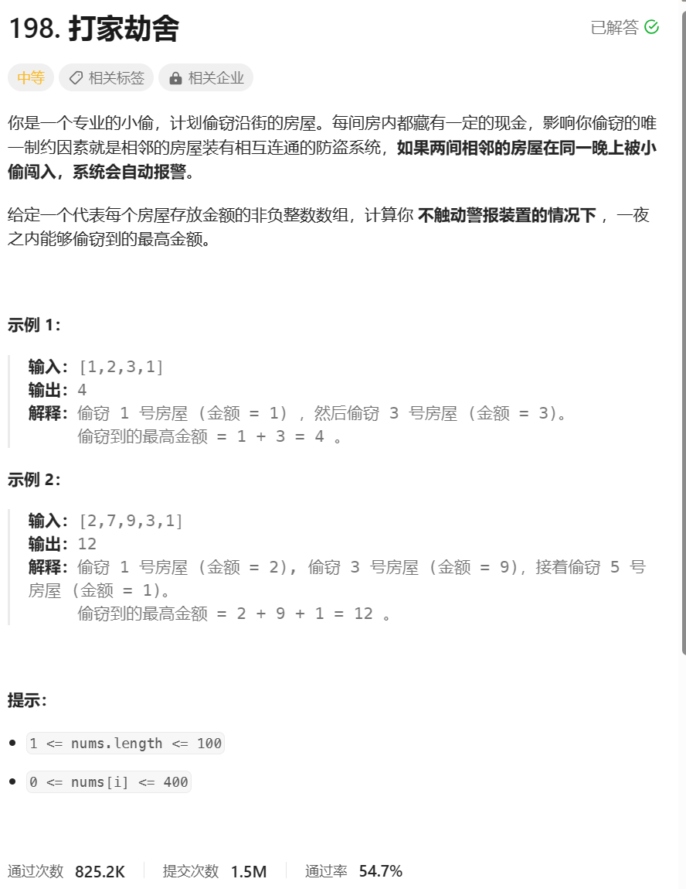

# 题目




# 我的题解

## 思路：动态规划

```C++
class Solution {
public:
  int rob(vector<int>& nums) {
    if (nums.size() == 0) {
        return 0;
    }
    // 子问题：
    // f(k) = 偷 [0..k) 房间中的最大金额
        //偷前k间
    // f(0) = 0
    // f(1) = nums[0]
    // f(k) = max{ rob(k-1), nums[k-1] + rob(k-2) }

    int N = nums.size();
    vector<int> dp(N+1, 0);
    dp[0] = 0;
    dp[1] = nums[0];
    for (int k = 2; k <= N; k++) {
        //举例，2个也可以更新
        dp[k] = max(dp[k-1], nums[k-1] + dp[k-2]);
    }
    return dp[N];
}

};

/*
首先考虑最简单的情况。如果只有一间房屋，则偷窃该房屋，可以偷窃到最高总金额。如果只有两间房屋，则由于两间房屋相邻，不能同时偷窃，只能偷窃其中的一间房屋，因此选择其中金额较高的房屋进行偷窃，可以偷窃到最高总金额。

如果房屋数量大于两间，应该如何计算能够偷窃到的最高总金额呢？对于第 
k (k>2) 间房屋，
有两个选项：
偷窃第 k 间房屋，那么就不能偷窃第 k−1 间房屋，偷窃总金额为前 k−2 间房屋的最高总金额与第 k 间房屋的金额之和。

不偷窃第 k 间房屋，偷窃总金额为前 k−1 间房屋的最高总金额。

在两个选项中选择偷窃总金额较大的选项，该选项对应的偷窃总金额即为前 k 间房屋能偷窃到的最高总金额。

用 dp[i]  [0,i)==[0,i-1] 表示前 i 间房屋能偷窃到的最高总金额，那么就有如下的状态转移方程：

作者：LeetCode-Solution
链接：https://leetcode.cn/problems/house-robber/solution/da-jia-jie-she-by-leetcode-solution/

*/
```


# 其他题解

