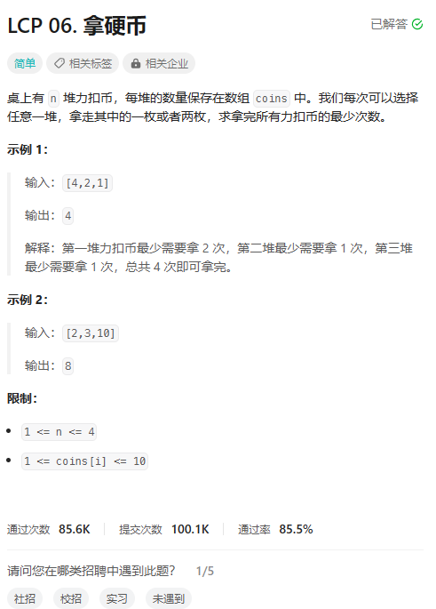
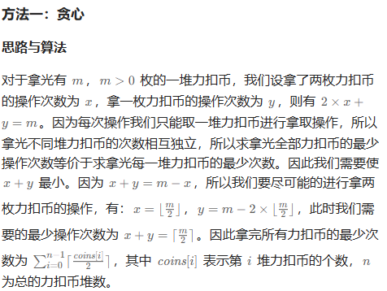

# 题目



# 我的题解

思路：贪心，向上取整

```C++
class Solution {
public:
    int minCount(vector<int>& coins) {
        //贪心，每次都拿2枚,向上取整
        int res = 0;
        for (int i = 0; i < coins.size(); i++){
            int temp = (coins[i] + 1) / 2;
            res += temp;
        }
        return res;
    }
};
```


# 其他题解

## 其他1



```C++
class Solution {
public:
    int minCount(vector<int>& coins) {
        int sum = 0;
        for (int& i : coins) {
            sum += (i + 1) / 2;
        }
        return sum;
    }
};

作者：力扣官方题解
链接：https://leetcode.cn/problems/na-ying-bi/
来源：力扣（LeetCode）
著作权归作者所有。商业转载请联系作者获得授权，非商业转载请注明出处。
```

