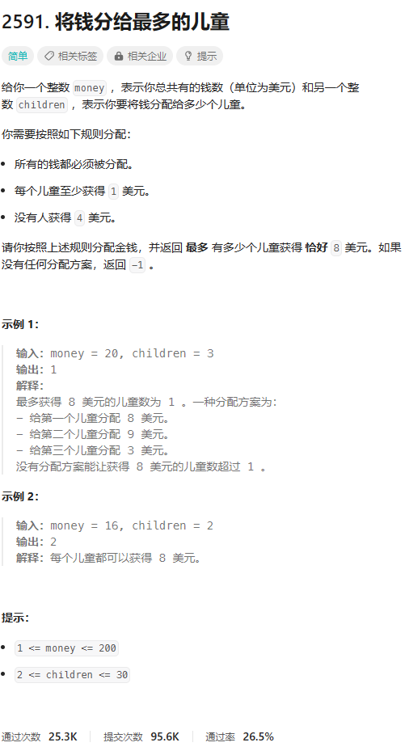
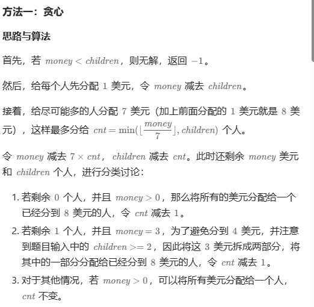
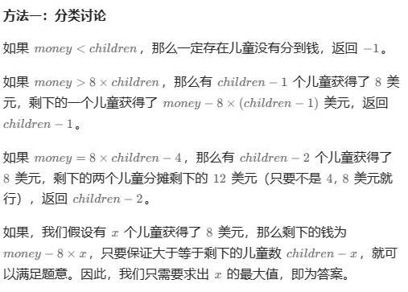

# 题目



# 我的题解

思路：贪心

这种题目之前应该做过，就是不允许有人获得特定的数量，需要分类讨论


# 其他题解

## 其他1：贪心



```C++
class Solution {
public:
    int distMoney(int money, int children) {
        if (money < children) {
            return -1;
        }
        money -= children;
        int cnt = min(money / 7, children);
        money -= cnt * 7;
        children -= cnt;
        if ((children == 0 && money > 0) || (children == 1 && money == 3)) {
            cnt--;
        }
        return cnt;
    }
};

```

## 其他2



```C++
class Solution {
public:
    int distMoney(int money, int children) {
        if (money < children) {
            return -1;
        }
        if (money > 8 * children) {
            return children - 1;
        }
        if (money == 8 * children - 4) {
            return children - 2;
        }
        // money-8x >= children-x, x <= (money-children)/7
        return (money - children) / 7;
    }
};

作者：ylb
链接：https://leetcode.cn/problems/distribute-money-to-maximum-children/
来源：力扣（LeetCode）
著作权归作者所有。商业转载请联系作者获得授权，非商业转载请注明出处。
```

