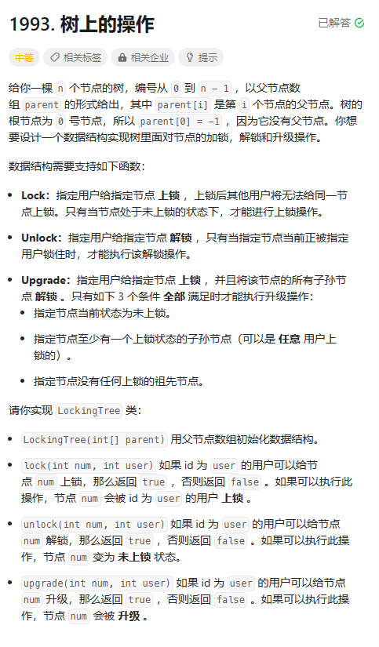

# 题目



# 我的题解


# 其他题解

## 其他1

```C++
class LockingTree {
public:
    LockingTree(vector<int>& parent) {
        int n = parent.size();
        locked = vector<int>(n, -1);
        this->parent = parent;
        children.resize(n);
        for (int i = 1; i < n; ++i) {
            children[parent[i]].push_back(i);
        }
    }

    bool lock(int num, int user) {
        if (locked[num] == -1) {
            locked[num] = user;
            return true;
        }
        return false;
    }

    bool unlock(int num, int user) {
        if (locked[num] == user) {
            locked[num] = -1;
            return true;
        }
        return false;
    }

    bool upgrade(int num, int user) {
        int x = num;
        while (x != -1) {
            if (locked[x] != -1) {
                return false;
            }
            x = parent[x];
        }
        bool find = false;
        function<void(int)> dfs = [&](int x) {
            for (int y : children[x]) {
                if (locked[y] != -1) {
                    find = true;
                    locked[y] = -1;
                }
                dfs(y);
            }
        };
        dfs(num);
        if (!find) {
            return false;
        }
        locked[num] = user;
        return true;
    }

private:
    vector<int> locked;
    vector<int> parent;
    vector<vector<int>> children;
};

/**
 * Your LockingTree object will be instantiated and called as such:
 * LockingTree* obj = new LockingTree(parent);
 * bool param_1 = obj->lock(num,user);
 * bool param_2 = obj->unlock(num,user);
 * bool param_3 = obj->upgrade(num,user);
 */

```

