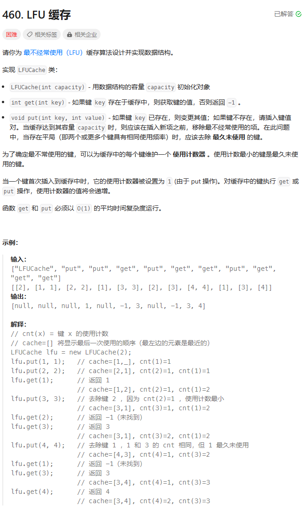

# 题目



# 我的题解

## 思路：


# 其他题解

## 其他1


```C++
struct Node {
    int cnt, time, key, value;

    Node(int _cnt, int _time, int _key, int _value):cnt(_cnt), time(_time), key(_key), value(_value){}
    
    bool operator < (const Node& rhs) const {
        return cnt == rhs.cnt ? time < rhs.time : cnt < rhs.cnt;
    }
};
class LFUCache {
    // 缓存容量，时间戳
    int capacity, time;
    unordered_map<int, Node> key_table;
    set<Node> S;
public:
    LFUCache(int _capacity) {
        capacity = _capacity;
        time = 0;
        key_table.clear();
        S.clear();
    }
    
    int get(int key) {
        if (capacity == 0) return -1;
        auto it = key_table.find(key);
        // 如果哈希表中没有键 key，返回 -1
        if (it == key_table.end()) return -1;
        // 从哈希表中得到旧的缓存
        Node cache = it -> second;
        // 从平衡二叉树中删除旧的缓存
        S.erase(cache);
        // 将旧缓存更新
        cache.cnt += 1;
        cache.time = ++time;
        // 将新缓存重新放入哈希表和平衡二叉树中
        S.insert(cache);
        it -> second = cache;
        return cache.value;
    }
    
    void put(int key, int value) {
        if (capacity == 0) return;
        auto it = key_table.find(key);
        if (it == key_table.end()) {
            // 如果到达缓存容量上限
            if (key_table.size() == capacity) {
                // 从哈希表和平衡二叉树中删除最近最少使用的缓存
                key_table.erase(S.begin() -> key);
                S.erase(S.begin());
            }
            // 创建新的缓存
            Node cache = Node(1, ++time, key, value);
            // 将新缓存放入哈希表和平衡二叉树中
            key_table.insert(make_pair(key, cache));
            S.insert(cache);
        }
        else {
            // 这里和 get() 函数类似
            Node cache = it -> second;
            S.erase(cache);
            cache.cnt += 1;
            cache.time = ++time;
            cache.value = value;
            S.insert(cache);
            it -> second = cache;
        }
    }
};


/**
 * Your LFUCache object will be instantiated and called as such:
 * LFUCache* obj = new LFUCache(capacity);
 * int param_1 = obj->get(key);
 * obj->put(key,value);
 */
```

