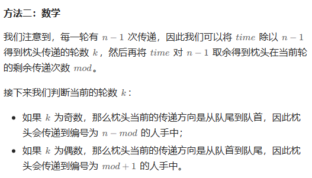

# 题目


# 我的题解

## 思路：数学，除法，取模

主要思路就是因为从1开始到n，中间步数就是n-1,所以先整除，发现能走多少趟完整的路，当然如果是偶数的话，其实总的步数是可以走奇数趟，也就是正的走

如果整除下来是奇数，说明总的步数是偶数，就是返回来的

最后就找个规律，得到最后结果

```C++
class Solution {
public:
    int passThePillow(int n, int time) {
        int cnt = time / (n - 1);
        int res = 0;
        if (cnt % 2 == 1){
            res = n - time % (n - 1);     
        }
        else res = 1 + time % (n - 1);
        return res;
    }
};
```


# 其他题解

## 其他1


```C++
class Solution {
public:
    int passThePillow(int n, int time) {
        int ans = 1, k = 1;
        while (time--) {
            ans += k;
            if (ans == 1 || ans == n) {
                k *= -1;
            }
        }
        return ans;
    }
};

作者：ylb
链接：https://leetcode.cn/problems/pass-the-pillow/
来源：力扣（LeetCode）
著作权归作者所有。商业转载请联系作者获得授权，非商业转载请注明出处。
```

## 其他2

和我自己的思路是一致的



```C++
class Solution {
public:
    int passThePillow(int n, int time) {
        int k = time / (n - 1);
        int mod = time % (n - 1);
        return k & 1 ? n - mod : mod + 1;
    }
};

作者：ylb
链接：https://leetcode.cn/problems/pass-the-pillow/
来源：力扣（LeetCode）
著作权归作者所有。商业转载请联系作者获得授权，非商业转载请注明出处。
```

