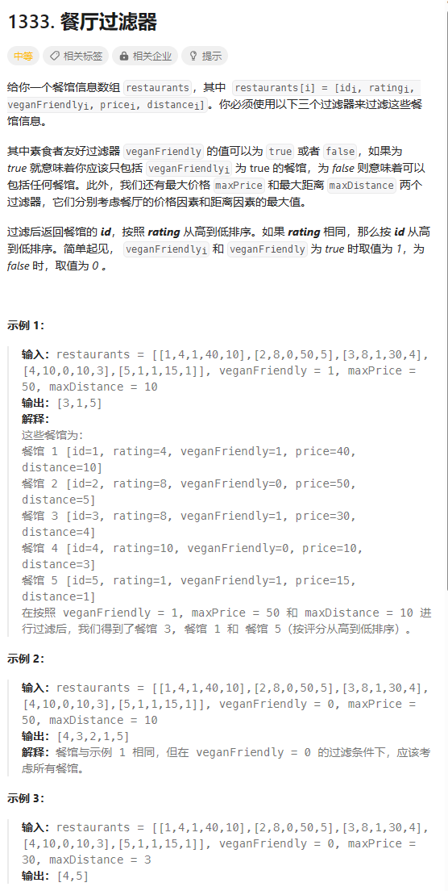
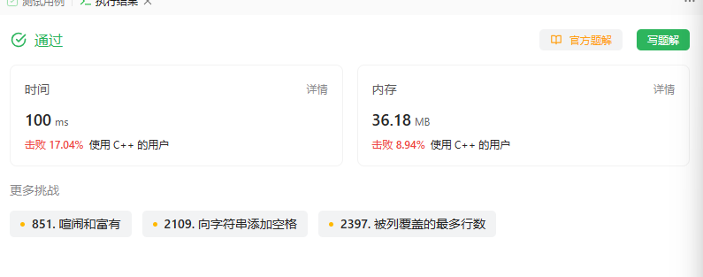
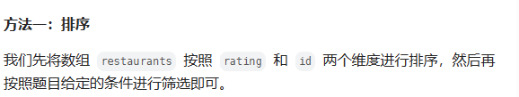
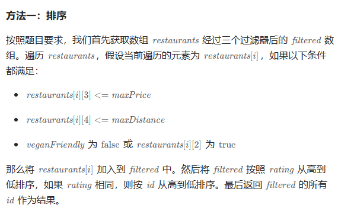

# 题目



# 我的题解

## 思路：过滤 、 排序

独立完成，但是我发现的lambda中的比较函数 里面的逻辑 还是写的比较丑陋的，需要学习下别人的

```C++
class Solution {
public:
    vector<int> filterRestaurants(vector<vector<int>>& restaurants, int veganFriendly, int maxPrice, int maxDistance) {
       function<bool(vector<int>,vector<int>)> comp = [](vector<int> a,vector<int> b)->bool{
           if (a[1] > b[1]) return a[1] > b[1];
           else if (a[1] == b[1]) return  a[0] > b[0];
           return 0;
       }; 
       vector<vector<int>> res;
       for (int i = 0;i < restaurants.size(); i++){
           if (veganFriendly == true && restaurants[i][2] != veganFriendly){
               continue;
           }
           if (restaurants[i][3] > maxPrice){
               continue;
           }
           if (restaurants[i][4] > maxDistance){
               continue;
           }
            res.push_back(restaurants[i]);
       }
       sort(res.begin(), res.end(), comp);
       vector<int> cnt;
       for (auto &i : res){
           cnt.emplace_back(i[0]);
       }
       return cnt;
    }
};
```



# 其他题解

主要是学习比较函数的写法，可以分类讨论写，也可以使用逻辑表达式或||来。

## 其他1



```C++
class Solution {
public:
    vector<int> filterRestaurants(vector<vector<int>>& restaurants, int veganFriendly, int maxPrice, int maxDistance) {
        sort(restaurants.begin(), restaurants.end(), [](const vector<int>& a, const vector<int>& b) {
            if (a[1] != b[1]) {
                return a[1] > b[1];
            }
            return a[0] > b[0];
        });
        vector<int> ans;
        for (auto& r : restaurants) {
            if (r[2] >= veganFriendly && r[3] <= maxPrice && r[4] <= maxDistance) {
                ans.push_back(r[0]);
            }
        }
        return ans;
    }
};

作者：ylb
链接：https://leetcode.cn/problems/filter-restaurants-by-vegan-friendly-price-and-distance/
来源：力扣（LeetCode）
著作权归作者所有。商业转载请联系作者获得授权，非商业转载请注明出处。
```


## 其他2



```C++
class Solution {
public:
    vector<int> filterRestaurants(vector<vector<int>>& restaurants, int veganFriendly, int maxPrice, int maxDistance) {
        int n = restaurants.size();
        vector<vector<int>> filtered;
        for (int i = 0; i < n; i++) {
            if (restaurants[i][3] <= maxPrice && restaurants[i][4] <= maxDistance && !(veganFriendly && !restaurants[i][2])) {
                filtered.push_back(restaurants[i]);
            }
        }
        sort(filtered.begin(), filtered.end(), [](vector<int> &v1, vector<int> &v2) -> bool {
            return v1[1] > v2[1] || (v1[1] == v2[1] && v1[0] > v2[0]);
        });
        vector<int> res;
        for (auto &v : filtered) {
            res.push_back(v[0]);
        }
        return res;
    }
};

作者：力扣官方题解
链接：https://leetcode.cn/problems/filter-restaurants-by-vegan-friendly-price-and-distance/
来源：力扣（LeetCode）
著作权归作者所有。商业转载请联系作者获得授权，非商业转载请注明出处。
```

