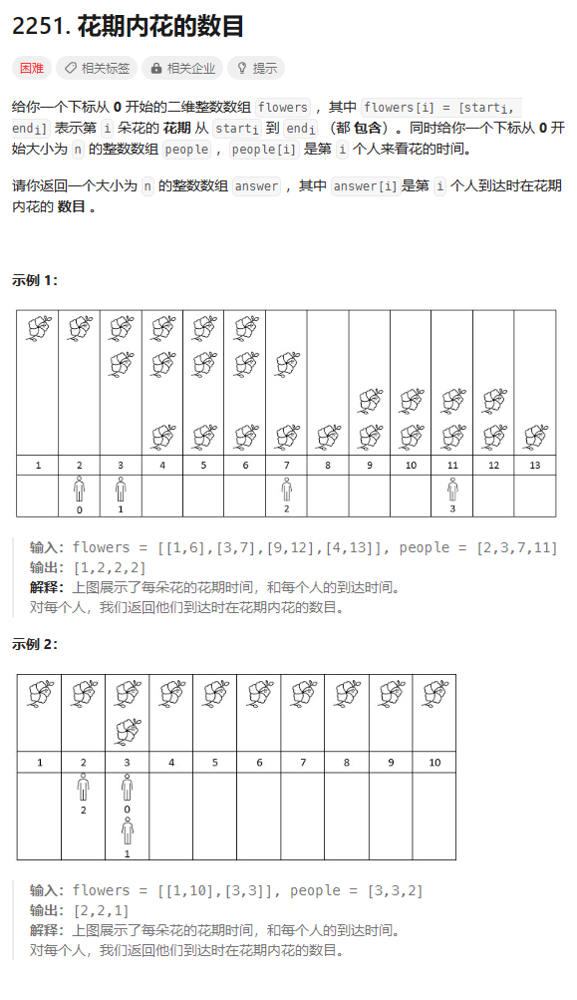
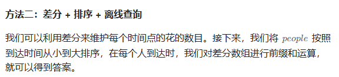

# 题目



# 我的题解

## 思路：区间叠加？


# 其他题解

## 其他1


```C++
class Solution {
public:
    vector<int> fullBloomFlowers(vector<vector<int>>& flowers, vector<int>& people) {
        int n = flowers.size();
        vector<int> start;
        vector<int> end;
        for (auto& f : flowers) {
            start.push_back(f[0]);
            end.push_back(f[1]);
        }
        sort(start.begin(), start.end());
        sort(end.begin(), end.end());
        vector<int> ans;
        for (auto& p : people) {
            auto r = upper_bound(start.begin(), start.end(), p) - start.begin();
            auto l = lower_bound(end.begin(), end.end(), p) - end.begin();
            ans.push_back(r - l);
        }
        return ans;
    }
};

作者：ylb
链接：https://leetcode.cn/problems/number-of-flowers-in-full-bloom/
来源：力扣（LeetCode）
著作权归作者所有。商业转载请联系作者获得授权，非商业转载请注明出处。
```

## 其他2



```C++
class Solution {
public:
    vector<int> fullBloomFlowers(vector<vector<int>>& flowers, vector<int>& people) {
        map<int, int> d;
        for (auto& f : flowers) {
            d[f[0]]++;
            d[f[1] + 1]--;
        }
        int m = people.size();
        vector<int> idx(m);
        iota(idx.begin(), idx.end(), 0);
        sort(idx.begin(), idx.end(), [&](int i, int j) {
            return people[i] < people[j];
        });
        vector<int> ans(m);
        int s = 0;
        for (int i : idx) {
            int t = people[i];
            while (!d.empty() && d.begin()->first <= t) {
                s += d.begin()->second;
                d.erase(d.begin());
            }
            ans[i] = s;
        }
        return ans;
    }
};

作者：ylb
链接：https://leetcode.cn/problems/number-of-flowers-in-full-bloom/
来源：力扣（LeetCode）
著作权归作者所有。商业转载请联系作者获得授权，非商业转载请注明出处。
```

