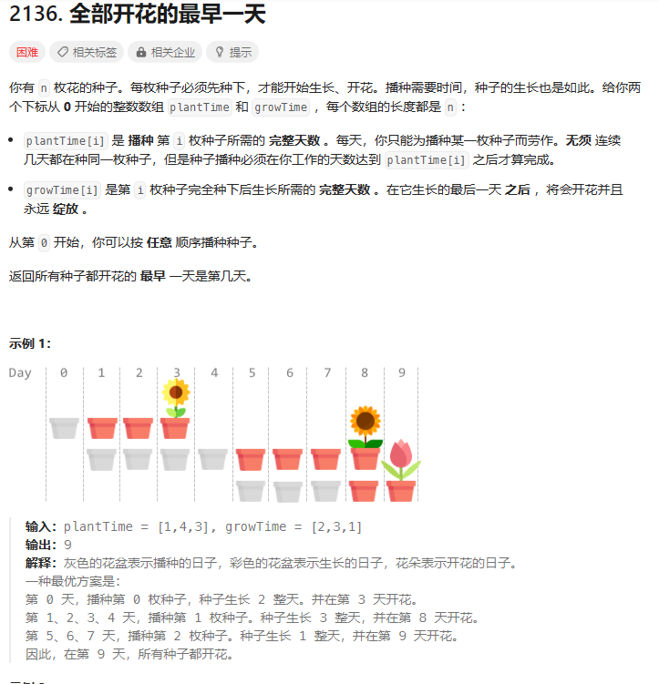
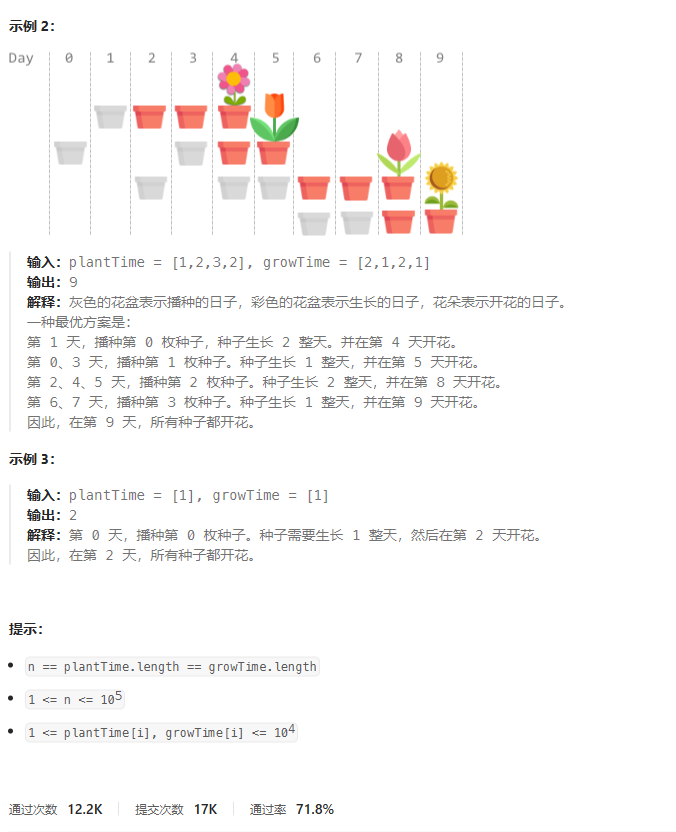
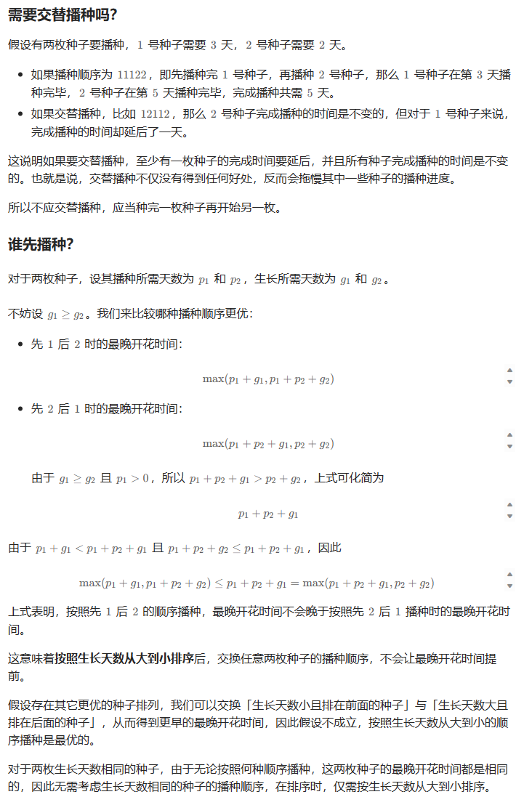

# 题目



# 我的题解

## 思路：贪心+排序

先按生长时间排序，先种植生长时间长的

然后种植时间好像是固定的不用管。

这里应该需要一个证明

```C++
class Solution {
public:
    int earliestFullBloom(vector<int>& plantTime, vector<int>& growTime) {
        int n = plantTime.size();
        vector<int> idx(n);
        //使用iota函数将idx初始化为从0开始的连续整数。这是为了在接下来的排序中跟踪植物的索引。
        iota(idx.begin(), idx.end(), 0);
        //这一行代码使用sort函数对idx向量进行排序，排序规则是基于growTime向量的值，将植物索引按照生长时间的降序排列。这样，最长生长时间的植物将排在前面。
        sort(idx.begin(), idx.end(), [&](int i, int j) { return growTime[j] < growTime[i]; });
        int ans = 0, t = 0;
        //遍历排序后的植物索引。
        for (int i : idx) {
            //累积种植时间到当前时间t中。
            t += plantTime[i];
            //将ans更新为当前时间t加上该植物的生长时间，以确保ans保持记录的最早完全开花的时间。
            ans = max(ans, t + growTime[i]);
        }
        return ans;
    }
};
```


# 其他题解

## 其他1


```C++
class Solution {
public:
    int earliestFullBloom(vector<int>& plantTime, vector<int>& growTime) {
        int n = plantTime.size();
        vector<int> idx(n);
        iota(idx.begin(), idx.end(), 0);
        sort(idx.begin(), idx.end(), [&](int i, int j) { return growTime[j] < growTime[i]; });
        int ans = 0, t = 0;
        for (int i : idx) {
            t += plantTime[i];
            ans = max(ans, t + growTime[i]);
        }
        return ans;
    }
};

作者：ylb
链接：https://leetcode.cn/problems/earliest-possible-day-of-full-bloom/
来源：力扣（LeetCode）
著作权归作者所有。商业转载请联系作者获得授权，非商业转载请注明出处。
```

## 其他2



```C++
class Solution {
public:
    int earliestFullBloom(vector<int> &plantTime, vector<int> &growTime) {
        vector<int> id(plantTime.size());
        iota(id.begin(), id.end(), 0); // id[i] = i
        sort(id.begin(), id.end(), [&](int i, int j) { return growTime[i] > growTime[j]; });
        int ans = 0, days = 0;
        for (int i : id) {
            days += plantTime[i]; // 累加播种天数
            ans = max(ans, days + growTime[i]); // 再加上生长天数，就是这个种子的开花时间
        }
        return ans;
    }
};

作者：灵茶山艾府
链接：https://leetcode.cn/problems/earliest-possible-day-of-full-bloom/
来源：力扣（LeetCode）
著作权归作者所有。商业转载请联系作者获得授权，非商业转载请注明出处。
```

