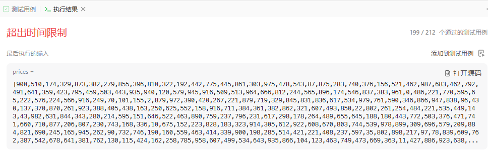

# 题目


# 我的题解

## 思路：暴力

因为只买一种股票，然后枚举每种利润

```C++
class Solution {
public:
    int maxProfit(vector<int>& prices) {
        //暴力算法
        int res = 0;
        for (int i = 0; i < prices.size(); i++){
            for (int j = i + 1; j <prices.size(); j++){
                res = max (res, prices[j] - prices[i]);
            }
        }
        return res;
    }
};
```

时间复杂度过高




# 其他题解

## 其它1：贪心


```C++
class Solution {
public:
    int maxProfit(vector<int>& prices) {
        int cost = INT_MAX, profit = 0;
        for (int price : prices) {
            cost = min(cost, price);
            profit = max(profit, price - cost);
        }
        return profit;
    }
};

```

## 其他2：动态规划

### 代码随想录：二维动态规划

```C++
class Solution {
public:
    int maxProfit(vector<int>& prices) {
        int n=prices.size();
        //从第0天开始，最后就是n-1天，不需要申请n+1空间
        //二维，第二维表示2种状态
        vector<vector<int>>dp(n,vector<int>(2));
        //初始化
        dp[0][0]=-prices[0],dp[0][1]=0;
        for(int i=1;i<n;i++){
            //两种状态需要一起更新
            dp[i][0]=max(dp[i-1][0],-prices[i]);
            dp[i][1]=max(dp[i-1][1],dp[i-1][0]+prices[i]);
        }
        //卖出最大
        return dp[n-1][1];
    }
};

//动态规划
//要注意起始资金为0，并且只能买卖一次，并且最后不持有股票的最大现金肯定是大于持有股票的，我们最后要卖掉股票。
//注意我们需要使用二维来描述第i天和 状态：持有股票和不持有股票
//我们需要有2种递推关系，对应不同的状态
//含义；
//dp[i][0]:表示第i天持有股票的最大现金
//递推公式：dp[i][0]=max(dp[i-1][0],-price[i]);
//表示为 第i-1天就含有股票的最大现金， 或者刚好在i-1天时买了股票,定义为-price[i],而不是dp[i-1][1]-price[i](第i-1天不持有股票的钱减去，
//这是我们认为1这个状态一定是卖了，所以买要在前，并且我们只能买卖一次)
//dp[i][1]=max(dp[i-1][1],dp[i-1][0]+price[i])
//含义：第i天不含有股票最大现金，等于 第i-1天就不含有股票，之前就卖了， 或者 dp[i-1][0]+price[i],在第i-1天卖了股票
//这里我的理解就是 1代表卖了，所以不能出现在拥有股票之前，-price[i]的出现就是这样

//天数从第0天开始
//初始化：dp[0][0]=-price[0],并且不存在dp[0][1]=0;（打扰了，这个是存在的，我们还是不能从1代表卖出，上面的-price还是理解为就是0-price）
//dp[0][1]=0;

//遍历顺序：从小到大更新
```

