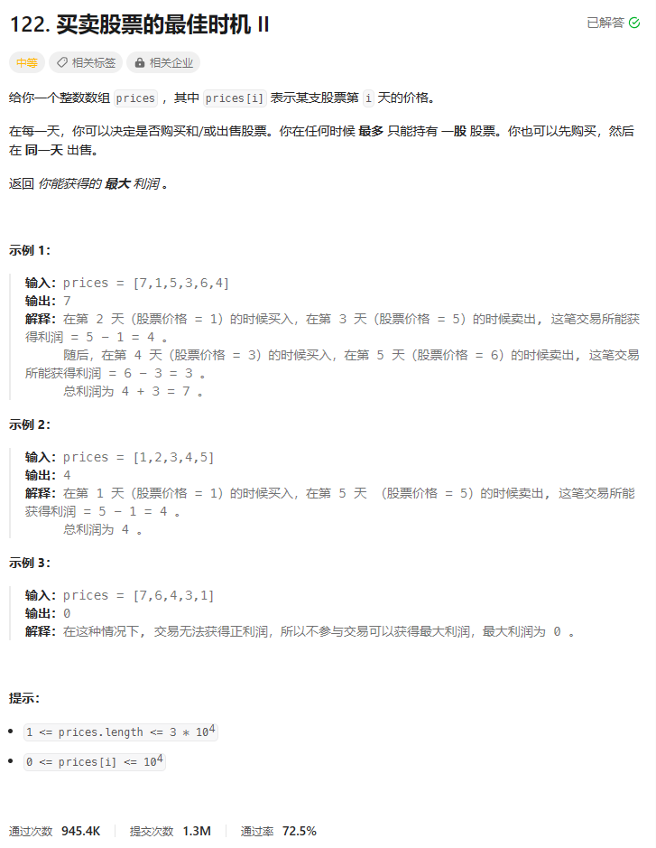
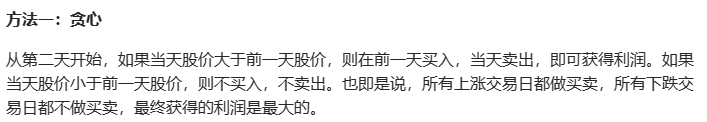
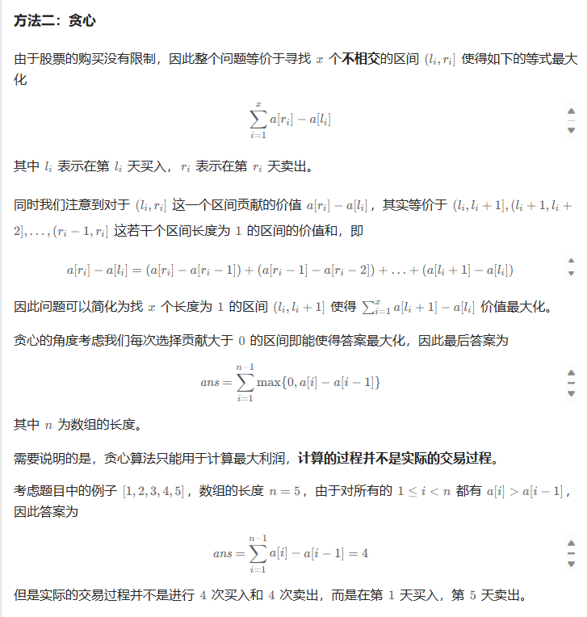
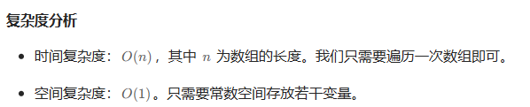

# 题目



# 我的题解

## 思路：二维动态规划

两种状态，持有股票和不持有股票

```C++
class Solution {
public:
    int maxProfit(vector<int>& prices) {
        int n = prices.size();
        vector<vector<int>> dp(n, vector<int>(2, 0));
        //dp[i][0] 表示第i天持有股票的最大利润， dp[i][1]表示第i天不持有股票的最大利润 
        dp[0][0] = -prices[0], dp[0][1] = 0;
        for (int i = 1; i < n; i++){
            //2种状态
            //第i天持有股票等于第i-1天持有股票或者第i-1天不持有股票然后买股票 其中的最大值
            dp[i][0] = max(dp[i - 1][0], dp[i - 1][1] - prices[i]);
            //第i天不持有股票等于第i-1天不持有股票或者第i-1天持有股票然后卖股票的最大利润 的最大值
            dp[i][1] = max(dp[i-1][1], dp[i - 1][0] + prices[i]);
        }
        //最后返回的就是卖了股票的最大利润
        return dp[n - 1][1];
    }
};
```

## 思路2：贪心

```
class Solution {
public:
    int maxProfit(vector<int>& prices) {   
        int ans = 0;
        int n = prices.size();
        for (int i = 1; i < n; ++i) {
            //贪心算法只能计算最大利润，计算过程并不是实际的交易过程
            //只比较当前和前一天，只买当天上涨的
            ans += max(0, prices[i] - prices[i - 1]);
        }
        return ans;
    }
};

```


# 其他题解

## 其他1：贪心

所有上涨的交易日都买，因为只能只有一个股票

因为不会存在有最低我们没买的情况



```C++
class Solution {
public:
    int maxProfit(vector<int>& prices) {
        int ans = 0;
        for (int i = 1; i < prices.size(); ++i) ans += max(0, prices[i] - prices[i - 1]);
        return ans;
    }
};

作者：ylb
链接：https://leetcode.cn/problems/best-time-to-buy-and-sell-stock-ii/
来源：力扣（LeetCode）
著作权归作者所有。商业转载请联系作者获得授权，非商业转载请注明出处。
```

## 其他2：贪心



```C++
class Solution {
public:
    int maxProfit(vector<int>& prices) {   
        int ans = 0;
        int n = prices.size();
        for (int i = 1; i < n; ++i) {
            ans += max(0, prices[i] - prices[i - 1]);
        }
        return ans;
    }
};

作者：力扣官方题解
链接：https://leetcode.cn/problems/best-time-to-buy-and-sell-stock-ii/
来源：力扣（LeetCode）
著作权归作者所有。商业转载请联系作者获得授权，非商业转载请注明出处。
```

