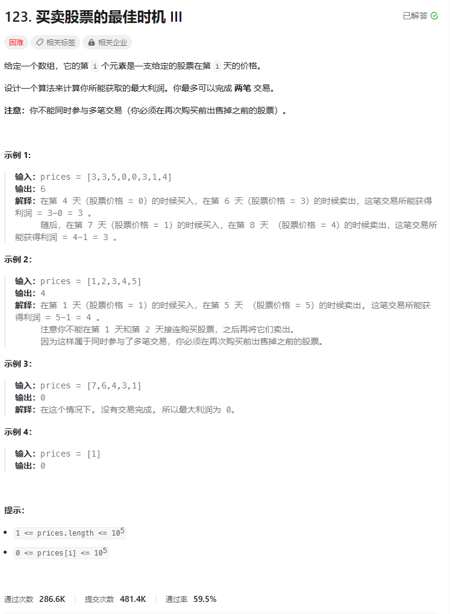
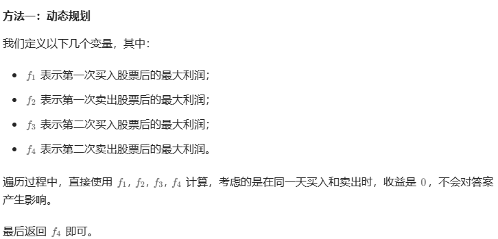

# 题目



# 我的题解

## 思路：动态规划

```C++
class Solution {
public:
    int maxProfit(vector<int>& prices) {
        //动态规划，定义5种状态
        int n=prices.size();
        vector<vector<int>>dp(n,vector<int>(5));
        //初始化
        dp[0][0]=0,dp[0][1]=-prices[0],dp[0][2]=0,dp[0][3]=-prices[0],dp[0][4]=0;
        //遍历顺序
        for(int i=1;i<n;i++){
            //递推公式
            dp[i][0]=0;//可省略
            //第i天第一次持有股票（不一定是第i天买，可以延续之前的状态）=第i-1就持有股票，或者第i-1天不持有股票，第i天买
            dp[i][1]=max(dp[i-1][1],dp[i][0]-prices[i]);
            //第i天第一次卖出股票，（也是可以延续之前状态），=第i-1天就卖出，或者第i-1天持有，第i天卖出
            dp[i][2]=max(dp[i-1][2],dp[i-1][1]+prices[i]);
            //第i天第二次持有股票（可以延续状态），=第i天第二次持有股票，或者第i-1天不持有股票，但是是第一次卖出的状态
            dp[i][3]=max(dp[i-1][3],dp[i-1][2]-prices[i]);
            //第i天第二次卖出股票，（也是可以延续之前状态），=第i-1天就卖出，或者第i-1天持有，前提是第二次持有，第i天卖出
            dp[i][4]=max(dp[i-1][4],dp[i-1][3]+prices[i]);
        }
        //可以返回第一次卖出，第二次卖出的最大值
        //但是其实第二次是包含第一次的，因为可以第一次卖出后再买再卖，就是第二次，且现金不变
        return dp[n-1][4];
    }
};

//半独立完成，看了代码随想录视频后

//股票持有和卖出的状态已经不能用2个来描述了，因为分为第一次持有和第二次持有，第一次卖出和第二次卖出
//dp含义和推导
//dp[i][0]=0
//第i天不操作，所持有的最大现金为0
//dp[i][1]=max(dp[i-1][1],dp[i][0]-price[i])
//第i天第一次持有股票（不一定是第i天买，可以延续之前的状态）=第i-1就持有股票，或者第i-1天不持有股票，第i天买
//dp[i][2]=max(dp[i-1][2],dp[i-1][1]+price[i]);
//第i天第一次卖出股票，（也是可以延续之前状态），=第i-1天就卖出，或者第i-1天持有，第i天卖出
//dp[i][3]=max(dp[i-1][3],dp[i-1][2]-price[i])
//第i天第二次持有股票（可以延续状态），=第i天第二次持有股票，或者第i-1天不持有股票，但是是第一次卖出的状态
//dp[i][4]=max(dp[i-1][4],dp[i-1][3]+price[i]);
//第i天第二次卖出股票，（也是可以延续之前状态），=第i-1天就卖出，或者第i-1天持有，前提是第二次持有，第i天卖出

//初始化
//dp[0][0]=0;//无操作
//dp[0][1]=-price[0]
//dp[0][2]=0;//当天持有当天卖出，最大现金为0
//dp[0][3]=-price[0]；//当天第二次购买
//dp[0][4]=0;//第二次卖出，当天再买再卖
//遍历顺序，从小到大
```


# 其他题解

## 其他1



```C++
class Solution {
public:
    int maxProfit(vector<int>& prices) {
        int f1 = -prices[0], f2 = 0, f3 = -prices[0], f4 = 0;
        for (int i = 1; i < prices.size(); ++i) {
            f1 = max(f1, -prices[i]);
            f2 = max(f2, f1 + prices[i]);
            f3 = max(f3, f2 - prices[i]);
            f4 = max(f4, f3 + prices[i]);
        }
        return f4;
    }
};

作者：ylb
链接：https://leetcode.cn/problems/best-time-to-buy-and-sell-stock-iii/
来源：力扣（LeetCode）
著作权归作者所有。商业转载请联系作者获得授权，非商业转载请注明出处。
```


## 其他2

```C++
class Solution {
public:
    int maxProfit(vector<int>& prices) {
        int n = prices.size();
        int buy1 = -prices[0], sell1 = 0;
        int buy2 = -prices[0], sell2 = 0;
        for (int i = 1; i < n; ++i) {
            buy1 = max(buy1, -prices[i]);
            sell1 = max(sell1, buy1 + prices[i]);
            buy2 = max(buy2, sell1 - prices[i]);
            sell2 = max(sell2, buy2 + prices[i]);
        }
        return sell2;
    }
};

作者：力扣官方题解
链接：https://leetcode.cn/problems/best-time-to-buy-and-sell-stock-iii/
来源：力扣（LeetCode）
著作权归作者所有。商业转载请联系作者获得授权，非商业转载请注明出处。
```

