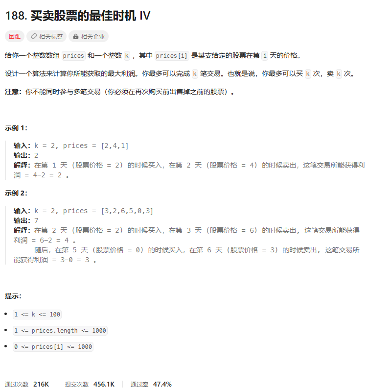
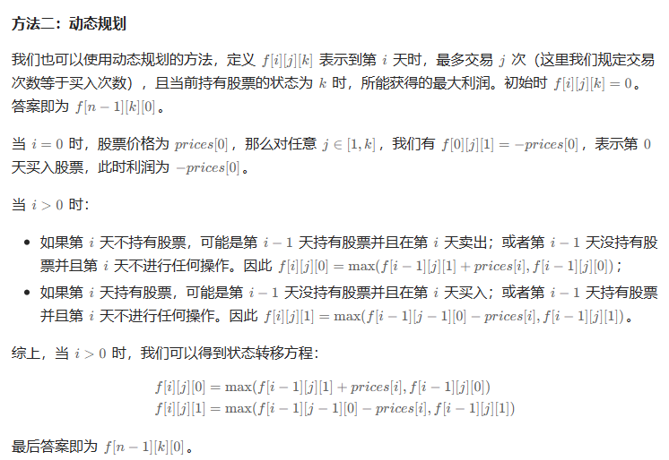
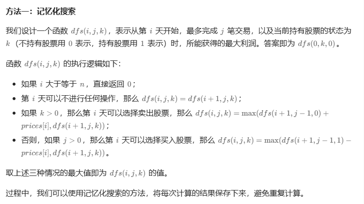

# 题目



# 我的题解

## 思路：动态规划

```C++
class Solution {
public:
    int maxProfit(int k, vector<int>& prices) {
        int n = prices.size();
        //f[i][j][k]表示第i天，最多交易j次，k等于0表示卖出，等于1等于买入
        int f[n][k + 1][2];
        memset(f, 0, sizeof(f));
        //初始化
        //第0天买入股票利润为-prices[0]
        for (int j = 1; j <= k; ++j) {
            f[0][j][1] = -prices[0];
        }
        
        for (int i = 1; i < n; ++i) {
            for (int j = 1; j <= k; ++j) {
                //如果第 i天不持有股票，可能是第 i−1天持有股票并且在第 i 天卖出；或者第 i−1天没持有股票并且第 i天不进行任何操作。
                f[i][j][0] = max(f[i - 1][j][1] + prices[i], f[i - 1][j][0]);
                //如果第 i天持有股票，可能是第 i−1天没持有股票并且在第 i 天买入；或者第 i−1 天持有股票并且第 i天不进行任何操作。
                f[i][j][1] = max(f[i - 1][j - 1][0] - prices[i], f[i - 1][j][1]);
            }
        }
        return f[n - 1][k][0];
    }
};

```

三维动态规划，因为交易次数太多了，能持有的股票数量也很多

# 其他题解

## 其他1：动态规划



```C++
class Solution {
public:
    int maxProfit(int k, vector<int>& prices) {
        int n = prices.size();
        int f[n][k + 1][2];
        memset(f, 0, sizeof(f));
        for (int j = 1; j <= k; ++j) {
            f[0][j][1] = -prices[0];
        }
        for (int i = 1; i < n; ++i) {
            for (int j = 1; j <= k; ++j) {
                f[i][j][0] = max(f[i - 1][j][1] + prices[i], f[i - 1][j][0]);
                f[i][j][1] = max(f[i - 1][j - 1][0] - prices[i], f[i - 1][j][1]);
            }
        }
        return f[n - 1][k][0];
    }
};

作者：ylb
链接：https://leetcode.cn/problems/best-time-to-buy-and-sell-stock-iv/
来源：力扣（LeetCode）
著作权归作者所有。商业转载请联系作者获得授权，非商业转载请注明出处。
```


## 其他2



```C++
class Solution {
public:
    int maxProfit(int k, vector<int>& prices) {
        int n = prices.size();
        int f[n][k + 1][2];
        memset(f, -1, sizeof(f));
        function<int(int, int, int)> dfs = [&](int i, int j, int k) -> int {
            if (i >= n) {
                return 0;
            }
            if (f[i][j][k] != -1) {
                return f[i][j][k];
            }
            int ans = dfs(i + 1, j, k);
            if (k) {
                ans = max(ans, prices[i] + dfs(i + 1, j, 0));
            } else if (j) {
                ans = max(ans, -prices[i] + dfs(i + 1, j - 1, 1));
            }
            return f[i][j][k] = ans;
        };
        return dfs(0, k, 0);
    }
};

作者：ylb
链接：https://leetcode.cn/problems/best-time-to-buy-and-sell-stock-iv/
来源：力扣（LeetCode）
著作权归作者所有。商业转载请联系作者获得授权，非商业转载请注明出处。
```

