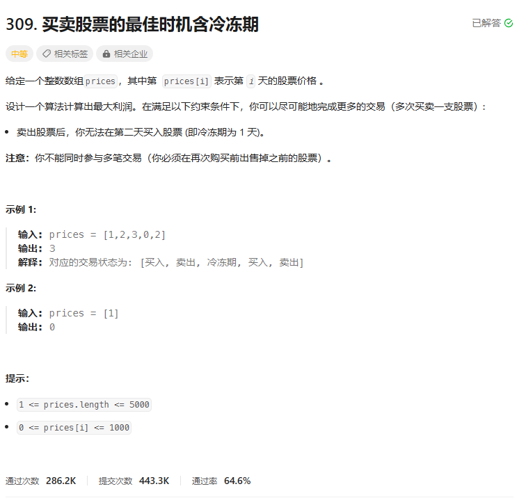
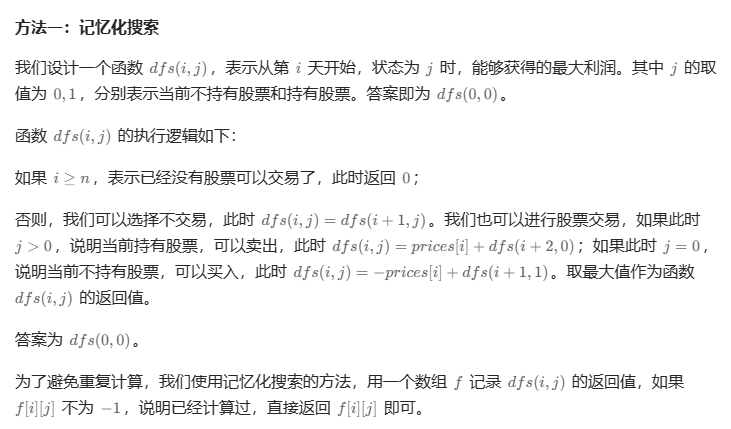
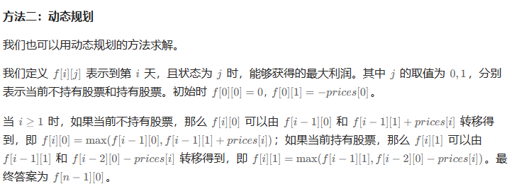

# 题目




# 我的题解

## 思路：动态规划

冷冻期，就是得隔天买，所以持有股票的转化公式 有 f[i-2] [0] + prices[i]得到

```C++
class Solution {
public:
    int maxProfit(vector<int>& prices) {
        int n = prices.size();
        //f[i][j]表示到第i天，且状态为j时，0表示不持有股票，1表示持有股票， 能够取得的最大利润
        int f[n][2];
        memset(f, 0, sizeof(f));
        //初始化
        f[0][1] = -prices[0];
        //还是2种状态更新
        //持有股票， 如果需要买的话，是在i-2天来不持有
        for (int i = 1; i < n; ++i) {
            //不持有股票，由i-1天不持有股票，或者i-1天持有，然后卖 得到
            f[i][0] = max(f[i - 1][0], f[i - 1][1] + prices[i]);
            //持有股票 由i-1天持有，或者i-2天不持有，第i天买  这里0表示f[0][0]
            f[i][1] = max(f[i - 1][1], (i > 1 ? f[i - 2][0] : 0) - prices[i]);
        }
        return f[n - 1][0];
    }
};

```


# 其他题解

## 其他1



```C++
class Solution {
public:
    int maxProfit(vector<int>& prices) {
        int n = prices.size();
        int f[n][2];
        memset(f, -1, sizeof(f));
        function<int(int, int)> dfs = [&](int i, int j) {
            if (i >= n) {
                return 0;
            }
            if (f[i][j] != -1) {
                return f[i][j];
            }
            int ans = dfs(i + 1, j);
            if (j) {
                ans = max(ans, prices[i] + dfs(i + 2, 0));
            } else {
                ans = max(ans, -prices[i] + dfs(i + 1, 1));
            }
            return f[i][j] = ans;
        };
        return dfs(0, 0);
    }
};

作者：ylb
链接：https://leetcode.cn/problems/best-time-to-buy-and-sell-stock-with-cooldown/
来源：力扣（LeetCode）
著作权归作者所有。商业转载请联系作者获得授权，非商业转载请注明出处。
```


## 其他2



```C++
class Solution {
public:
    int maxProfit(vector<int>& prices) {
        int n = prices.size();
        int f[n][2];
        memset(f, 0, sizeof(f));
        f[0][1] = -prices[0];
        for (int i = 1; i < n; ++i) {
            f[i][0] = max(f[i - 1][0], f[i - 1][1] + prices[i]);
            f[i][1] = max(f[i - 1][1], (i > 1 ? f[i - 2][0] : 0) - prices[i]);
        }
        return f[n - 1][0];
    }
};

作者：ylb
链接：https://leetcode.cn/problems/best-time-to-buy-and-sell-stock-with-cooldown/
来源：力扣（LeetCode）
著作权归作者所有。商业转载请联系作者获得授权，非商业转载请注明出处。
```

