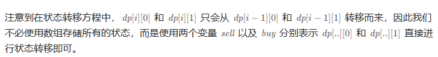

# 题目


# 我的题解

## 思路：动态规划

独立完成，还是股票套路题，二维动态规划，只是需要在卖出股票时加上手续费

因为只能持有一张股票问题

```C++
class Solution {
public:
    int maxProfit(vector<int>& prices, int fee) {
        int n = prices.size();
        vector<vector<int>> dp(n, vector<int>(2));
        //初始化
        //0是不持有，1是持有
        dp[0][0] = 0;
        dp[0][1] = -prices[0] - fee;
        for (int i = 1; i < prices.size(); i++){
            //卖出需要加手续费
            dp[i][0] = max(dp[i - 1][0], dp[i - 1][1] + prices[i]);
            dp[i][1] = max(dp[i - 1][1], dp[i - 1][0] - prices[i] - fee);
        }
        return dp[n - 1][0];
    }
};
```

# 其他题解

## 其他1：记忆化搜索


```C++
class Solution {
public:
    int maxProfit(vector<int>& prices, int fee) {
        int n = prices.size();
        int f[n][2];
        memset(f, -1, sizeof(f));
        function<int(int, int)> dfs = [&](int i, int j) {
            if (i >= prices.size()) {
                return 0;
            }
            if (f[i][j] != -1) {
                return f[i][j];
            }
            int ans = dfs(i + 1, j);
            if (j) {
                ans = max(ans, prices[i] + dfs(i + 1, 0) - fee);
            } else {
                ans = max(ans, -prices[i] + dfs(i + 1, 1));
            }
            return f[i][j] = ans;
        };
        return dfs(0, 0);
    }
};

作者：ylb
链接：https://leetcode.cn/problems/best-time-to-buy-and-sell-stock-with-transaction-fee/
来源：力扣（LeetCode）
著作权归作者所有。商业转载请联系作者获得授权，非商业转载请注明出处。
```


## 其他2：动态规划


```C++
class Solution {
public:
    int maxProfit(vector<int>& prices, int fee) {
        int n = prices.size();
        vector<vector<int>> dp(n, vector<int>(2));
        dp[0][0] = 0, dp[0][1] = -prices[0];
        for (int i = 1; i < n; ++i) {
            dp[i][0] = max(dp[i - 1][0], dp[i - 1][1] + prices[i] - fee);
            dp[i][1] = max(dp[i - 1][1], dp[i - 1][0] - prices[i]);
        }
        return dp[n - 1][0];
    }
};

作者：力扣官方题解
链接：https://leetcode.cn/problems/best-time-to-buy-and-sell-stock-with-transaction-fee/
来源：力扣（LeetCode）
著作权归作者所有。商业转载请联系作者获得授权，非商业转载请注明出处。
```



```C++
class Solution {
public:
    int maxProfit(vector<int>& prices, int fee) {
        int n = prices.size();
        int sell = 0, buy = -prices[0];
        for (int i = 1; i < n; ++i) {
            tie(sell, buy) = pair(max(sell, buy + prices[i] - fee), max(buy, sell - prices[i]));
        }
        return sell;
    }
};

作者：力扣官方题解
链接：https://leetcode.cn/problems/best-time-to-buy-and-sell-stock-with-transaction-fee/
来源：力扣（LeetCode）
著作权归作者所有。商业转载请联系作者获得授权，非商业转载请注明出处。
```

