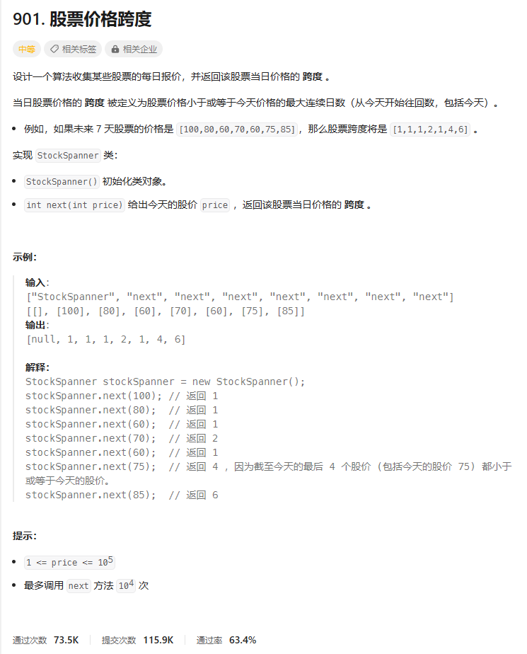
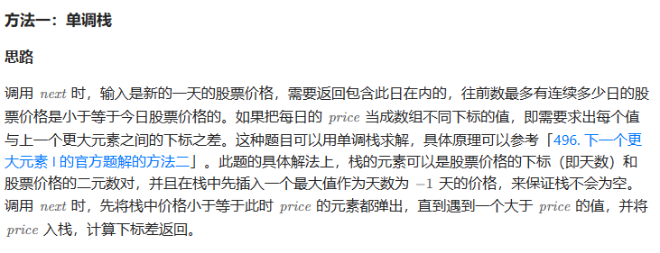
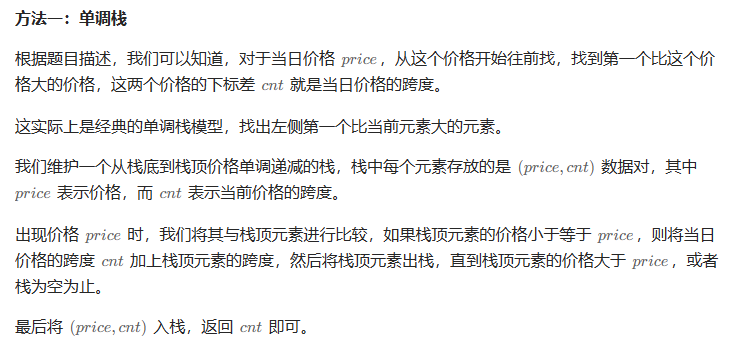

# 题目



# 我的题解

## 思路：暴力，模拟

往前数包括今天

结构体栈

==private成员变量stack<pair<int,int>> stk==

类比下一个最大元素1（单调栈）

```C++
class StockSpanner {
public:
    StockSpanner() {
    }
    //单调栈
    int next(int price) {
        int cnt = 1;
        while (!stk.empty() && stk.top().first <= price) {
            cnt += stk.top().second;
            stk.pop();
        }
        stk.emplace(price, cnt);
        return cnt;
    }

private:
    stack<pair<int, int>> stk;
};

/**
 * Your StockSpanner object will be instantiated and called as such:
 * StockSpanner* obj = new StockSpanner();
 * int param_1 = obj->next(price);
 */
```


# 其他题解

## 其他1：单调栈



```C++
class StockSpanner {
public:
    StockSpanner() {
        this->stk.emplace(-1, INT_MAX);
        this->idx = -1;
    }
    
    int next(int price) {
        idx++;
        while (price >= stk.top().second) {
            stk.pop();
        }
        int ret = idx - stk.top().first;
        stk.emplace(idx, price);
        return ret;
    }

private:
    stack<pair<int, int>> stk; 
    int idx;
};

作者：力扣官方题解
链接：https://leetcode.cn/problems/online-stock-span/
来源：力扣（LeetCode）
著作权归作者所有。商业转载请联系作者获得授权，非商业转载请注明出处。
```

## 其他2



```C++
class StockSpanner {
public:
    StockSpanner() {
    }

    int next(int price) {
        int cnt = 1;
        while (!stk.empty() && stk.top().first <= price) {
            cnt += stk.top().second;
            stk.pop();
        }
        stk.emplace(price, cnt);
        return cnt;
    }

private:
    stack<pair<int, int>> stk;
};

/**
 * Your StockSpanner object will be instantiated and called as such:
 * StockSpanner* obj = new StockSpanner();
 * int param_1 = obj->next(price);
 */

作者：ylb
链接：https://leetcode.cn/problems/online-stock-span/
来源：力扣（LeetCode）
著作权归作者所有。商业转载请联系作者获得授权，非商业转载请注明出处。
```

