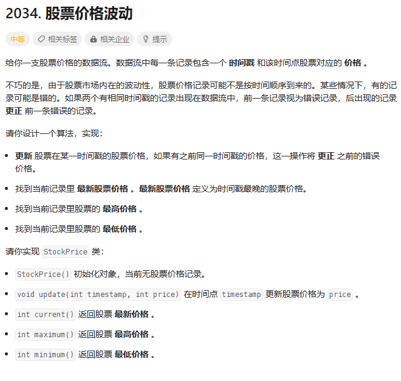
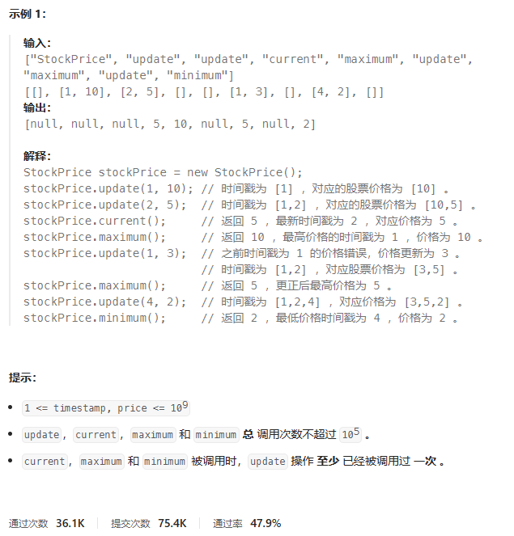
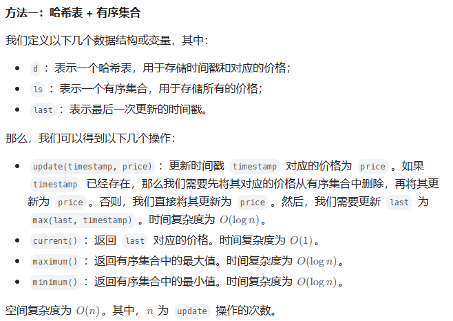
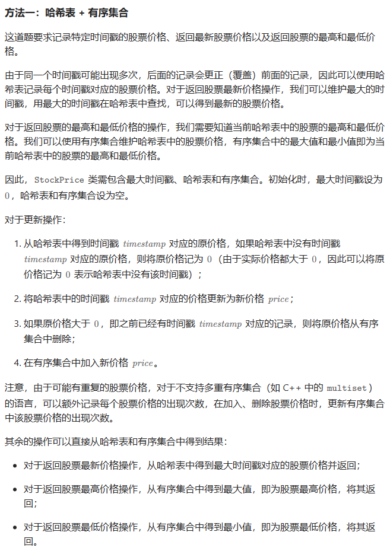

# 题目






# 我的题解

## 思路：哈希表+有序集合

```C++
class StockPrice {
public:
    StockPrice() {

    }
    //更新时间戳 timestamp 对应的价格为 price。
    void update(int timestamp, int price) {
        //如果 timestamp 已经存在，那么我们需要先将其对应的价格从有序集合中删除，再将其更新为 price。
        if (d.count(timestamp)) {
            ls.erase(ls.find(d[timestamp]));
        }
        //否则，我们直接将其更新为 price。
        d[timestamp] = price;
        ls.insert(price);
        //然后，我们需要更新 last 为 max(last, timestamp)。时间复杂度为 O(log⁡n)
        last = max(last, timestamp);
    }
    //返回 last 对应的价格。时间复杂度为 O(1)O(1)O(1)。
    int current() {
        return d[last];
    }
    //返回有序集合中的最大值。
    int maximum() {
        return *ls.rbegin();
    }
    //返回有序集合中的最小值。
    int minimum() {
        return *ls.begin();
    }

private:
    //存储时间戳和对应的价格
    unordered_map<int, int> d;
    //一个有序集合，存储所有的价格
    multiset<int> ls;
    //表示最后一次更新的时间戳
    int last = 0;
};

/**
 * Your StockPrice object will be instantiated and called as such:
 * StockPrice* obj = new StockPrice();
 * obj->update(timestamp,price);
 * int param_2 = obj->current();
 * int param_3 = obj->maximum();
 * int param_4 = obj->minimum();
 */
```


# 其他题解

## 其他1：哈希表+有序集合



```C++
class StockPrice {
public:
    StockPrice() {

    }

    void update(int timestamp, int price) {
        if (d.count(timestamp)) {
            ls.erase(ls.find(d[timestamp]));
        }
        d[timestamp] = price;
        ls.insert(price);
        last = max(last, timestamp);
    }

    int current() {
        return d[last];
    }

    int maximum() {
        return *ls.rbegin();
    }

    int minimum() {
        return *ls.begin();
    }

private:
    unordered_map<int, int> d;
    multiset<int> ls;
    int last = 0;
};

/**
 * Your StockPrice object will be instantiated and called as such:
 * StockPrice* obj = new StockPrice();
 * obj->update(timestamp,price);
 * int param_2 = obj->current();
 * int param_3 = obj->maximum();
 * int param_4 = obj->minimum();
 */

作者：ylb
链接：https://leetcode.cn/problems/stock-price-fluctuation/
来源：力扣（LeetCode）
著作权归作者所有。商业转载请联系作者获得授权，非商业转载请注明出处。
```

## 其他2：哈希表+有序集合



```C++
class StockPrice {
public:
    StockPrice() {
        this->maxTimestamp = 0;
    }
    
    void update(int timestamp, int price) {
        maxTimestamp = max(maxTimestamp, timestamp);
        int prevPrice = timePriceMap.count(timestamp) ? timePriceMap[timestamp] : 0;
        timePriceMap[timestamp] = price;
        if (prevPrice > 0) {
            auto it = prices.find(prevPrice);
            if (it != prices.end()) {
                prices.erase(it);
            }
        }
        prices.emplace(price);
    }
    
    int current() {
        return timePriceMap[maxTimestamp];
    }
    
    int maximum() {
        return *prices.rbegin();
    }
    
    int minimum() {
        return *prices.begin();
    }
private:
    int maxTimestamp;
    unordered_map<int, int> timePriceMap;
    multiset<int> prices;
};

作者：力扣官方题解
链接：https://leetcode.cn/problems/stock-price-fluctuation/
来源：力扣（LeetCode）
著作权归作者所有。商业转载请联系作者获得授权，非商业转载请注明出处。
```

