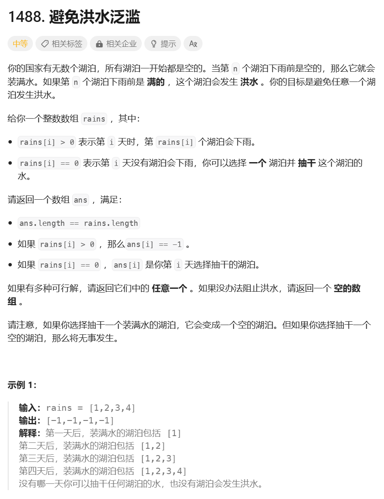
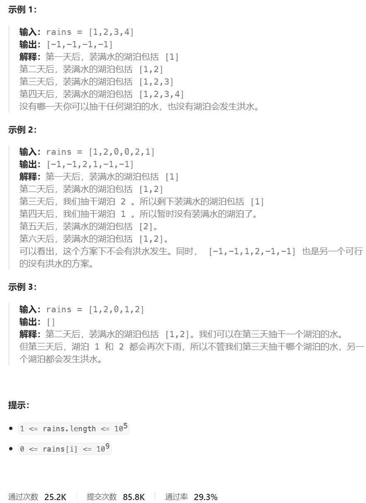
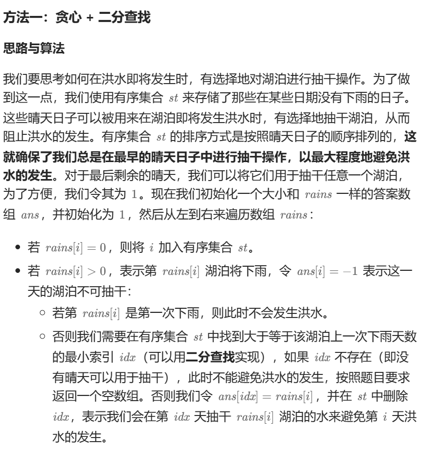

# 题目





# 我的题解

## 思路：无


# 其他题解

## 其他1：贪心+二分查找



```C++
class Solution {
public:
    vector<int> avoidFlood(vector<int>& rains) {
        vector<int> ans(rains.size(), 1);
        set<int> st;
        unordered_map<int, int> mp;
        for (int i = 0; i < rains.size(); ++i) {
            if (rains[i] == 0) {
                st.insert(i);
            } else {
                ans[i] = -1;
                if (mp.count(rains[i])) {
                    auto it = st.lower_bound(mp[rains[i]]);
                    if (it == st.end()) {
                        return {};
                    }
                    ans[*it] = rains[i];
                    st.erase(it);
                }
                mp[rains[i]] = i;
            }
        }
        return ans;
    }
};

作者：力扣官方题解
链接：https://leetcode.cn/problems/avoid-flood-in-the-city/
来源：力扣（LeetCode）
著作权归作者所有。商业转载请联系作者获得授权，非商业转载请注明出处。
```

