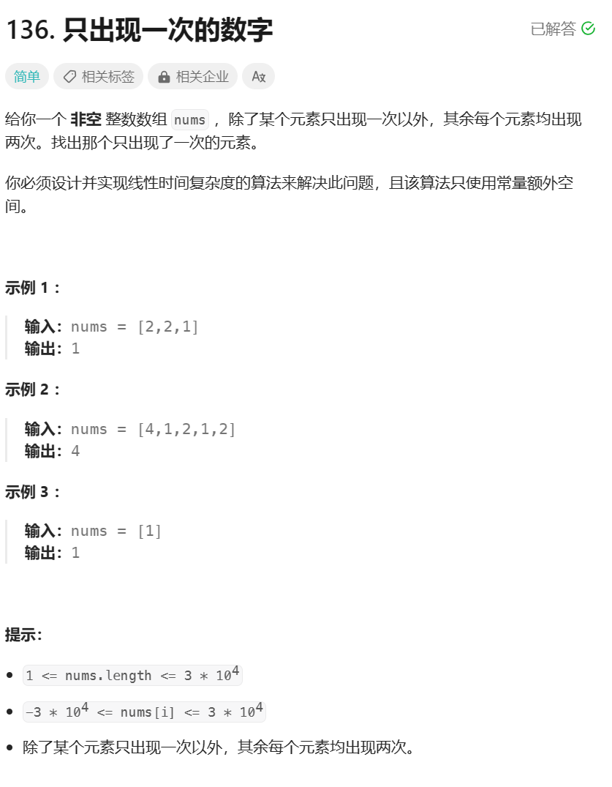
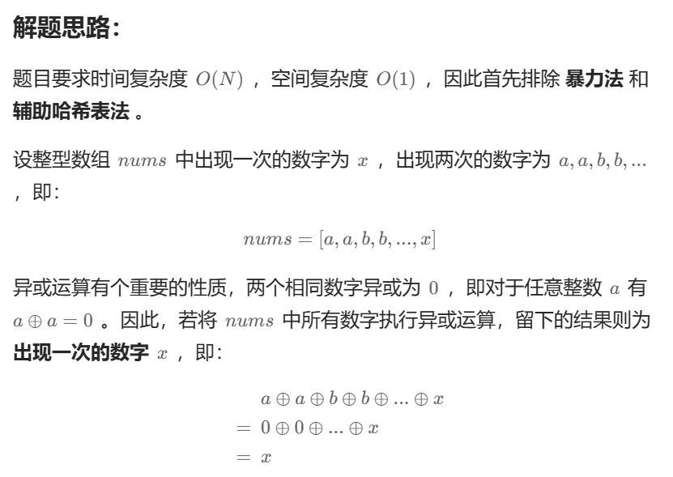
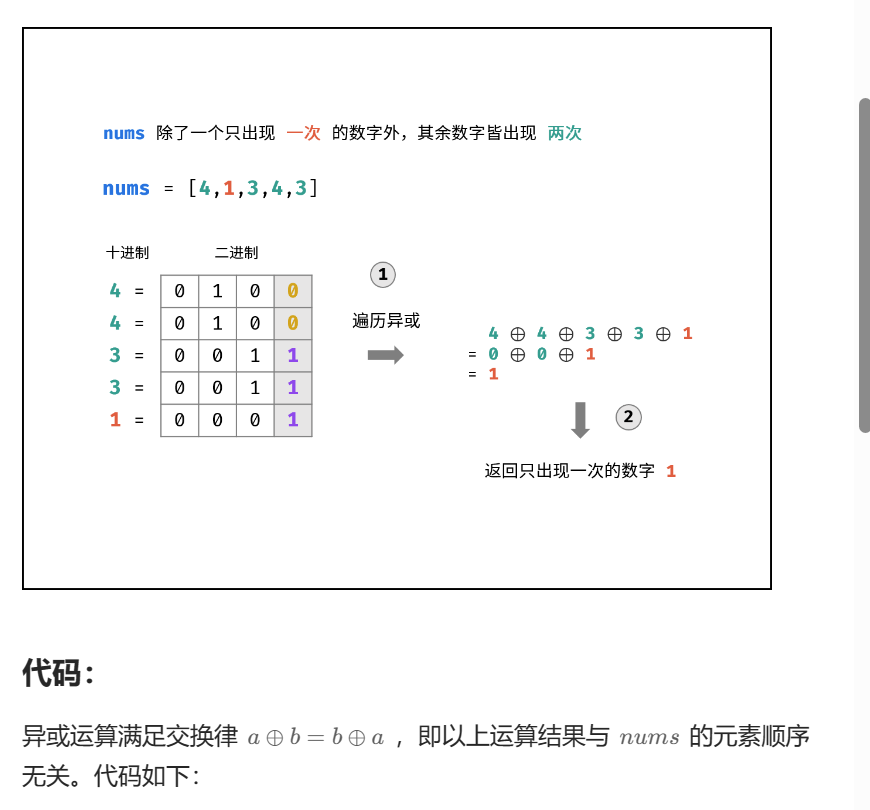

# 题目



# 我的题解

## 思路：哈希表计数

```C++
class Solution {
public:
    int singleNumber(vector<int>& nums) {
    unordered_map<int, int> map;
    for (const int &i:nums)
    {
        map[i]++;
    }
    for(auto i = map.begin(); i != map.end(); i++)
    {
        if (i->second == 1)
            return i->first;
    }
        return 0;
    }
};
```

# 其他题解

## 其他1：位运算





```C++
class Solution {
public:
    int singleNumber(vector<int>& nums) {
        int ret = 0;
        for (auto e: nums) ret ^= e;
        return ret;
    }
};

作者：力扣官方题解
链接：https://leetcode.cn/problems/single-number/submissions/388968040/
来源：力扣（LeetCode）
著作权归作者所有。商业转载请联系作者获得授权，非商业转载请注明出处。
```

