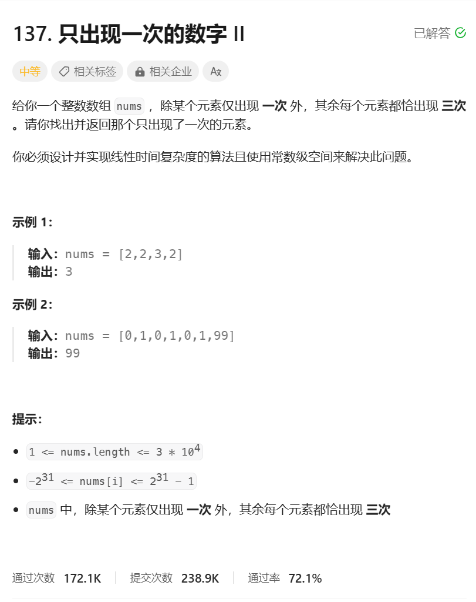
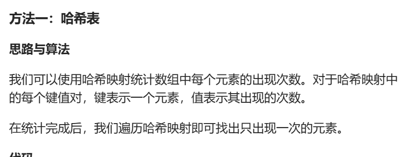
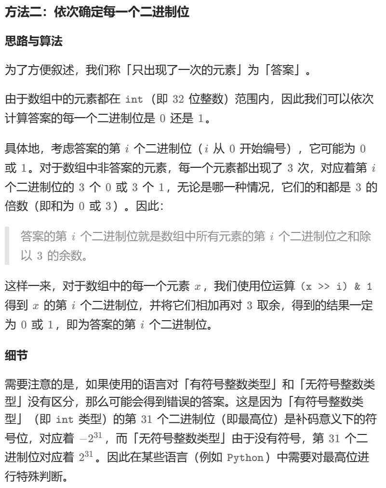

# 题目



# 我的题解

## 思路：位运算

```C++
class Solution {
public:
    int singleNumber(vector<int>& nums) {
        //遍历统计
        vector<int> cnt(32);
        for(int i = 0; i < nums.size(); i++){
            for(int j = 31; j>=0; j--){
                cnt[j] += nums[i]&1;
                nums[i]>>=1;
            }
        }
        int res=0;
        int j=0;
        for(int i = 31; i >= 0; i--){
            cnt[i] %= 3;//不是1就是0
            res |= cnt[i] << j;
            j++;
        }
        return res;
    }
};
```


# 其他题解

## 其他1：哈希表



```C++
class Solution {
public:
    int singleNumber(vector<int>& nums) {
        unordered_map<int, int> freq;
        for (int num: nums) {
            ++freq[num];
        }
        int ans = 0;
        for (auto [num, occ]: freq) {
            if (occ == 1) {
                ans = num;
                break;
            }
        }
        return ans;
    }
};

作者：力扣官方题解
链接：https://leetcode.cn/problems/single-number-ii/
来源：力扣（LeetCode）
著作权归作者所有。商业转载请联系作者获得授权，非商业转载请注明出处。
```

## 其他2：位运算



```C++
class Solution {
public:
    int singleNumber(vector<int>& nums) {
        int ans = 0;
        for (int i = 0; i < 32; ++i) {
            int total = 0;
            for (int num: nums) {
                total += ((num >> i) & 1);
            }
            if (total % 3) {
                ans |= (1 << i);
            }
        }
        return ans;
    }
};

作者：力扣官方题解
链接：https://leetcode.cn/problems/single-number-ii/
来源：力扣（LeetCode）
著作权归作者所有。商业转载请联系作者获得授权，非商业转载请注明出处。
```

