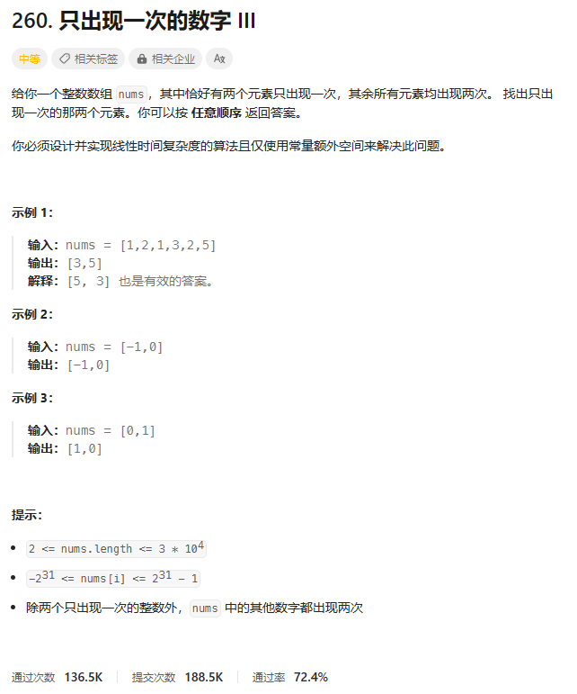
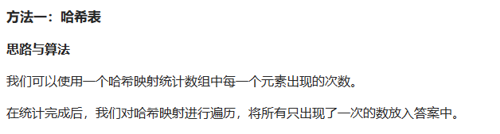
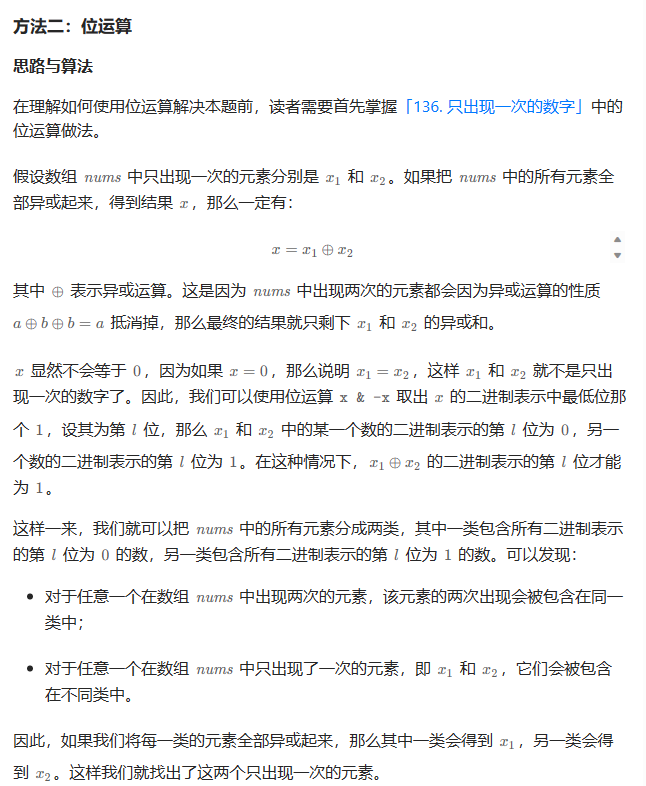
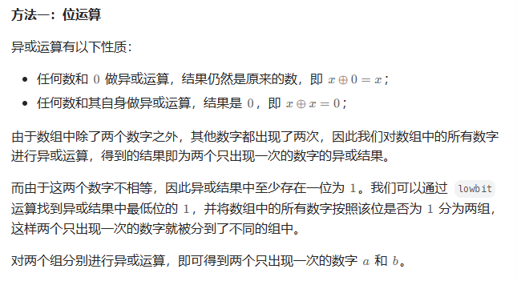

# 题目



# 我的题解

## 思路：哈希表

```C++
class Solution {
public:
    vector<int> singleNumber(vector<int>& nums) {
        unordered_map<int, int> freq;
        for (int num: nums) {
            ++freq[num];
        }
        vector<int> ans;
        for (const auto& [num, occ]: freq) {
            if (occ == 1) {
                ans.push_back(num);
            }
        }
        return ans;
    }
};

作者：力扣官方题解
链接：https://leetcode.cn/problems/single-number-iii/
来源：力扣（LeetCode）
著作权归作者所有。商业转载请联系作者获得授权，非商业转载请注明出处。
```


# 其他题解

## 其他1



```C++
class Solution {
public:
    vector<int> singleNumber(vector<int>& nums) {
        unordered_map<int, int> freq;
        for (int num: nums) {
            ++freq[num];
        }
        vector<int> ans;
        for (const auto& [num, occ]: freq) {
            if (occ == 1) {
                ans.push_back(num);
            }
        }
        return ans;
    }
};

作者：力扣官方题解
链接：https://leetcode.cn/problems/single-number-iii/
来源：力扣（LeetCode）
著作权归作者所有。商业转载请联系作者获得授权，非商业转载请注明出处。
```


## 其他2



```C++
class Solution {
public:
    vector<int> singleNumber(vector<int>& nums) {
        int xorsum = 0;
        for (int num: nums) {
            xorsum ^= num;
        }
        // 防止溢出
        int lsb = (xorsum == INT_MIN ? xorsum : xorsum & (-xorsum));
        int type1 = 0, type2 = 0;
        for (int num: nums) {
            if (num & lsb) {
                type1 ^= num;
            }
            else {
                type2 ^= num;
            }
        }
        return {type1, type2};
    }
};

作者：力扣官方题解
链接：https://leetcode.cn/problems/single-number-iii/
来源：力扣（LeetCode）
著作权归作者所有。商业转载请联系作者获得授权，非商业转载请注明出处。
```


## 其他3



```C++
class Solution {
public:
    vector<int> singleNumber(vector<int>& nums) {
        long long xs = 0;
        for (int& x : nums) {
            xs ^= x;
        }
        int lb = xs & -xs;
        int a = 0;
        for (int& x : nums) {
            if (x & lb) {
                a ^= x;
            }
        }
        int b = xs ^ a;
        return {a, b};
    }
};

作者：ylb
链接：https://leetcode.cn/problems/single-number-iii/
来源：力扣（LeetCode）
著作权归作者所有。商业转载请联系作者获得授权，非商业转载请注明出处。
```

