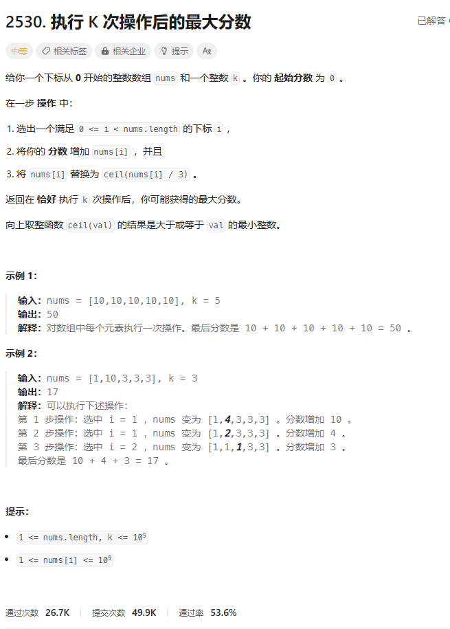
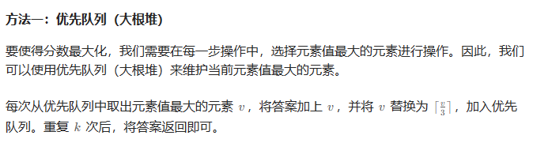

# 题目



# 我的题解


# 其他题解

## 其他1



```C++
class Solution {
public:
    long long maxKelements(vector<int>& nums, int k) {
        priority_queue<int> pq(nums.begin(), nums.end());
        long long ans = 0;
        while (k--) {
            int v = pq.top();
            pq.pop();
            ans += v;
            pq.push((v + 2) / 3);
        }
        return ans;
    }
};

作者：ylb
链接：https://leetcode.cn/problems/maximal-score-after-applying-k-operations/
来源：力扣（LeetCode）
著作权归作者所有。商业转载请联系作者获得授权，非商业转载请注明出处。
```

