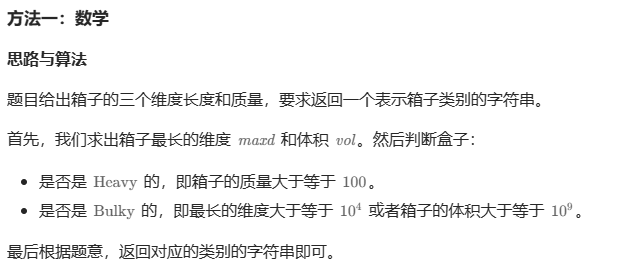

# 题目


# 我的题解

## 思路：模拟

注意体积的数值范围超过int, 使用long long

```C++
class Solution {
public:
    bool isBulky(int length, int width, int height, int mass){
        long long temp = (long long)length * width * height;
        if ( temp >= (long long)pow(10, 9) || length >= pow(10, 4) || width >= pow(10, 4) || height >= pow(10, 4)){
            return true;
        }
        return false;
    }
    bool isHeavy(int mass){
        if (mass >= 100) return true;
        return false; 
    }
    string categorizeBox(int length, int width, int height, int mass) {
        bool bulkyflag = false, heavyflag = false; 
        if (isBulky(length, width, height, mass)) bulkyflag = true;
        if (isHeavy(mass)) heavyflag = true;
        string res = "";
        if (bulkyflag && heavyflag) res = "Both";
        else if (!bulkyflag && !heavyflag) res = "Neither";
        else if (bulkyflag && !heavyflag) res = "Bulky";
        else if (!bulkyflag && heavyflag) res = "Heavy";
        return res;    
    }
};
```


# 其他题解

## 其他1：模拟

```C++
class Solution {
public:
    string categorizeBox(int length, int width, int height, int mass) {
        long v = (long) length * width * height;
        int bulky = length >= 10000 || width >= 10000 || height >= 10000 || v >= 1000000000 ? 1 : 0;
        int heavy = mass >= 100 ? 1 : 0;
        string d[4] = {"Neither", "Bulky", "Heavy", "Both"};
        int i = heavy << 1 | bulky;
        return d[i];
    }
};

作者：ylb
链接：https://leetcode.cn/problems/categorize-box-according-to-criteria/
来源：力扣（LeetCode）
著作权归作者所有。商业转载请联系作者获得授权，非商业转载请注明出处。
```


## 其他2



```C++
class Solution {
public:
    string categorizeBox(int length, int width, int height, int mass) {
        long long maxd = max(length, max(width, height)), vol = 1L * length * width * height;
        bool isBulky = maxd >= 10000 || vol >= 1000000000, isHeavy = mass >= 100;
        if (isBulky && isHeavy) {
             return "Both";
        } else if (isBulky) {
            return "Bulky";
        } else if (isHeavy) {
            return "Heavy";
        } else {
            return "Neither";
        }
    }
};

作者：力扣官方题解
链接：https://leetcode.cn/problems/categorize-box-according-to-criteria/
来源：力扣（LeetCode）
著作权归作者所有。商业转载请联系作者获得授权，非商业转载请注明出处。
```

