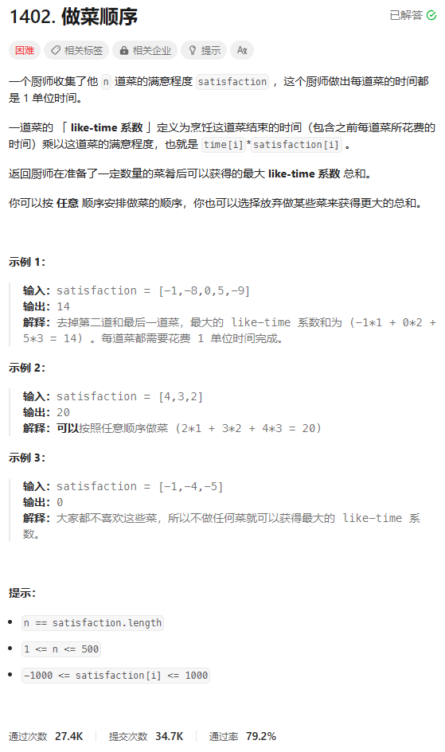
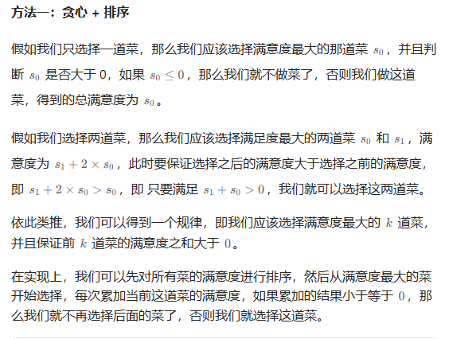
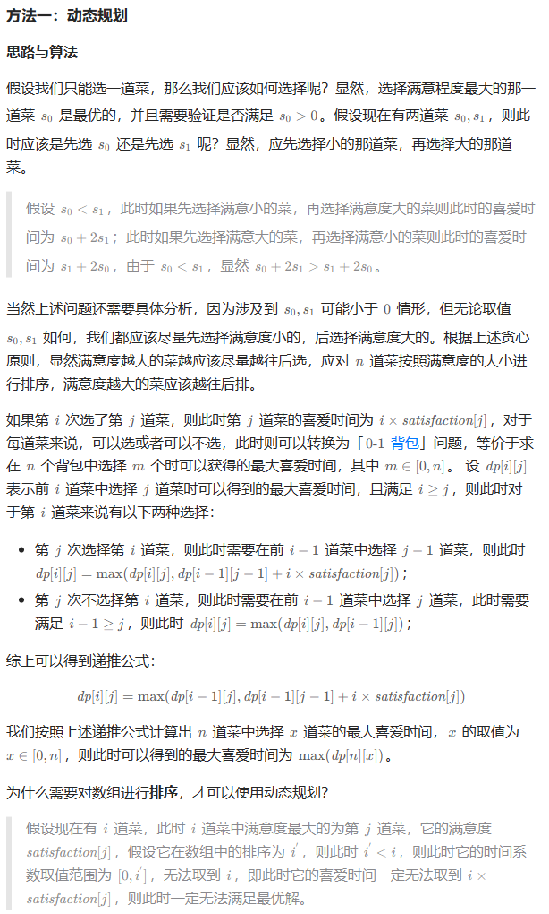

# 题目



# 我的题解

## 思路：贪心+排序

```C++
class Solution {
public:
    int maxSatisfaction(vector<int>& satisfaction) {
        sort(rbegin(satisfaction), rend(satisfaction));
        int ans = 0, s = 0;
        for (int x : satisfaction) {
            s += x;
            if (s <= 0) {
                break;
            }
            ans += s;
        }
        return ans;
    }
};
```


# 其他题解

## 其他1：



```C++
class Solution {
public:
    int maxSatisfaction(vector<int>& satisfaction) {
        sort(rbegin(satisfaction), rend(satisfaction));
        int ans = 0, s = 0;
        for (int x : satisfaction) {
            s += x;
            if (s <= 0) {
                break;
            }
            ans += s;
        }
        return ans;
    }
};
```


## 其他2：动态规划



```C++
class Solution {
public:
    int maxSatisfaction(vector<int>& satisfaction) {
        int n = satisfaction.size();
        vector<vector<int>> dp(n + 1, vector<int>(n + 1));
        sort(satisfaction.begin(), satisfaction.end());
        int res = 0;
        for (int i = 1; i <= n; i++) {
            for (int j = 1; j <= i; j++) {
                dp[i][j] = dp[i - 1][j - 1] + satisfaction[i - 1] * j;
                if (j < i) {
                    dp[i][j] = max(dp[i - 1][j], dp[i][j]);
                }
                res = max(res, dp[i][j]);
            }
        }
        return res;
    }
};

作者：力扣官方题解
链接：https://leetcode.cn/problems/reducing-dishes/
来源：力扣（LeetCode）
著作权归作者所有。商业转载请联系作者获得授权，非商业转载请注明出处。
```

