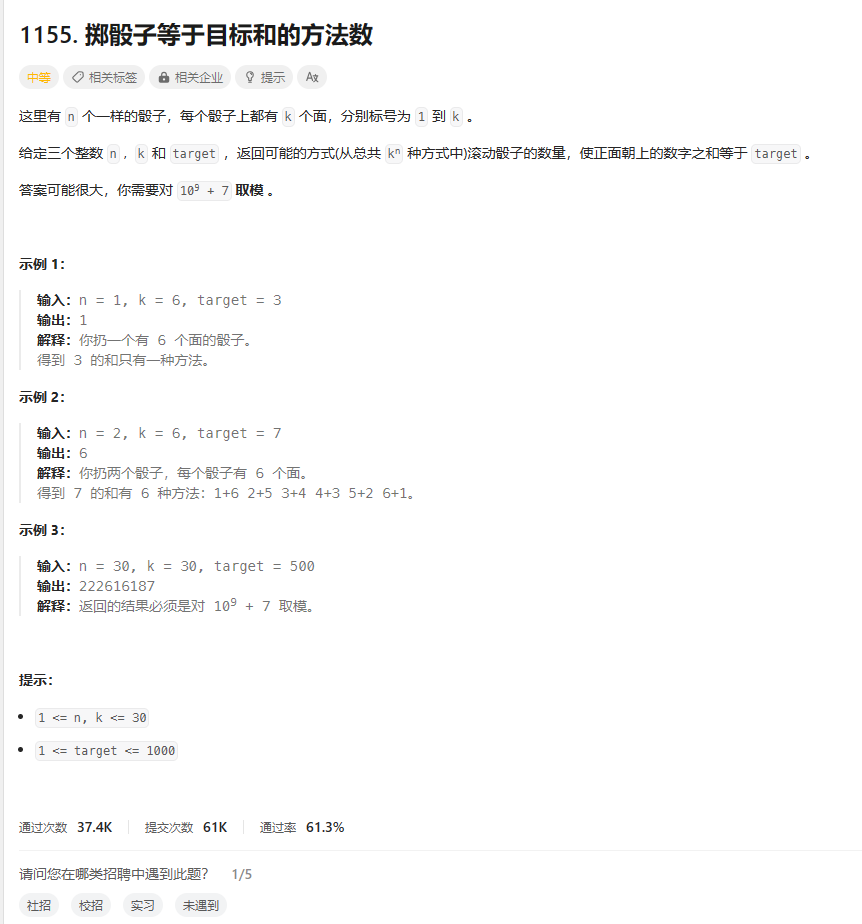
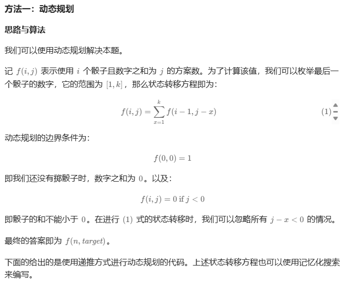
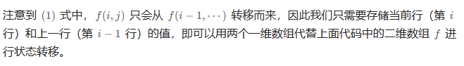
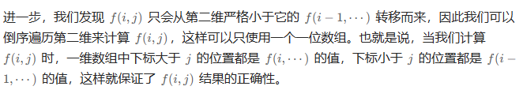

# 题目



# 我的题解

## 思路：动态规划

```java
class Solution {
    public int numRollsToTarget(int n, int k, int target) {
        int mod = (int) (1e9 + 7);
//思路：二维 dp，第一维为使用骰子个数，第二维为骰子点数之和，存储得到对应结果的方案数量
//遍历的骰子个数为 i，点数之和为 j
//设第i个骰子的点数为l，则前 i - 1 个骰子得到的点数应当为 j - l
//由于i个骰子得到j的方式可能不止一种，因此还需加上原本得到的方案数
//由此得到状态转移方程 dp[i][j] = dp[i - 1][j - l] + dp[i][j]
//由于结果需要等于 n, target，因此数组下标范围 + 1 防止越界
//初始化边界条件 dp[0][0] = 1
        int[][] dp = new int[n + 1][target + 1];
        dp[0][0] = 1;
        for (int i = 1; i <= n; i++)
            for (int j = i; j <= target; j++)
                for (int l = 1; l <= k && l <= j; l++)
                    dp[i][j] = (dp[i][j] + dp[i - 1][j - l]) % mod;
        return dp[n][target];
    }
}
```


# 其他题解



```C++
class Solution {
public:
    int numRollsToTarget(int n, int k, int target) {
        vector<vector<int>> f(n + 1, vector<int>(target + 1));
        f[0][0] = 1;
        for (int i = 1; i <= n; ++i) {
            for (int j = 0; j <= target; ++j) {
                for (int x = 1; x <= k; ++x) {
                    if (j - x >= 0) {
                        f[i][j] = (f[i][j] + f[i - 1][j - x]) % mod;
                    }
                }
            }
        }
        return f[n][target];
    }

private:
    static constexpr int mod = 1000000007;
};

作者：力扣官方题解
链接：https://leetcode.cn/problems/number-of-dice-rolls-with-target-sum/
来源：力扣（LeetCode）
著作权归作者所有。商业转载请联系作者获得授权，非商业转载请注明出处。
```



```C++
class Solution {
public:
    int numRollsToTarget(int n, int k, int target) {
        vector<int> f(target + 1);
        f[0] = 1;
        for (int i = 1; i <= n; ++i) {
            vector<int> g(target + 1);
            for (int j = 0; j <= target; ++j) {
                for (int x = 1; x <= k; ++x) {
                    if (j - x >= 0) {
                        g[j] = (g[j] + f[j - x]) % mod;
                    }
                }
            }
            f = move(g);
        }
        return f[target];
    }

private:
    static constexpr int mod = 1000000007;
};

作者：力扣官方题解
链接：https://leetcode.cn/problems/number-of-dice-rolls-with-target-sum/
来源：力扣（LeetCode）
著作权归作者所有。商业转载请联系作者获得授权，非商业转载请注明出处。
```



```C++
class Solution {
public:
    int numRollsToTarget(int n, int k, int target) {
        vector<int> f(target + 1);
        f[0] = 1;
        for (int i = 1; i <= n; ++i) {
            for (int j = target; j >= 0; --j) {
                f[j] = 0;
                for (int x = 1; x <= k; ++x) {
                    if (j - x >= 0) {
                        f[j] = (f[j] + f[j - x]) % mod;
                    }
                }
            }
        }
        return f[target];
    }

private:
    static constexpr int mod = 1000000007;
};

作者：力扣官方题解
链接：https://leetcode.cn/problems/number-of-dice-rolls-with-target-sum/
来源：力扣（LeetCode）
著作权归作者所有。商业转载请联系作者获得授权，非商业转载请注明出处。
```


## 其他2


```C++
class Solution {
public:
    int numRollsToTarget(int n, int k, int target) {
        const int mod = 1e9 + 7;
        int f[n + 1][target + 1];
        memset(f, 0, sizeof f);
        f[0][0] = 1;
        for (int i = 1; i <= n; ++i) {
            for (int j = 1; j <= min(target, i * k); ++j) {
                for (int h = 1; h <= min(j, k); ++h) {
                    f[i][j] = (f[i][j] + f[i - 1][j - h]) % mod;
                }
            }
        }
        return f[n][target];
    }
};

作者：ylb
链接：https://leetcode.cn/problems/number-of-dice-rolls-with-target-sum/
来源：力扣（LeetCode）
著作权归作者所有。商业转载请联系作者获得授权，非商业转载请注明出处。
```


```C++
class Solution:
    def numRollsToTarget(self, n: int, k: int, target: int) -> int:
        f = [1] + [0] * target
        mod = 10**9 + 7
        for i in range(1, n + 1):
            g = [0] * (target + 1)
            for j in range(1, min(i * k, target) + 1):
                for h in range(1, min(j, k) + 1):
                    g[j] = (g[j] + f[j - h]) % mod
            f = g
        return f[target]

作者：ylb
链接：https://leetcode.cn/problems/number-of-dice-rolls-with-target-sum/
来源：力扣（LeetCode）
著作权归作者所有。商业转载请联系作者获得授权，非商业转载请注明出处。
```

