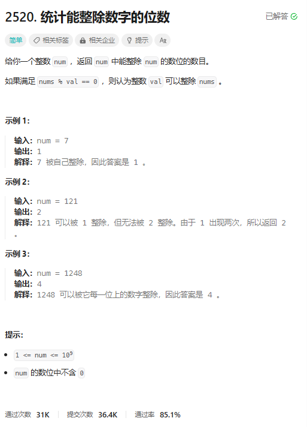
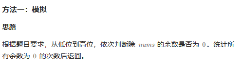
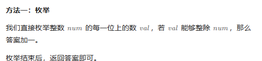

# 题目



# 我的题解

## 思路：模拟

判断每个数位上的数 能够被整除

```C++
class Solution {
public:
    int countDigits(int num) {
        //统计数位
        string str = to_string(num);
        int n = str.size();
        int res = 0;
        for (int i = 0; i < n; i++){
            if (num % (str[i] - '0') == 0) res++;
        }
        return res;
    }
};
```

# 其他题解

## 其他1：模拟



```C++
class Solution {
public:
    int countDigits(int num) {
        int t = num, res = 0;
        //从末位开始
        while (t) {
            if (num % (t % 10) == 0) {
                res += 1;
            }
            t /= 10;
        }
        return res;
    }
};

作者：力扣官方题解
链接：https://leetcode.cn/problems/count-the-digits-that-divide-a-number/
来源：力扣（LeetCode）
著作权归作者所有。商业转载请联系作者获得授权，非商业转载请注明出处。
```

## 其他2:枚举



```C++
class Solution {
public:
    int countDigits(int num) {
        int ans = 0;
        //枚举最后数位
        for (int x = num; x > 0; x /= 10) {
            if (num % (x % 10) == 0) {
                ++ans;
            }
        }
        return ans;
    }
};

作者：ylb
链接：https://leetcode.cn/problems/count-the-digits-that-divide-a-number/
来源：力扣（LeetCode）
著作权归作者所有。商业转载请联系作者获得授权，非商业转载请注明出处。
```

