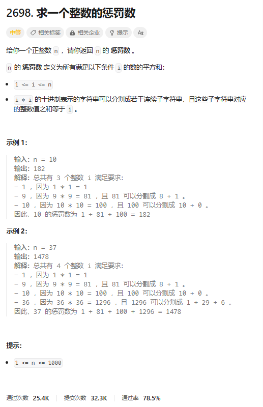
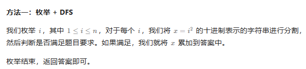
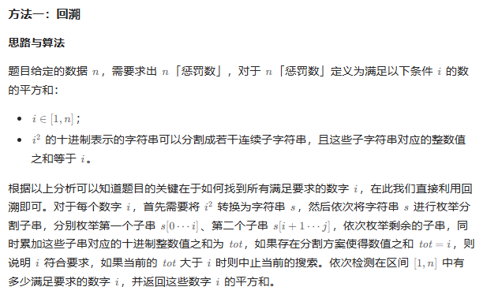

# 题目



# 我的题解

思路：暴力，但是需要遍历分割字符串的数字和

```

```


# 其他题解

## 其他1:**枚举 + DFS**



```C++
class Solution {
public:
    int punishmentNumber(int n) {
        int ans = 0;
        for (int i = 1; i <= n; ++i) {
            int x = i * i;
            string s = to_string(x);
            if (check(s, 0, i)) {
                ans += x;
            }
        }
        return ans;
    }

    bool check(const string& s, int i, int x) {
        int m = s.size();
        if (i >= m) {
            return x == 0;
        }
        int y = 0;
        for (int j = i; j < m; ++j) {
            y = y * 10 + s[j] - '0';
            if (y > x) {
                break;
            }
            if (check(s, j + 1, x - y)) {
                return true;
            }
        }
        return false;
    }
};

作者：ylb
链接：https://leetcode.cn/problems/find-the-punishment-number-of-an-integer/
来源：力扣（LeetCode）
著作权归作者所有。商业转载请联系作者获得授权，非商业转载请注明出处。
```

## 其它2：回溯



```C++
class Solution {
public:
    bool dfs(string &s, int pos, int tot, int target) {
        if (pos == s.size()) {
            return tot == target;
        } 
        int sum = 0;
        for (int i = pos; i < s.size(); i++) {
            sum = sum * 10 + s[i] - '0';
            if (sum + tot > target) {
                break;
            }
            if (dfs(s, i + 1, sum + tot, target)) {
                return true;
            }
        }
        return false;
    }
    
    int punishmentNumber(int n) {
        int res = 0;
        for (int i = 1; i <= n; i++) {
            string s = to_string(i * i);
            if (dfs(s, 0, 0, i)) {
                res += i * i;
            }
        }
        return res;
    }
};

作者：力扣官方题解
链接：https://leetcode.cn/problems/find-the-punishment-number-of-an-integer/
来源：力扣（LeetCode）
著作权归作者所有。商业转载请联系作者获得授权，非商业转载请注明出处。
```

