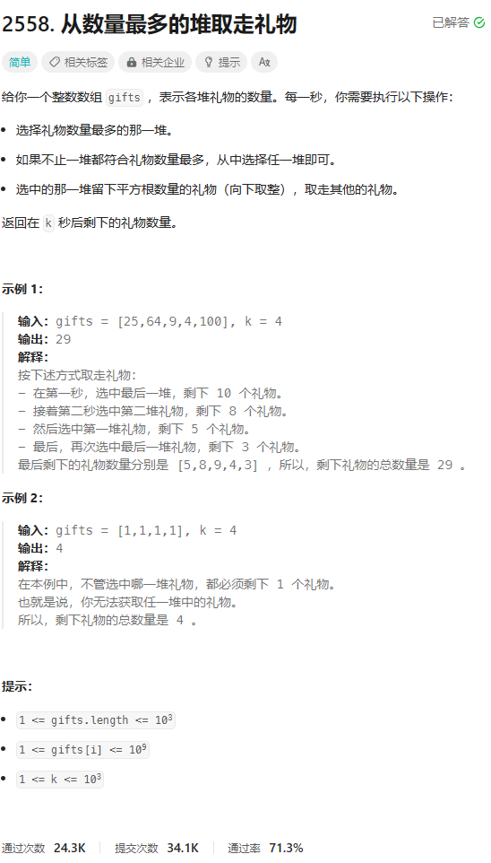

# 题目



# 我的题解

独立完成，周赛331 第一题 其中查找平方根并且返回向下取整的函数，是在网上找的，其实可以返回（int）sqrt(int x) 这样返回x的平方根，但是如果说要返回的是修改后的数组，且不改变下标怎么写

```C++
class Solution {
public:
    int mySqrt(int n){
        int left = 1;
        int right = n/2;
        while (left<right){
            int mid = left+(right-left)/2;
            if(n/mid>=mid){
                left = mid+1;
            }else if(n/mid<mid){
                right = mid-1;
            }
        }
        if(n/left<left){
            left--;
        }
        return left;
    }
    long long pickGifts(vector<int>& gifts, int k) {
        //暴力,不用返回数组，只返回数量
        int n=gifts.size();
        while(k--){
            sort(gifts.begin(),gifts.end(),greater<int>());
            gifts[0]=mySqrt(gifts[0]);
        }
        long long res=0;
        for(int &i:gifts){
            res+=i;
        }
        return res;
    }
};
```

# 其他题解

## 其他1

```C++
class Solution {
public:
    long long pickGifts(vector<int>& gifts, int k) {
        //优先级队列，底层是堆，默认是从大到小
        priority_queue<int> pq;
        for(auto &c:gifts)pq.push(c);
        //先放入最大堆中，从大到小排序好
        //也可以用以下方式初始化优先级队列
        //priority_queue<int>pq(gifts.begin(),gifts.end());
        int i;
        while(k--)
        {//操作次数k，1秒1次，k秒进行k次
            i=pq.top();//选出最大的礼物
            pq.pop();//弹出最大
            pq.push((int)sqrt(i));//放入最大值开平方后的数
            //只要这堆礼物的平方根数量（先移除原数量，再加入新平方根后数量）
        }
        long long ans=0;
        while(!pq.empty())
        {
            ans+=pq.top();//累加礼物总数量
            pq.pop();//累加完一个后弹出该值（front,最大值）
        }
        return ans;
    }
};


```

