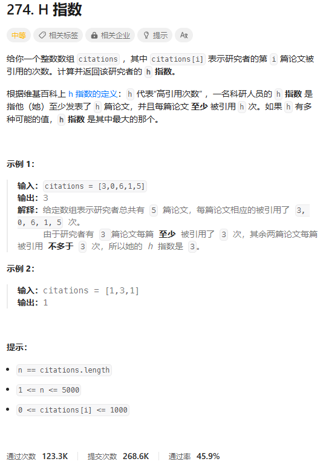
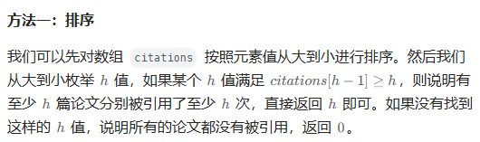
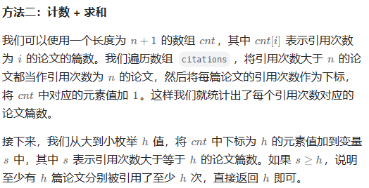
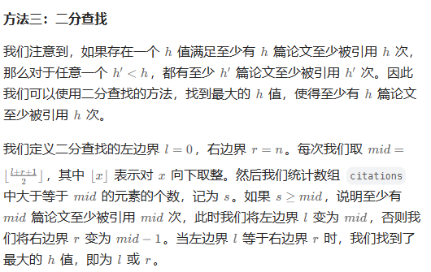

# 题目



# 我的题解

## 思路：排序+枚举

关键是citations[h-1] >= h 关系式

```C++
class Solution {
public:
    int hIndex(vector<int>& citations) {
        //先排序，然后根据关系式citations[h-1] >= h得到答案
        sort(citations.rbegin(), citations.rend());
        //从大到小排，枚举h值然后从后面遍历,找到最大返回
        for (int h = citations.size(); h; --h){
            if (citations[h-1] >= h){
                return h;
            }
        }
        return 0;
    }
};
```


# 其他题解

## 其他1



```C++
class Solution {
public:
    int hIndex(vector<int>& citations) {
        sort(citations.rbegin(), citations.rend());
        for (int h = citations.size(); h; --h) {
            if (citations[h - 1] >= h) {
                return h;
            }
        }
        return 0;
    }
};

作者：ylb
链接：https://leetcode.cn/problems/h-index/
来源：力扣（LeetCode）
著作权归作者所有。商业转载请联系作者获得授权，非商业转载请注明出处。
```

## 其他2



```C++
class Solution {
public:
    int hIndex(vector<int>& citations) {
        int n = citations.size();
        int cnt[n + 1];
        memset(cnt, 0, sizeof(cnt));
        for (int x : citations) {
            ++cnt[min(x, n)];
        }
        for (int h = n, s = 0;; --h) {
            s += cnt[h];
            if (s >= h) {
                return h;
            }
        }
    }
};

作者：ylb
链接：https://leetcode.cn/problems/h-index/
来源：力扣（LeetCode）
著作权归作者所有。商业转载请联系作者获得授权，非商业转载请注明出处。
```

## 其他3



```C++
class Solution {
public:
    int hIndex(vector<int>& citations) {
        int l = 0, r = citations.size();
        while (l < r) {
            int mid = (l + r + 1) >> 1;
            int s = 0;
            for (int x : citations) {
                if (x >= mid) {
                    ++s;
                }
            }
            if (s >= mid) {
                l = mid;
            } else {
                r = mid - 1;
            }
        }
        return l;
    }
};

作者：ylb
链接：https://leetcode.cn/problems/h-index/
来源：力扣（LeetCode）
著作权归作者所有。商业转载请联系作者获得授权，非商业转载请注明出处。
```

