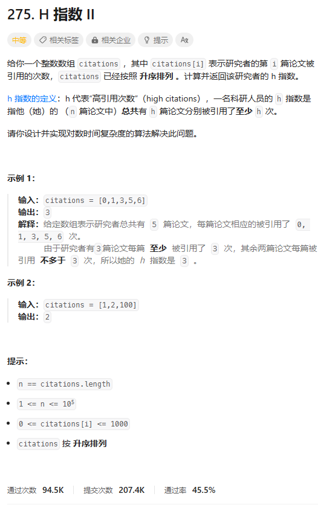
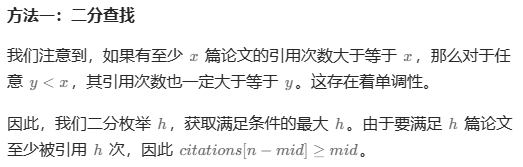
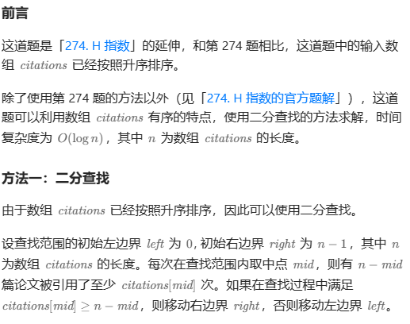
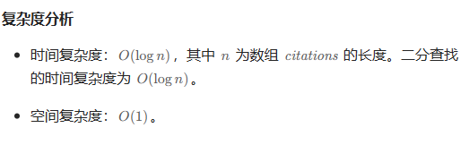

# 题目



# 我的题解

## 思路：二分

关系式还是citations[n-h] >= h

```C++
class Solution {
public:
    int hIndex(vector<int>& citations) {
        int n = citations.size();
        int left = 0, right = n;
        while (left < right) {
            //加一，一般是l = mid时
            int mid = (left + right + 1) >> 1;
            if (citations[n - mid] >= mid)
                left = mid;
            else
                right = mid - 1;
        }
        return left;
    }
};
```


# 其他题解

## 其他1：



```C++
class Solution {
public:
    int hIndex(vector<int>& citations) {
        int n = citations.size();
        int left = 0, right = n;
        while (left < right) {
            int mid = (left + right + 1) >> 1;
            if (citations[n - mid] >= mid)
                left = mid;
            else
                right = mid - 1;
        }
        return left;
    }
};

作者：ylb
链接：https://leetcode.cn/problems/h-index-ii/
来源：力扣（LeetCode）
著作权归作者所有。商业转载请联系作者获得授权，非商业转载请注明出处。
```

## 其他2



```C++
class Solution {
    public int hIndex(int[] citations) {
        int n = citations.length;
        int left = 0, right = n - 1;
        while (left <= right) {
            int mid = left + (right - left) / 2;
            if (citations[mid] >= n - mid) {
                right = mid - 1;
            } else {
                left = mid + 1;
            }
        }
        return n - left;
    }
}

作者：力扣官方题解
链接：https://leetcode.cn/problems/h-index-ii/
来源：力扣（LeetCode）
著作权归作者所有。商业转载请联系作者获得授权，非商业转载请注明出处。
```

