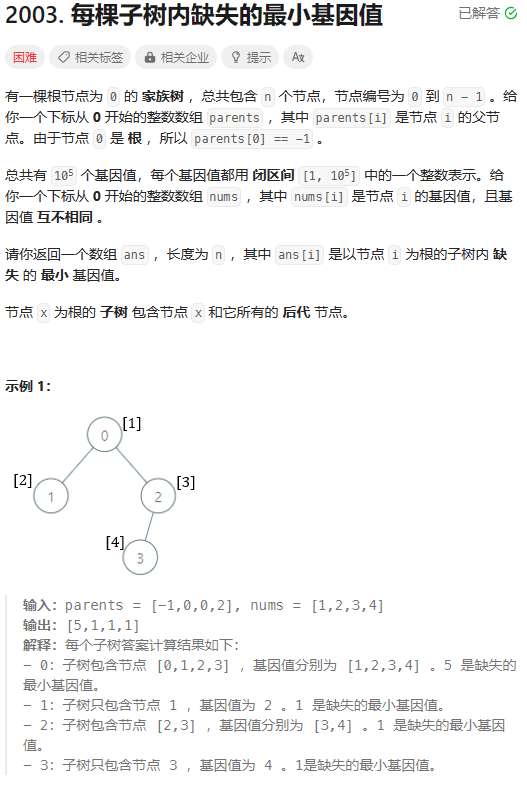
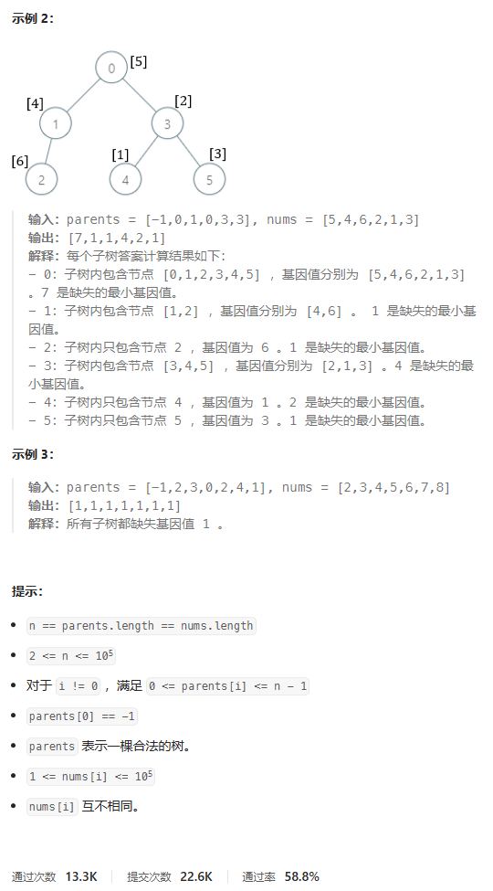
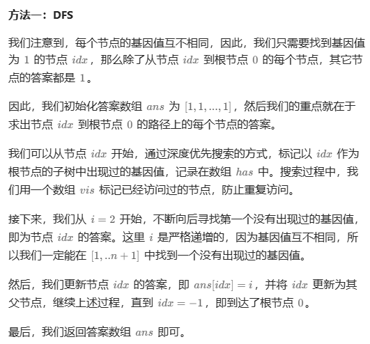

# 题目





# 我的题解

## 思路：


# 其他题解

## 其他1



```C++
class Solution {
public:
    vector<int> smallestMissingValueSubtree(vector<int>& parents, vector<int>& nums) {
        int n = nums.size();
        vector<int> g[n];
        bool vis[n];
        bool has[n + 2];
        memset(vis, false, sizeof(vis));
        memset(has, false, sizeof(has));
        int idx = -1;
        for (int i = 0; i < n; ++i) {
            if (i) {
                g[parents[i]].push_back(i);
            }
            if (nums[i] == 1) {
                idx = i;
            }
        }
        vector<int> ans(n, 1);
        if (idx == -1) {
            return ans;
        }
        function<void(int)> dfs = [&](int i) {
            if (vis[i]) {
                return;
            }
            vis[i] = true;
            if (nums[i] < n + 2) {
                has[nums[i]] = true;
            }
            for (int j : g[i]) {
                dfs(j);
            }
        };
        for (int i = 2; ~idx; idx = parents[idx]) {
            dfs(idx);
            while (has[i]) {
                ++i;
            }
            ans[idx] = i;
        }
        return ans;
    }
};
```

