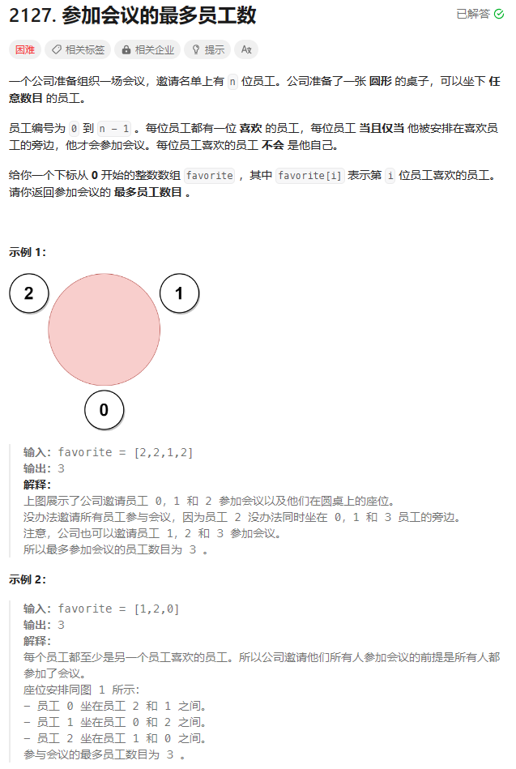
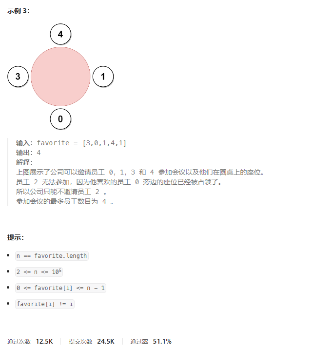
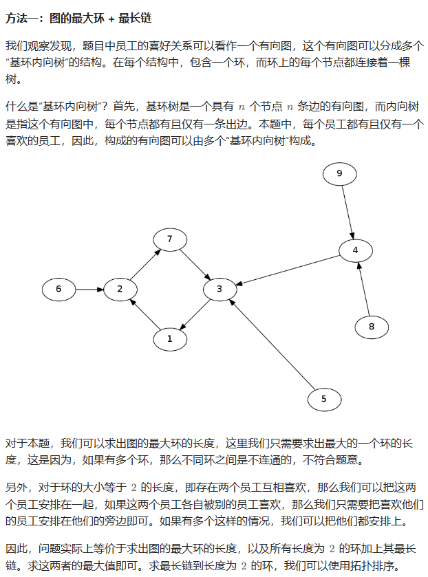

# 题目





# 我的题解

## 思路：


# 其他题解

## 其他1:图的最大环+最长链



```C++
class Solution {
public:
    int maximumInvitations(vector<int>& favorite) {
        return max(maxCycle(favorite), topologicalSort(favorite));
    }

    int maxCycle(vector<int>& fa) {
        int n = fa.size();
        vector<bool> vis(n);
        int ans = 0;
        for (int i = 0; i < n; ++i) {
            if (vis[i]) continue;
            vector<int> cycle;
            int j = i;
            while (!vis[j]) {
                cycle.push_back(j);
                vis[j] = true;
                j = fa[j];
            }
            for (int k = 0; k < cycle.size(); ++k) {
                if (cycle[k] == j) {
                    ans = max(ans, (int) cycle.size() - k);
                    break;
                }
            }
        }
        return ans;
    }

    int topologicalSort(vector<int>& fa) {
        int n = fa.size();
        vector<int> indeg(n);
        vector<int> dist(n, 1);
        for (int v : fa) ++indeg[v];
        queue<int> q;
        for (int i = 0; i < n; ++i)
            if (indeg[i] == 0) q.push(i);
        while (!q.empty()) {
            int i = q.front();
            q.pop();
            dist[fa[i]] = max(dist[fa[i]], dist[i] + 1);
            if (--indeg[fa[i]] == 0) q.push(fa[i]);
        }
        int ans = 0;
        for (int i = 0; i < n; ++i)
            if (i == fa[fa[i]]) ans += dist[i];
        return ans;
    }
};

作者：ylb
链接：https://leetcode.cn/problems/maximum-employees-to-be-invited-to-a-meeting/
来源：力扣（LeetCode）
著作权归作者所有。商业转载请联系作者获得授权，非商业转载请注明出处。
```

