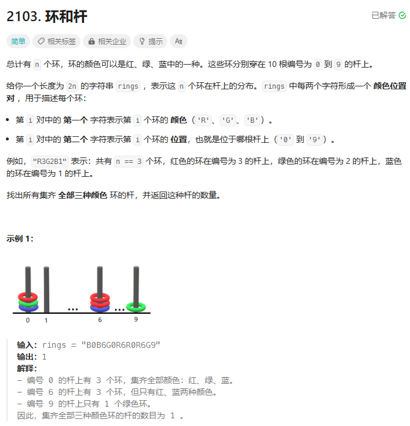
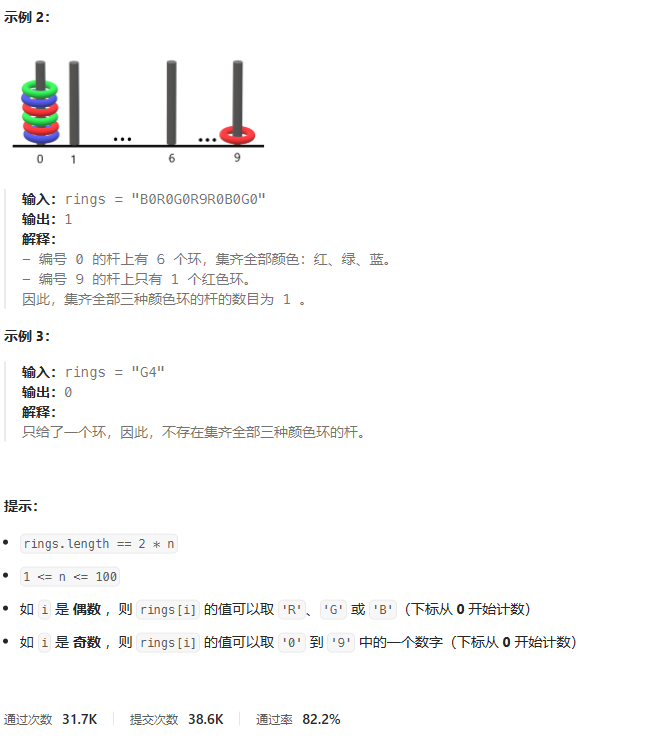
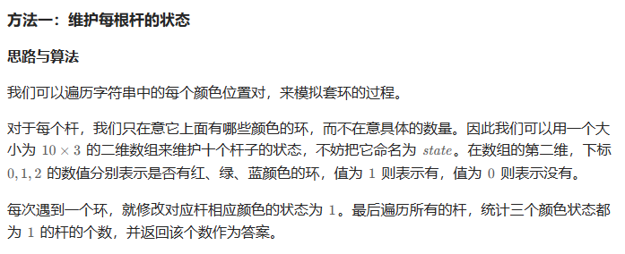
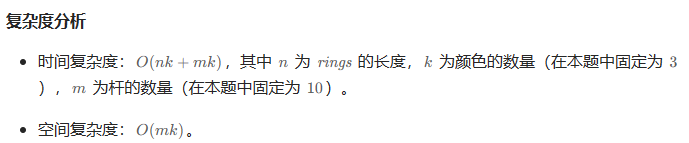
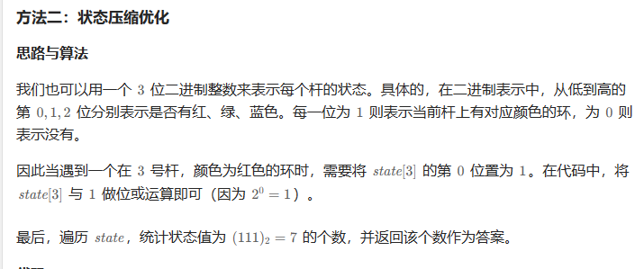
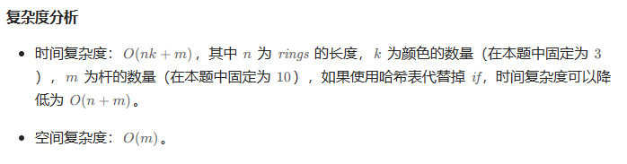

# 题目





# 我的题解

## 思路：


# 其他题解

## 其他1



```C++
class Solution {
public:
    static constexpr int POLE_NUM = 10;
    static constexpr int COLOR_NUM = 3;
    int getColorId(char color) {
        if (color == 'R') {
            return 0;
        } else if (color == 'G') {
            return 1;
        }
        return 2;
    }
    int countPoints(string rings) {
        vector<vector<int>> state(POLE_NUM, vector<int>(COLOR_NUM, 0));
        int n = rings.size();
        for (int i = 0; i < n; i += 2) {
            char color = rings[i];
            int pole_index = rings[i + 1] - '0';
            state[pole_index][getColorId(color)] = 1;
        }
        int res = 0;
        for (int i = 0; i < POLE_NUM; i++) {
            bool flag = true;
            for (int j = 0; j < COLOR_NUM; j++) {
                if (state[i][j] == 0) {
                    flag = false;
                    break;
                }
            }
            if (flag) {
                res++;
            }
        }
        return res;
    }
};

作者：力扣官方题解
链接：https://leetcode.cn/problems/rings-and-rods/solutions/2508862/python3javacgorusttypescript-yi-ti-yi-ji-p7qi/
来源：力扣（LeetCode）
著作权归作者所有。商业转载请联系作者获得授权，非商业转载请注明出处。
```



## 其他2



```C++
class Solution {
public:
    static constexpr int POLE_NUM = 10;
    int countPoints(string rings) {
        vector<int> state(POLE_NUM);
        int n = rings.size();
        for (int i = 0; i < n; i += 2) {
            char color = rings[i];
            int pole_index = rings[i + 1] - '0';
            if (color == 'R') {
                state[pole_index] |= 1;
            } else if (color == 'G') {
                state[pole_index] |= 2;
            } else {
                state[pole_index] |= 4;
            }
        }
        int res = 0;
        for (int i = 0; i < POLE_NUM; i++) {
            res += state[i] == 7;
        }
        return res;
    }
};

作者：力扣官方题解
链接：https://leetcode.cn/problems/rings-and-rods/solutions/2508862/python3javacgorusttypescript-yi-ti-yi-ji-p7qi/
来源：力扣（LeetCode）
著作权归作者所有。商业转载请联系作者获得授权，非商业转载请注明出处。
```

